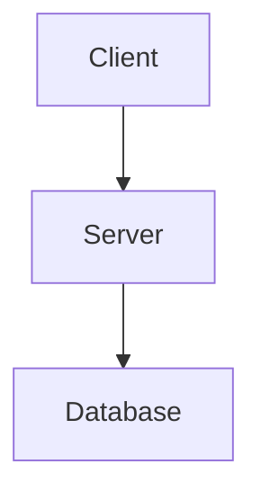

# Documentation System

Bub uses **MkDocs** with the Terminal theme for documentation.

## Quick Start

```bash
# Start documentation server (with live reload)
./scripts/docs-server.sh start [port]  # Default: 8000

# Check status
./scripts/docs-server.sh status

# View logs
./scripts/docs-server.sh logs

# Stop server
./scripts/docs-server.sh stop
```

## Configuration

**File**: `mkdocs.yml`

**Key Settings**:
- **Theme**: `terminal` (dark palette)
- **Plugins**: 
  - `search` - Full-text search
  - `mermaid2` - Mermaid diagram rendering
  - `mkdocstrings` - Auto-generated API docs from Python docstrings
- **Extensions**:
  - `tables` - Markdown tables
  - `admonition` - Callout blocks (note, warning, tip)
  - `toc` - Table of contents with permalinks
  - `pymdownx.*` - Various pymdown extensions

## Writing Guidelines

### Tables

**Requirement**: Tables **must** have a blank line before them.

```markdown
# BAD - table immediately after text
Here is a table:
| Column | Value |
|--------|-------|
| A      | 1     |

# GOOD - blank line before table
Here is a table:

| Column | Value |
|--------|-------|
| A      | 1     |
```

### Mermaid Diagrams

**Requirement**: All mermaid diagrams **must** be validated.

**Validation Script**: `scripts/validate_mermaid.py`

```bash
# Validate all diagrams in docs/architecture/
python scripts/validate_mermaid.py

# Validate specific file
python scripts/validate_mermaid.py docs/architecture/my-diagram.md

# Output rendered SVGs to custom directory
python scripts/validate_mermaid.py -o docs/mermaid-output/
```

**Requirements**:
- Install mermaid-cli: `npm install -g @mermaid-js/mermaid-cli`
- Diagrams are extracted from files matching `docs/architecture/*.md`
- Output goes to `docs/mermaid-output/` by default

**Example**:
```markdown
## Architecture


```

### Callouts (Admonitions)

Use admonitions for important notes:

```markdown
!!! note
    This is a note callout.

!!! warning
    This is a warning callout.

!!! tip
    This is a tip callout.
```

### Code Blocks

Use language identifiers for syntax highlighting:

```markdown
```python
def hello():
    print("Hello, World!")
```

```bash
./scripts/deploy-production.sh start bus
```
```

## Project Structure

```
docs/
├── index.md                    # Home page
├── features.md                 # Key features
├── architecture/               # Architecture diagrams
│   ├── index.md
│   ├── 01-class-hierarchy.md
│   ├── 02-message-flow-sequence.md
│   └── ...
├── components.md               # Component documentation
├── deployment.md               # Deployment guide
├── cli.md                      # CLI documentation
├── telegram.md                 # Telegram integration
├── discord.md                  # Discord integration
├── journal/                    # Development journals
└── mermaid-output/             # Rendered mermaid SVGs (generated)
```

## Adding New Pages

1. Create markdown file in `docs/`
2. Add to `nav:` section in `mkdocs.yml`
3. Run `python scripts/validate_mermaid.py` if using diagrams
4. Test with `./scripts/docs-server.sh start`

## Pre-commit Checklist

Before committing docs changes:

- [ ] Tables have blank lines before them
- [ ] Mermaid diagrams are validated: `python scripts/validate_mermaid.py`
- [ ] Links work (test in local server)
- [ ] No broken references
- [ ] Code blocks have language identifiers

## MkDocs Features

### Live Reload

The docs server automatically reloads when files change.

### Search

Full-text search is enabled. Headers are indexed automatically.

### Navigation

- `navigation.instant` - Instant navigation without page reload
- `navigation.tabs` - Top-level sections as tabs
- `navigation.sections` - Expandable sections
- `navigation.expand` - Expand navigation by default

### Mermaid2 Plugin

Configuration in `mkdocs.yml`:
```yaml
plugins:
  - mermaid2:
      arguments:
        theme: dark
        securityLevel: 'loose'
```

## Troubleshooting

### Port Already in Use

```bash
# Use different port
./scripts/docs-server.sh start 8001
```

### Mermaid Validation Fails

1. Install mermaid-cli: `npm install -g @mermaid-js/mermaid-cli`
2. Check diagram syntax
3. Run validation with output: `python scripts/validate_mermaid.py -o /tmp/test/`

### Changes Not Reflecting

1. Check server is running: `./scripts/docs-server.sh status`
2. Restart: `./scripts/docs-server.sh stop && ./scripts/docs-server.sh start`
3. Check logs: `./scripts/docs-server.sh logs`
