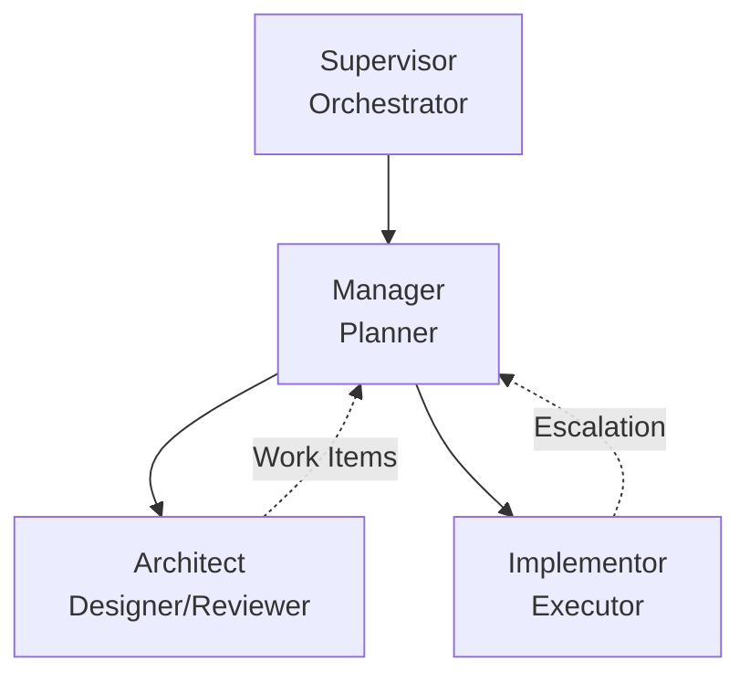

# Multi-Agent Workflow System

This skill defines a hierarchical multi-agent workflow for complex software engineering tasks that require separation of design from implementation.

## When to Use

Use this workflow when:
- Tasks are too large or complex for a single agent
- Architectural decisions need to be validated before implementation
- Multiple implementation passes with review cycles are needed
- Clear separation of concerns between design and implementation is required

## For Project Creators (Users)

As a project creator, you initiate the workflow by providing the request. There are two ways to do this:

### Option 1: Pass request as message (Recommended)
Simply describe your request in natural language. The system will:
1. Create a kanban file
2. Initialize the workflow
3. Route to appropriate agents

**Example:**
```
Create a Module dataclass and update the elaborator to return Module instead of tuple.
This is Phase 1 of refactoring to support LLM integration.
```

### Option 2: Create kanban manually and pass the file
If you want more control over the kanban structure or need to add detailed context:

```bash
# Create the kanban using the script
./scripts/create-kanban.py --title "My Feature" --request "Detailed request here"
```

Then pass the created kanban file path:
```
Please work on: tasks/0-kanban-my-feature.md
```

**Note:** You should NOT manually create task files or edit the kanban structure beyond the request content. The Manager role will create tasks based on the strategy defined in role-manager.md.

## Workflow Architecture

The workflow consists of four specialized roles working in sequence:



### Execution Model

**Sequential by Design**: The Supervisor ensures agents execute one at a time in a defined order. This prevents race conditions and ensures each agent works with consistent state.

## Roles

### Supervisor

**Purpose**: Dumb orchestrator that manages agent execution lifecycle.

**Key Constraints**:
- Only spawns agents based on kanban state
- Never makes decisions or interprets results
- Validates output format, not content
- Retries up to 3 times on format failures
- Fails workflow if retries exhausted

**Algorithm**: See `role-supervisor.md`

**Agent I/O Summary**:

| Agent | Input | Output |
|-------|-------|--------|
| Task Agent (Architect/Implementor) | `kanban_file: str, task_file: str` | None (ends with "DONE") |
| Manager | `kanban_file: str, done_task: str\|None, message: str\|None` | **JSON**: `{"next_task": str, "tasks": [...]}` |

### Task Agent Onboarding (REQUIRED)

When spawned as a task agent (Architect or Implementor), you **MUST** follow this protocol:

```bash
# Step 1: Generate your briefing from task metadata
.agents/skills/workflow/scripts/check-task.py --task <task_file>

# Step 2: Read your role definition
# The briefing will tell you which file to read (e.g., role-architect.md)

# Step 3: Load required skills
# The briefing lists skills you must consult before starting
```

**You MUST NOT skip these steps.**

The briefing provides:
- Your role definition file path
- Required skills to load
- Task context (expertise, dependencies, references)
- Reminders of what you MUST and MUST NOT do

### Manager

**Purpose**: Orchestrate workflow phases and task sequencing. **Manager is the ONLY role that updates kanban state.** Manager does NOT perform real work - only creates tasks and manages kanban.md.

**Key Design Decisions**:

1. **Manager Never Does Real Work**: Manager MUST NOT explore, edit files, execute shell commands, or make design decisions. Manager ONLY creates task files and updates kanban.md.

2. **One Work Item at a Time**: When replanning, Manager returns only the immediate next work item rather than all future work. This allows the workflow to adapt based on implementation results before committing to downstream tasks.

3. **Exploration Tasks for Missing Info**: If information is inadequate for planning, Manager creates exploration tasks delegated to other agents (typically Architect).

4. **Plan Adjustment Logging**: All plan changes are logged to kanban.md with timestamps and reasoning.

**Algorithm**: See `role-manager.md`

### Architect

**Purpose**: Design core systems and validate implementations.

**Task Type Routing**: Architect uses the `type` field to determine mode:
- `type: design` - Design phase tasks (create types.py, define contracts)
- `type: review` - Review phase tasks (validate implementation)

**Modes**:
- **DESIGN**: Create types.py and define test contracts
- **REVIEW**: Validate implementation quality

**Output Requirement**: MUST end response with message "DONE" to signal completion.

**Algorithm**: See `role-architect.md`

**Review Process**: See `review.md` for detailed review workflow, checklists, and output formats

### Implementor

**Purpose**: Execute implementation tasks according to specification.

**Escalation Strategy**: When complexity exceeds capacity, Implementor escalates rather than attempting work beyond expertise. This maintains quality and allows Manager to replan with appropriate resources.

**Output Requirement**: MUST end response with message "DONE" to signal completion.

**Algorithm**: See `role-implementor.md`

## Skills Registry

| Skill | Location | Used By | Description |
|-------|----------|---------|-------------|
| `docs` | `.agents/skills/docs/SKILL.md` | All | Documentation conventions, mermaid validation |
| `testing` | `.agents/skills/testing/SKILL.md` | Implementor | Test running and debugging |
| `deployment` | `.agents/skills/deployment/SKILL.md` | Manager | Production deployment |
| `python-project` | `/home/liu/.claude/skills/python-project/SKILL.md` | Implementor | Python project management with uv |
| `code-reading` | `.agents/skills/code-reading-assistant/SKILL.md` | All | Codebase exploration and Q&A |
| `skill-management` | `.agents/skills/skill-management/SKILL.md` | All | Skill catalog and navigation |

**Skill Loading**: Skills are automatically loaded by the agent tool based on the `skills` field in task metadata. Manager should select appropriate skills when creating tasks (see `role-manager.md` for skill selection guidelines).

## Helper Scripts

This skill includes executable Python scripts in `scripts/` for managing tasks and kanbans:

### create-task.py
Creates task files with validated YAML headers. Only Manager and users can create tasks.
```bash
.agents/skills/workflow/scripts/create-task.py \
    --assignee Architect \
    --expertise "System Design" \
    --kanban tasks/0-kanban.md \
    --creator-role manager \
    --title "Design API"
```

### create-kanban.py
Creates kanban files (empty, Manager adds tasks separately):
```bash
.agents/skills/workflow/scripts/create-kanban.py \
    --title "API Refactor" \
    --request "Refactor the API layer"
```

**Note:** Manager decides whether to start with exploration (unclear requirements) or direct work (clear requirements). See `role-manager.md` for details.

### log-task.py
Logs work using subcommands (generate/commit/quick):
```bash
# Phase 1: Generate temp file
TEMP=$(.agents/skills/workflow/scripts/log-task.py generate tasks/0-task.md "Analysis")

# Phase 2: Commit after editing
.agents/skills/workflow/scripts/log-task.py commit tasks/0-task.md "Analysis" $TEMP

# Or use quick mode for simple logs
.agents/skills/workflow/scripts/log-task.py quick tasks/0-task.md "Fix" "Fixed bug"
```

### check-task.py
Generates agent briefing from task metadata. **Task agents MUST run this first** to get their role instructions.
```bash
# Task agent onboarding - REQUIRED first step
.agents/skills/workflow/scripts/check-task.py --task tasks/0-design-api.md
```

This script renders a standardized briefing that tells agents:
- Which role definition to read (e.g., `role-architect.md`)
- What skills to load
- Task context (expertise, dependencies, files)
- MUST/MUST NOT reminders

All scripts use PEP 723 inline dependencies and can be run directly with `./script.py`.
See `scripts/README.md` for full documentation.

## Workflow Patterns

**Workflow patterns are encoded in algorithms** in `role-manager.md` and `role-architect.md`. See `patterns.md` for pattern documentation and reference.

### Pattern Quick Reference

| Pattern | Trigger | Structure |
|---------|---------|-----------|
| **Discovery** | Missing information for planning | Exploration → Manager decides |
| **Design-First** | New features, core types, architecture | Design → **Design Review** → Implementation-With-Review |
| **Design Review** | Design task complete with work items | Validate work items → Approve/Redesign |
| **Implementation-With-Review** | **ALL implementation work** (universal) | Implement → Review (same file) → Done |
| **Escalation Recovery** | Review finds issues | Review (escalate) → Prerequisites → Retry |
| **Integration** | Multiple parallel streams converge | Parallel tasks → Integration task |

**Universal Constraints (ALL patterns):**
- State transitions: `todo → review → done` (no direct `todo → done`)
- Single-file continuity: Review uses same task file
- Mandatory review: ALL work must be reviewed

**See `patterns.md` for:
- Detailed task structures (role, type, dependencies, skills)
- Pattern selection guide
- Pattern composition rules**

## Skill Loading Rules

- **Manager**: Must load `skill-management` first to discover other skills
- **Architect**: Must load `code-reading` and domain-specific skills
- **Implementor**: Must load skills specified in task file meta

In task files:
```yaml
skills: [python-project, testing]
```

## Task File Reference

**Complete specification**: See `task.md` for full task file format including metadata fields, work log structure, and examples.

## Work Log Requirement

**⚠️ CRITICAL**: You MUST read `task.md` (Work Log section) before writing any work log.

All agents must write a work log before completing their task. Work logs are the primary communication mechanism between agents.

### Script Usage (REQUIRED)

**You MUST use `log-task.py` to write work logs.** Manual editing of work logs is not allowed.

```bash
# Generate temp file for editing
TEMP=$(.agents/skills/workflow/scripts/log-task.py generate tasks/0-task.md "Analysis")
# Edit the temp file, then commit
.agents/skills/workflow/scripts/log-task.py commit tasks/0-task.md "Analysis" "$TEMP"

# Or for quick logs
.agents/skills/workflow/scripts/log-task.py quick tasks/0-task.md "Fix" "Fixed the bug"
```

### Work Log Structure (Summary)

Every work log MUST include three sections (see `task.md` for complete spec):

| Section | Key | Description |
|---------|-----|-------------|
| Facts | **F:** | What was done (files, code, tests) |
| Analysis | **A:** | Problems, alternatives, decisions |
| Conclusion | **C:** | Status (ok/blocked/escalate), next steps |

### Constraint

**You MUST write a work log before completing.** No exceptions.

## Rationale: Design Decisions

### Why Sequential Execution?

Sequential execution (one agent at a time) ensures:
- Consistent file system state for each agent
- Clear accountability for each step
- Predictable debugging when issues arise
- Manager has complete context for planning decisions

### Why One Work Item at a Time?

Returning one work item per planning cycle allows:
- Dynamic replanning based on implementation results
- Early discovery of architectural issues before committing to full task list
- Reduced waste from over-planning
- Adaptation to changing requirements

### Why Expertise Field?

The `expertise` field in task metadata allows:
- Self-assessment before attempting work
- Clear escalation criteria
- Appropriate agent selection by Manager
- Documentation of required domain knowledge

### Why Work Logs?

Mandatory work logging ensures:
- Handoff context for multi-agent workflows
- Audit trail for debugging
- Knowledge capture for future similar tasks
- Accountability for decisions made
