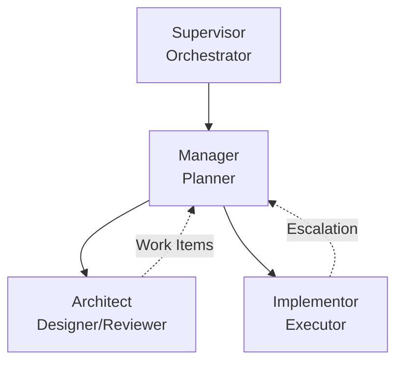

# Multi-Agent Workflow System

This skill defines a hierarchical multi-agent workflow for complex software engineering tasks that require separation of design from implementation.

## When to Use

Use this workflow when:
- Tasks are too large or complex for a single agent
- Architectural decisions need to be validated before implementation
- Multiple implementation passes with review cycles are needed
- Clear separation of concerns between design and implementation is required

## Workflow Architecture

The workflow consists of four specialized roles working in sequence:



### Execution Model

**Sequential by Design**: The Supervisor ensures agents execute one at a time in a defined order. This prevents race conditions and ensures each agent works with consistent state.

## Roles

### Supervisor

**Purpose**: Dumb orchestrator that manages agent execution lifecycle.

**Key Constraints**:
- Only spawns agents based on kanban state
- Never makes decisions or interprets results
- Validates output format, not content
- Retries up to 3 times on format failures
- Fails workflow if retries exhausted

**Algorithm**: See `role-supervisor.md`

**Agent I/O Summary**:

| Agent | Input | Output |
|-------|-------|--------|
| Task Agent (Architect/Implementor) | `kanban_file: str, task_file: str` | None (ends with "DONE") |
| Manager | `kanban_file: str, done_task: str\|None, message: str\|None` | **JSON**: `{"next_task": str, "tasks": [...]}` |

### Manager

**Purpose**: Orchestrate workflow phases and task sequencing. **Manager is the ONLY role that updates kanban state.** Manager does NOT perform real work - only creates tasks and manages kanban.md.

**Key Design Decisions**:

1. **Manager Never Does Real Work**: Manager MUST NOT explore, edit files, execute shell commands, or make design decisions. Manager ONLY creates task files and updates kanban.md.

2. **One Work Item at a Time**: When replanning, Manager returns only the immediate next work item rather than all future work. This allows the workflow to adapt based on implementation results before committing to downstream tasks.

3. **Exploration Tasks for Missing Info**: If information is inadequate for planning, Manager creates exploration tasks delegated to other agents (typically Architect).

4. **Plan Adjustment Logging**: All plan changes are logged to kanban.md with timestamps and reasoning.

**Algorithm**: See `role-manager.md`

### Architect

**Purpose**: Design core systems and validate implementations.

**Task Title Convention**: Tasks for Architect must have titles starting with:
- `Design - ` for design phase tasks
- `Review - ` for review phase tasks

This allows Architect to determine mode without explicit mode field.

**Modes**:
- **DESIGN**: Create types.py and define test contracts
- **REVIEW**: Validate implementation quality

**Output Requirement**: MUST end response with message "DONE" to signal completion.

**Algorithm**: See `role-architect.md`

### Implementor

**Purpose**: Execute implementation tasks according to specification.

**Escalation Strategy**: When complexity exceeds capacity, Implementor escalates rather than attempting work beyond expertise. This maintains quality and allows Manager to replan with appropriate resources.

**Output Requirement**: MUST end response with message "DONE" to signal completion.

**Algorithm**: See `role-implementor.md`

## Skills Registry

| Skill | Location | Used By | Description |
|-------|----------|---------|-------------|
| `docs` | `.agents/skills/docs/SKILL.md` | All | Documentation conventions, mermaid validation |
| `testing` | `.agents/skills/testing/SKILL.md` | Implementor | Test running and debugging |
| `deployment` | `.agents/skills/deployment/SKILL.md` | Manager | Production deployment |
| `python-project` | `/home/liu/.claude/skills/python-project/SKILL.md` | Implementor | Python project management with uv |
| `code-reading` | `.agents/skills/code-reading-assistant/SKILL.md` | All | Codebase exploration and Q&A |
| `skill-management` | `.agents/skills/skill-management/SKILL.md` | All | Skill catalog and navigation |

## Helper Scripts

This skill includes executable Python scripts in `scripts/` for managing tasks and kanbans:

### create-task.py
Creates task files with validated YAML headers. Only Manager and users can create tasks.
```bash
.agents/skills/workflow/scripts/create-task.py \
    --role Architect \
    --expertise "System Design" \
    --kanban tasks/0-kanban.md \
    --creator-role manager \
    --title "Design API"
```

### create-kanban.py
Creates kanban files with exploration task:
```bash
.agents/skills/workflow/scripts/create-kanban.py \
    --title "API Refactor" \
    --request "Refactor the API layer"
```

### log-task.py
Logs work using subcommands (generate/commit/quick):
```bash
# Phase 1: Generate temp file
TEMP=$(.agents/skills/workflow/scripts/log-task.py generate tasks/0-task.md "Analysis")

# Phase 2: Commit after editing
.agents/skills/workflow/scripts/log-task.py commit tasks/0-task.md "Analysis" $TEMP

# Or use quick mode for simple logs
.agents/skills/workflow/scripts/log-task.py quick tasks/0-task.md "Fix" "Fixed bug"
```

All scripts use PEP 723 inline dependencies and can be run directly with `./script.py`.
See `scripts/README.md` for full documentation.

## Workflow Patterns

**Manager MUST consult `patterns.md` when creating tasks** to apply the correct workflow sequence.

### Pattern Quick Reference

| Pattern | Trigger | Structure |
|---------|---------|-----------|
| **Simple** | Small changes, no core types | Single Implementor task |
| **Design-First** | New features, core types, architecture | Design → [Review] → Implement |
| **Validate-Before-Continue** | Must gate downstream work | Review task as dependency |
| **Escalation Recovery** | Work log has `ESCALATE`/`BLOCKED` | Redesign → Re-implement |
| **Discovery** | Missing information for planning | Exploration → Manager decides |
| **Integration** | Multiple parallel streams converge | Parallel → Integration task |

**See `patterns.md` for:
- Detailed task structures (role, type, dependencies, skills)
- Pattern selection guide
- Pattern composition rules**

## Skill Loading Rules

- **Manager**: Must load `skill-management` first to discover other skills
- **Architect**: Must load `code-reading` and domain-specific skills
- **Implementor**: Must load skills specified in task file meta

In task files:
```yaml
skills: [python-project, testing]
```

## Work Log Requirement

**⚠️ CRITICAL**: You MUST read `work-log.md` before writing any work log.

All agents must write a work log before completing their task. Work logs are the primary communication mechanism between agents.

### Required Structure

Every work log MUST include three sections:

| Section | Key | Required | Description |
|---------|-----|----------|-------------|
| Facts | **F:** | Yes | What was done (files, code, tests) |
| Analysis | **A:** | Yes | Problems, alternatives, decisions |
| Conclusion | **C:** | Yes | Status (ok/blocked/escalate), next steps |

### Optional Sections

| Section | When to Use |
|---------|-------------|
| Suggested Work Items | Architect proposing tasks for Manager |
| Blockers | When status = blocked |
| References | Links to docs, related tasks |
| Plan Adjustment Log | Manager recording plan changes |

### Status Values

- `ok` - Task completed successfully
- `blocked` - Cannot proceed, needs help
- `escalate` - Needs different expertise

### Constraint

**You MUST write a work log before completing.** No exceptions.

## Rationale: Design Decisions

### Why Sequential Execution?

Sequential execution (one agent at a time) ensures:
- Consistent file system state for each agent
- Clear accountability for each step
- Predictable debugging when issues arise
- Manager has complete context for planning decisions

### Why One Work Item at a Time?

Returning one work item per planning cycle allows:
- Dynamic replanning based on implementation results
- Early discovery of architectural issues before committing to full task list
- Reduced waste from over-planning
- Adaptation to changing requirements

### Why Expertise Field?

The `expertise` field in task metadata allows:
- Self-assessment before attempting work
- Clear escalation criteria
- Appropriate agent selection by Manager
- Documentation of required domain knowledge

### Why Work Logs?

Mandatory work logging ensures:
- Handoff context for multi-agent workflows
- Audit trail for debugging
- Knowledge capture for future similar tasks
- Accountability for decisions made
