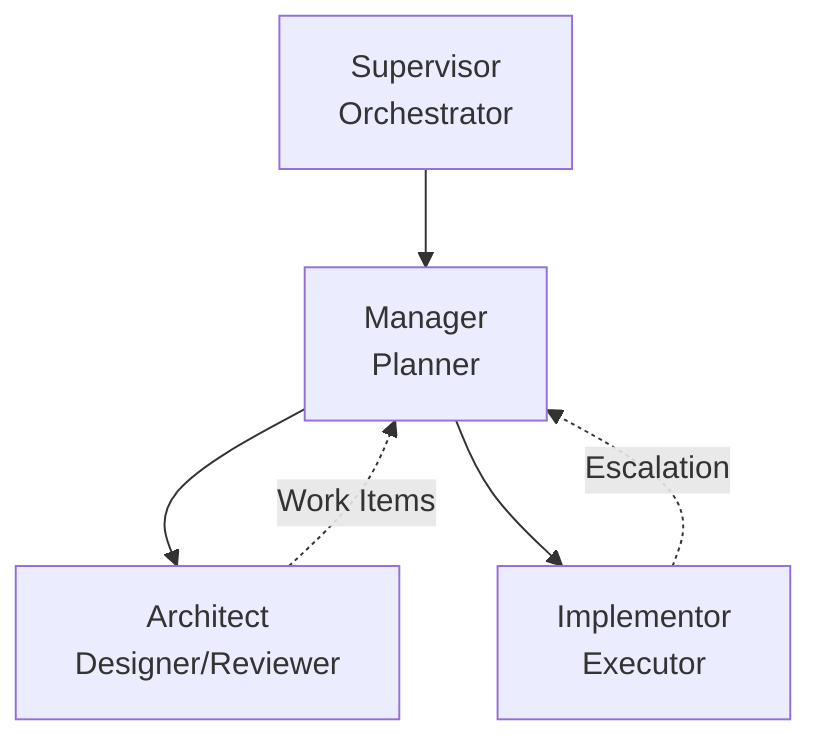

# Multi-Agent Workflow System

This skill defines a hierarchical multi-agent workflow for complex software engineering tasks that require separation of design from implementation.

## When to Use

Use this workflow when:
- Tasks are too large or complex for a single agent
- Architectural decisions need to be validated before implementation
- Multiple implementation passes with review cycles are needed
- Clear separation of concerns between design and implementation is required

## Workflow Architecture

The workflow consists of four specialized roles working in sequence:



### Execution Model

**Sequential by Design**: The Supervisor ensures agents execute one at a time in a defined order. This prevents race conditions and ensures each agent works with consistent state.

## Roles

### Supervisor

**Purpose**: Dumb orchestrator that manages agent execution lifecycle.

**Key Constraints**:
- Only spawns agents based on kanban state
- Never makes decisions or interprets results
- Validates output format, not content
- Retries up to 3 times on format failures
- Fails workflow if retries exhausted

**Algorithm**: See `role-supervisor.md`

### Manager

**Purpose**: Orchestrate workflow phases and task sequencing. **Manager is the ONLY role that updates kanban state.** Manager does NOT perform real work - only creates tasks and manages kanban.md.

**Key Design Decisions**:

1. **Manager Never Does Real Work**: Manager MUST NOT explore, edit files, execute shell commands, or make design decisions. Manager ONLY creates task files and updates kanban.md.

2. **One Work Item at a Time**: When replanning, Manager returns only the immediate next work item rather than all future work. This allows the workflow to adapt based on implementation results before committing to downstream tasks.

3. **Exploration Tasks for Missing Info**: If information is inadequate for planning, Manager creates exploration tasks delegated to other agents (typically Architect).

4. **Plan Adjustment Logging**: All plan changes are logged to kanban.md with timestamps and reasoning.

**Algorithm**: See `role-manager.md`

### Architect

**Purpose**: Design core systems and validate implementations.

**Task Title Convention**: Tasks for Architect must have titles starting with:
- `Design - ` for design phase tasks
- `Review - ` for review phase tasks

This allows Architect to determine mode without explicit mode field.

**Modes**:
- **DESIGN**: Create types.py and define test contracts
- **REVIEW**: Validate implementation quality

**Algorithm**: See `role-architect.md`

### Implementor

**Purpose**: Execute implementation tasks according to specification.

**Escalation Strategy**: When complexity exceeds capacity, Implementor escalates rather than attempting work beyond expertise. This maintains quality and allows Manager to replan with appropriate resources.

**Algorithm**: See `role-implementor.md`

## Skills Registry

| Skill | Location | Used By | Description |
|-------|----------|---------|-------------|
| `docs` | `.agents/skills/docs/SKILL.md` | All | Documentation conventions, mermaid validation |
| `testing` | `.agents/skills/testing/SKILL.md` | Implementor | Test running and debugging |
| `deployment` | `.agents/skills/deployment/SKILL.md` | Manager | Production deployment |
| `python-project` | `/home/liu/.claude/skills/python-project/SKILL.md` | Implementor | Python project management with uv |
| `code-reading` | `.agents/skills/code-reading-assistant/SKILL.md` | All | Codebase exploration and Q&A |
| `skill-management` | `.agents/skills/skill-management/SKILL.md` | All | Skill catalog and navigation |

## Skill Loading Rules

- **Manager**: Must load `skill-management` first to discover other skills
- **Architect**: Must load `code-reading` and domain-specific skills
- **Implementor**: Must load skills specified in task file meta

In task files:
```yaml
skills: [python-project, testing]
```

## Work Log Definition

A work log is the primary communication mechanism between agents. It captures what was done, why decisions were made, and what comes next.

### Purpose

Work logs provide:
- **Traceability**: What was actually done vs what was planned
- **Accountability**: Clear record of decisions and actions
- **Handoff context**: Essential information for the next agent in the chain
- **Learning**: Pattern recognition across similar tasks

### Work Log Structure

Every work log entry follows this structure:

```markdown
### [timestamp] Title

**Facts:**
- List of concrete actions taken
- Files modified, code written, tests run
- Commands executed, data gathered

**Analysis:**
- Problems encountered
- Approaches considered
- Decisions made and why
- Trade-offs evaluated

**Conclusion:**
- Status: ok | blocked | escalate
- Summary of outcome
- Next steps or recommendations
```

### Optional Sections

Depending on the role and task, work logs may include:

#### Suggested Work Items (Architect)
```markdown
## Suggested Work Items (for Manager)

```yaml
work_items:
  - description: What needs to be done
    files: [src/file.py, tests/test_file.py]
    related_domains: ["Software Engineering", "Domain"]
    expertise_required: ["Skill1", "Skill2"]
    dependencies: [0]  # Indices of other work items
    priority: high     # critical | high | medium | low
    estimated_effort: medium  # small | medium | large
    notes: Additional context
```
```

#### References
```markdown
## References

- Design doc: docs/architecture/feature.md
- Related PR: #456
- External spec: https://example.com/spec
- Task dependencies: tasks/0-design.md
```

#### Blockers (if status = blocked)
```markdown
## Blockers

- **Blocker 1**: Description of what's blocking progress
  - Impact: What can't proceed
  - Possible solutions: Ideas for resolution
  - Required expertise: What help is needed
```

#### Plan Adjustments (Manager in kanban.md)
```markdown
## Plan Adjustment Log

### [timestamp] EVENT_TYPE

**Details:**
- **reason:** Why adjustment was needed
- **action:** What Manager did
- **next_step:** What happens next
```

### Work Log Placement

- **Architect/Implementor**: Append to the task file they're working on
- **Manager**: Append to kanban.md

### Escalation Work Logs

When escalating, work logs are **especially critical**:

```markdown
## Work Log - ESCALATION

### [timestamp] Blocked Implementation

**Facts:**
- Attempted implementation per spec
- Blocked at line 45: UserSchema missing required field

**Analysis:**
- Root cause: Core types incomplete for use case
- Attempted workaround: local schema extension (rejected - violates architecture)
- Required expertise: Need Architect to update types.py

**Conclusion:**
- **ESCALATE** to Architect
- Required: Update UserSchema in types.py to include email field
- Impact: All existing implementations need review

## Suggested Work Items

```yaml
work_items:
  - description: Fix UserSchema to include email field
    files: [src/types.py, tests/test_types.py]
    related_domains: ["System Design", "Type Systems"]
    expertise_required: ["Type Design", "Schema Validation"]
    priority: critical
    notes: This is blocking all auth implementation
```
```

### Constraint

**You MUST write a work log before completing.** No exceptions. Even for failures, the work log documents what was attempted and why it failed.

---

## Work Logging Requirement

All agents **must** write a work log before completing their task, regardless of success or failure.

### Content Requirements by Role

Every work log must include the three core sections:
1. **Facts**: What was actually done (files modified, code written, tests run)
2. **Analysis**: What problems were encountered, what approaches were tried
3. **Conclusion**: Pass/fail/escalate status and why

### Work Log Format by Role

#### Architect (writes to task.md)

```markdown
## Work Log

### [2026-02-25 14:30:00] Design Session

**Facts:**
- Analyzed requirements from user request
- Defined 3 new types in types.py: User, Role, Permission
- Created test contracts in tests/test_auth.py
- Reviewed existing User class in models.py

**Analysis:**
- Identified ambiguity in permission inheritance
- Considered RBAC vs ABAC models, chose RBAC for simplicity
- Noticed existing User class needs deprecation path

**Conclusion:**
- Design complete, ready for implementation
- 2 work items identified for Manager to create
- Future issue: Need migration path for existing User class

## Suggested Work Items (for Manager)

```yaml
work_items:
  - description: Implement User model with validation
    files: [src/models/user.py, tests/test_user.py]
    related_domains: ["Software Engineering", "Database Design"]
    expertise_required: ["Python", "SQLAlchemy", "Data Validation"]
    dependencies: []
    priority: high
    estimated_effort: medium
    notes: Must support email validation per RFC 5322
    
  - description: Implement Role-based permission system
    files: [src/auth/permissions.py, tests/test_permissions.py]
    related_domains: ["Software Engineering", "Security"]
    expertise_required: ["Python", "Access Control"]
    dependencies: [0]
    priority: medium
    estimated_effort: medium
    notes: Depends on User model completion
```

## References

- Design doc: docs/architecture/auth-system.md
- Related issue: #123
- External spec: https://datatracker.ietf.org/doc/html/rfc5322
```

#### Implementor (writes to task.md)

```markdown
## Work Log

### [timestamp] Implementation

**Facts:**
- Modified src/auth/models.py: added UserSchema class
- Modified src/auth/routes.py: updated login endpoint
- Tests pass: 12/12

**Analysis:**
- Had to deviate from spec: email validation requires regex not in types.py
- Alternative considered: use external library, decided against to minimize deps

**Conclusion:**
- Implementation complete, ready for review
- Note: Email validation regex may need refinement per RFC 5322
```

#### Manager (writes to kanban.md)

Manager maintains TWO logs in kanban.md:

**Work Log** (per session):
```markdown
## Work Log

### [timestamp] Planning Session

**Facts:**
- Read work items from tasks/0-design-core.md
- Created task file: tasks/1-implement-models.md
- Set dependencies: task/2 depends on task/1

**Analysis:**
- Work item requires architecture review before implementation
- Detected potential dependency chain complexity

**Conclusion:**
- Next task: tasks/1-implement-models.md
- Will create implementation task after review passes
```

**Plan Adjustment Log** (all significant decisions):
```markdown
## Plan Adjustment Log

### [timestamp] BLOCKER_DETECTED

**Details:**
- **blocked_task:** tasks/3-implementation.md
- **blocker:** Missing type information for User model
- **action:** Created exploration task to resolve blocker
- **exploration_task:** tasks/4-explore-user-model.md
```

## Rationale: Design Decisions

### Why Sequential Execution?

Sequential execution (one agent at a time) ensures:
- Consistent file system state for each agent
- Clear accountability for each step
- Predictable debugging when issues arise
- Manager has complete context for planning decisions

### Why One Work Item at a Time?

Returning one work item per planning cycle allows:
- Dynamic replanning based on implementation results
- Early discovery of architectural issues before committing to full task list
- Reduced waste from over-planning
- Adaptation to changing requirements

### Why Expertise Field?

The `expertise` field in task metadata allows:
- Self-assessment before attempting work
- Clear escalation criteria
- Appropriate agent selection by Manager
- Documentation of required domain knowledge

### Why Work Logs?

Mandatory work logging ensures:
- Handoff context for multi-agent workflows
- Audit trail for debugging
- Knowledge capture for future similar tasks
- Accountability for decisions made
