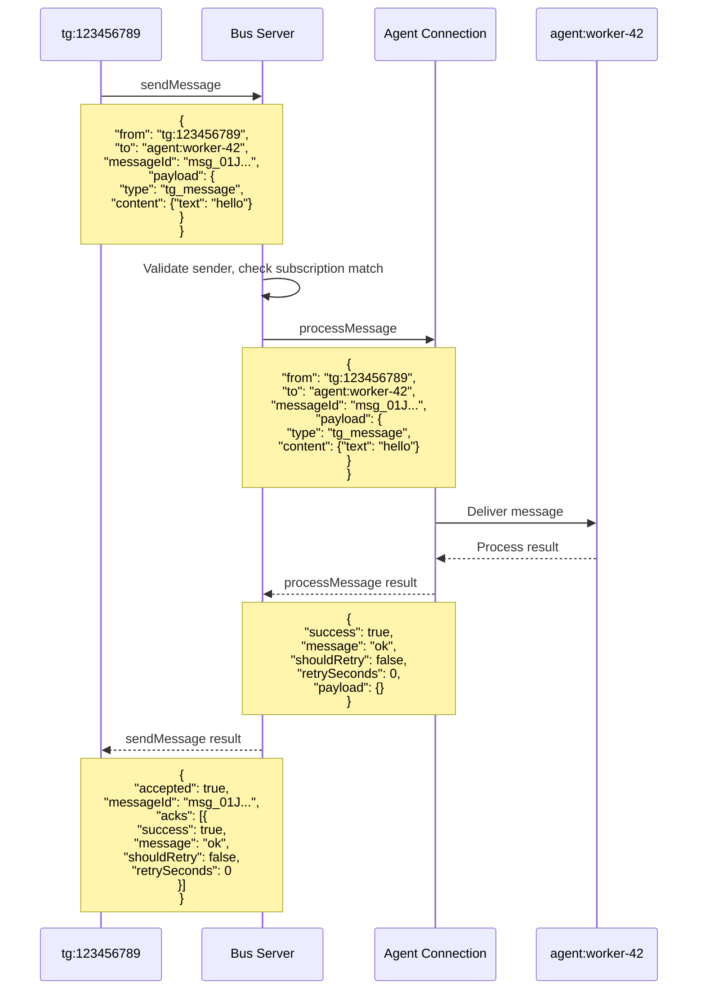

# Agent Communication Protocol (Extended v2)

This document defines the authoritative JSON-RPC protocol for Bub peers communicating over WebSocket.

This is the only supported protocol. Backward compatibility with earlier protocol variants is out of scope.

## Table of Contents

1. [Scope and Principles](#1-scope-and-principles)
2. [Roles](#2-roles)
3. [Transport](#3-transport)
4. [Connection Lifecycle](#4-connection-lifecycle)
5. [Methods](#5-methods)
6. [Address Conventions](#6-address-conventions)
7. [Message Envelope](#7-message-envelope)
    - [7.1 Request Envelope (params)](#71-request-envelope-params)
    - [7.2 Payload Fields](#72-payload-fields)
    - [7.3 Routing Rules](#73-routing-rules)
8. [Message Flow: sendMessage/processMessage](#8-message-flow-sendmessageprocessmessage)
9. [Application Message Types (Payload)](#9-application-message-types-payload)
10. [TG Empty-Channel Bootstrap Flow](#10-tg-empty-channel-bootstrap-flow)
11. [System Agent and Agent Spawning](#11-system-agent-and-agent-spawning)
12. [Direct Messaging with From/To Headers](#12-direct-messaging-with-fromto-headers)
13. [Implementation Notes](#13-implementation-notes)
    - [13.1 Agent Startup](#131-agent-startup)
    - [13.2 Agent State](#132-agent-state)
    - [13.3 Systemd Integration](#133-systemd-integration)
    - [13.4 Workspace Management](#134-workspace-management)
    - [13.5 Sessions Tracking](#135-sessions-tracking)
14. [Delivery and Retry Ownership](#14-delivery-and-retry-ownership)
15. [Activity Logging (SQLite, Append-Only)](#15-activity-logging-sqlite-append-only)
16. [Error Codes](#16-error-codes)
17. [Non-Goals](#17-non-goals)
18. [Appendix A: Role/Type Authorization Matrix (Future)](#appendix-a-roletype-authorization-matrix-future)

## 1. Scope and Principles

- Transport is JSON-RPC 2.0 over WebSocket.
- All participants are peers connected to the same bus.
- **Addressing model**: Explicit `from`/`to` addressing (like IP), not topic-based pub/sub.
- Bus-to-peer delivery uses `processMessage` only.
- Peer-to-bus publish uses `sendMessage` only.
- No protocol version negotiation (the whole software stack uses a single version).
- No compatibility fallback.
- Delivery is in-memory at runtime.
- Bus writes persistent append-only activity logs to SQLite for audit/debug.

## 2. Roles

- `bus`: Message router and delivery coordinator.
- `tg:{chat_id}` peer: Telegram bridge peer per chat identity, tracks chat state, agent assignment, and retry queue.
- `telegram-bridge`: System component that manages all `tg:*` addresses. Acts as a router between Telegram Bot API and the bus, spawning/managing individual `tg:{chat_id}` peers.
- `agent:system`: System agent that spawns/assigns conversation agents via systemd. Started by deployment script (not dynamically spawned).
- `agent:{id}` peer: Conversation agent assigned to one or more addresses, configured with `talkto` for direct messaging.

## 3. Transport

- WebSocket URL: `ws://host:port` or `wss://host:port`.
- Encoding: UTF-8 JSON.
- JSON-RPC envelope must be valid per spec.

## 4. Connection Lifecycle

### 4.1 Initialize Required

First request after connect must be `initialize`.

Client request:

```json
{
  "jsonrpc": "2.0",
  "id": 1,
  "method": "initialize",
  "params": {
    "clientId": "agent:system",
    "clientInfo": {
      "name": "bub",
      "version": "0.2.0"
    }
  }
}
```

Server response:

```json
{
  "jsonrpc": "2.0",
  "id": 1,
  "result": {
    "serverId": "bus-abc",
    "serverInfo": {
      "name": "bub-bus",
      "version": "0.2.0"
    },
    "capabilities": {
      "subscribe": true,
      "processMessage": true,
      "addresses": ["tg:*", "agent:*", "system:*"]
    }
  }
}
```

**Notes:**
- `clientId` identifies the connection to the bus, but clients may send messages with a `from` field different from their `clientId` (e.g., routers forwarding on behalf of others).
- The `version` field is informational only; the entire software stack uses a single protocol version without negotiation.

## 5. Methods

## 5.1 subscribe

Subscribe connection to receive messages matching an address pattern.

**Note**: While messages are routed by explicit `to` addresses (like IP), peers subscribe to address patterns (like firewall rules or routing table entries) to indicate which destinations they can handle. The protocol supports fan-out to multiple peers, though the system typically maintains only one subscriber per pattern.

Request:

```json
{
  "jsonrpc": "2.0",
  "id": 2,
  "method": "subscribe",
  "params": {
    "address": "tg:*"
  }
}
```

Response:

```json
{
  "jsonrpc": "2.0",
  "id": 2,
  "result": {
    "success": true
  }
}
```

Rules:
- Subscriptions are a set of address patterns (e.g., `tg:*`, `agent:worker-42`).
- Subscriptions are connection-scoped.
- No subscription ID.
- Bus routes messages to **all** peers whose subscriptions match the message's `to` address.
- **Multiple Subscribers**: All matching peers receive the message (fan-out). Order is not guaranteed; peers should be independent.
- **Auto-Subscription**: The bus automatically subscribes each connection to its own `client_id` address upon initialization. Peers don't need to explicitly subscribe to their own address.

## 5.2 unsubscribe

Unsubscribe by exact address pattern string.

Request:

```json
{
  "jsonrpc": "2.0",
  "id": 3,
  "method": "unsubscribe",
  "params": {
    "address": "tg:*"
  }
}
```

Response:

```json
{
  "jsonrpc": "2.0",
  "id": 3,
  "result": {
    "success": true
  }
}
```

Rules:
- Removes the exact address pattern from the connection subscription set.
- After unsubscribing, peer will no longer receive messages matching that pattern.

## 5.3 sendMessage (peer -> bus)

Peer sends a message to a destination address.

Request:

```json
{
  "jsonrpc": "2.0",
  "id": 4,
  "method": "sendMessage",
  "params": {
    "from": "tg:123456789",
    "to": "agent:worker-42",
    "messageId": "msg_01J...",
    "payload": {
      "type": "tg_message",
      "content": { "text": "hello" }
    }
  }
}
```

Response:

```json
{
  "jsonrpc": "2.0",
  "id": 4,
  "result": {
    "accepted": true,
    "messageId": "msg_01J...",
    "acks": [
      {
        "success": true,
        "message": "ok",
        "shouldRetry": false,
        "retrySeconds": 0,
        "payload": {}
      }
    ]
  }
}
```

**Request Params:**
- `from` (string, required): Source address of the sender.
- `to` (string, required): Destination address.
- `messageId` (string, required): Arbitrary ID generated by the client; the bus server uses it only for logging and correlation.
- `payload` (object, required): The message payload. See `agent-messages.md` for payload structure.

**Response Fields:**
- `accepted` (boolean): Whether the bus accepted the message for delivery.
- `messageId` (string): The message ID from the request.
- `acks` (array): Individual ProcessMessageResult from each recipient. Use `len(acks)` to get delivery count.

Notes:
- `to` field specifies the destination address (like IP destination).
- `from` field specifies the source address (sender identity).
- Bus routes message to peer matching `to` address via `processMessage`.
- `sendMessage` confirms bus acceptance and returns individual acks from recipients.
- `stopPropagation` is not part of v2.
- Delivery policy object may be added later.
- **Ordering**: Message delivery order is not guaranteed.
- **Message IDs**: The `messageId` in params is the protocol-level ID used by the bus for logging/correlation. The application-level payload may also include a `messageId` for application-specific tracking (e.g., to reference specific Telegram messages). These are independent and serve different purposes.

## 5.4 processMessage (bus -> peer)

Bus delivers message to destination peer.

Request:

```json
{
  "jsonrpc": "2.0",
  "id": 5,
  "method": "processMessage",
  "params": {
    "from": "tg:123456789",
    "to": "agent:worker-42",
    "messageId": "msg_01J...",
    "payload": {
      "type": "configure",
      "content": { "talkto": "tg:123456789" }
    }
  }
}
```

**Params Fields:**
- `from` (string, required): Source address of the sender. Note: In JSON-RPC this is `from`, but in Python code it's `from_` since `from` is a reserved keyword. Clients may send messages with `from` different from their `client_id` (e.g., a router forwarding messages on behalf of other peers).
- `to` (string, required): Destination address. Required because the destination may be a group address that the client subscribes to (different from the client's own ID).
- `messageId` (string, required): Arbitrary ID generated by the client; the bus server uses it only for logging and correlation.
- `payload` (object, required): The message payload containing type, content, etc. See `agent-messages.md` for payload structure.

**Response Fields:**
- `success` (boolean): Whether processing succeeded.
- `message` (string): Human-readable status message.
- `shouldRetry` (boolean): Whether the sender should retry.
- `retrySeconds` (integer): Seconds to wait before retry (if `shouldRetry` is true).
- `payload` (object): Response payload from the peer.

Response:

```json
{
  "jsonrpc": "2.0",
  "id": 5,
  "result": {
    "success": true,
    "message": "configured",
    "shouldRetry": false,
    "retrySeconds": 0,
    "payload": {}
  }
}
```

Rules:
- Bus waits for each target peer `processMessage` response.
- If peer is offline/unavailable, bus marks failure in activity log.
- Retry policy is peer-managed for now (for example tg peer retry queue).

## 5.5 ping

Liveness check.

## 6. Address Conventions

Addresses use hierarchical naming with `:` separator (similar to IP addressing):

- `tg:{chat_id}`: Telegram chat address (e.g., `tg:123456789`).
- `agent:{agent_id}`: Direct agent address (e.g., `agent:worker-42`).
- `system:spawn`: System agent spawn service address.
- `system:route`: Routing/assignment service address.

**Address Patterns:**
- `tg:*`: All Telegram chats (subscription wildcard).
- `agent:*`: All agents (subscription wildcard).
- `system:*`: All system services.

## 7. Message Envelope

The protocol defines two distinct layers: **protocol-level addressing** (used by the bus for routing) and **application-level payload** (content handled by agents).

### 7.1 Protocol-Level Fields (`params`)

These fields are used by the bus for message routing and tracking:

**sendMessage params:**
- `to` (string, required): Destination address.
- `messageId` (string, required): Globally unique message ID for this message.
- `payload` (object, required): Application-level message content (opaque to the protocol).

**processMessage params:**
- `from` (string, required): Source address of the sender.
- `to` (string, required): Destination address.
- `messageId` (string, required): Globally unique message ID.
- `payload` (object, required): Application-level message content.

### 7.2 Application-Level Payload

The `payload` field contains the application message content. The protocol treats `payload` as opaque - it simply delivers whatever content is provided.

> **Note**: Payload structure is defined in `agent-messages.md`. Protocol examples below show minimal payload for demonstration only.

### 7.3 Routing Rules

1. **Primary Routing**: `params.to` is the decisive destination field.
2. **Source Address**: In `processMessage`, `params.from` identifies the sender for routing/tracking purposes.
3. **Subscription Matching**: Bus uses address patterns to match subscriptions:
   - Exact match: `agent:worker-42` matches subscription to `agent:worker-42`
   - Wildcard match: `tg:123456789` matches subscription to `tg:*`
4. **Direct Delivery**: Messages are routed to the peer whose client_id matches `to`.

**IP Protocol Analogy:**
- Like IP, we have explicit `from` (source) and `to` (destination) addresses.
- The bus acts like a router, forwarding packets to the correct destination.
- Subscriptions are like routing table entries matching destination patterns.

## 8. Message Flow: sendMessage/processMessage

This section describes the complete flow when a peer sends a message to another peer via the bus.



**Key Points:**

1. **sendMessage (Peer → Bus)**: The sender includes `from` in params. The bus validates that the sender is authorized to send from this address.

2. **processMessage (Bus → Peer)**: The bus forwards the message to all subscribers matching the `to` address. Each subscriber receives a processMessage call with `from` indicating the original sender.

3. **Response Aggregation**: The bus collects all individual processMessage results and returns them as an array in `acks`. The sender can inspect each ack to see if delivery succeeded.

## 9. Application Message Types (Payload)

Common payload types include: `spawn_request`, `spawn_result`, `configure`, `tg_message`, `tg_reply`.

> See `agent-messages.md` for complete payload definitions.


## 18. TG Empty-Channel Bootstrap Flow

When `tg:{chat_id}` has no assigned agent:

1. TG peer sends `spawn_request` to `system:spawn` with `chat_id` and `channel`.
2. Bus routes to `agent:system` via `processMessage`.
3. `agent:system` generates unique `agent:{id}` and workspace path.
4. `agent:system` creates workspace directory `/run/bub/workspaces/{channel}:{chat_id}` (e.g., `/run/bub/workspaces/telegram:123456789`).
5. `agent:system` writes session entry to `/run/bub/sessions.json` with `status: spawning`.
6. `agent:system` uses systemd to spawn agent with `--workspace` parameter.
7. `agent:system` sends `spawn_result` to `tg:{chat_id}` with assigned `agent:{id}`.
8. `agent:system` updates session entry to `status: running`.
9. TG peer sends `configure` to `agent:{id}` with `content.talkto = "tg:{chat_id}"`.
10. TG peer forwards user text as `tg_message` to assigned `agent:{id}`.
11. Agent responds with `tg_reply` to `tg:{chat_id}`.
12. On agent exit, `agent:system` detects via systemd and updates session to `status: stopped`.

This makes TG peer stateful and self-healing across temporary peer outages/restarts.

## 18. System Agent and Agent Spawning

### 11.1 System Agent Role

The system agent (`agent:system`) is a special peer responsible for:
- Receiving spawn requests from other peers
- Spawning new conversation agents via systemd
- Managing agent lifecycle

### 11.2 Spawn Request

When a new chat needs an agent, the telegram-bridge sends a spawn request:

```json
{
  "jsonrpc": "2.0",
  "id": 10,
  "method": "sendMessage",
  "params": {
    "from": "tg:123456789",
    "to": "system:spawn",
    "messageId": "msg_01J...",
    "payload": {
      "type": "spawn_request",
      "from": "tg:123456789",
      "timestamp": "2026-02-17T12:00:00Z",
      "content": {
        "chat_id": "123456789",
        "channel": "telegram"
      }
    }
  }
}
```

### 11.3 System Agent Spawn Process

The system agent:
1. Receives the spawn request via `processMessage`
2. Generates a unique agent ID (e.g., `agent:worker-abc123`)
3. Uses systemd to spawn a new agent process:
   ```bash
   systemd-run --user bub agent --client-id agent:worker-abc123 --talkto tg:123456789
   ```
4. Waits for agent to connect to the bus
5. Sends `spawn_result` back to the requesting peer:

```json
{
  "jsonrpc": "2.0",
  "id": 11,
  "method": "sendMessage",
  "params": {
    "from": "agent:system",
    "to": "tg:123456789",
    "messageId": "msg_01J...",
    "payload": {
      "type": "spawn_result",
      "from": "agent:system",
      "timestamp": "2026-02-17T12:00:01Z",
      "content": {
        "success": true,
        "client_id": "agent:worker-abc123",
        "status": "running"
      }
    }
  }
}
```

### 11.4 Talkto Configuration

After spawning, the telegram-bridge configures the new agent with its `talkto` target:

```json
{
  "jsonrpc": "2.0",
  "id": 12,
  "method": "sendMessage",
  "params": {
    "from": "tg:123456789",
    "to": "agent:worker-abc123",
    "messageId": "msg_01J...",
    "payload": {
      "type": "configure",
      "from": "tg:123456789",
      "timestamp": "2026-02-17T12:00:02Z",
      "content": {
        "talkto": "tg:123456789"
      }
    }
  }
}
```

The agent stores this `talkto` as its default destination for all LLM responses.

## 18. Direct Messaging with From/To Headers

### 13.1 Message Passing Between Peers

The protocol provides explicit `from` and `to` addressing at the params level for routing. Applications may also include addressing information in the payload for their own purposes:

```json
{
  "jsonrpc": "2.0",
  "id": 13,
  "method": "sendMessage",
  "params": {
    "from": "tg:123456789",
    "to": "agent:worker-abc123",
    "messageId": "msg_01J...",
    "payload": {
      "type": "tg_message",
      "content": { "text": "Hello, how are you?" }
    }
  }
}
```

**Protocol fields:**
- `params.to`: The destination address (decisive routing field, like IP destination)
- `params.from` (in processMessage): The source address for routing/tracking

**Application fields** (in payload, defined in agent-messages.md):
- Applications may include their own `from` field in payload for content-level addressing

### 13.2 LLM Direct Style Input

LLMs naturally work in a **direct conversation style** - they receive input and produce output without explicit addressing. To bridge this gap:

**When message arrives matching `talkto`:**
- The message is from the peer the agent is talking to
- Pass content **directly** to LLM as user input

```python
if message.from == agent.talkto:
    # Direct conversation - no headers needed
    llm_input = message.content.text
```

**When message arrives from other peers:**
- Include a "from" header so LLM knows who is speaking
- Format: `[from:{sender_id}] {content}`

```python
else:
    # Message from third party - add from header
    llm_input = f"[from:{message.from}] {message.content.text}"
```

### 13.3 LLM Output Routing

When the LLM produces a response:

1. **If agent has `talkto` configured:**
   - Send response directly to `talkto` peer
   - Message type: `tg_reply`

```json
{
  "jsonrpc": "2.0",
  "id": 14,
  "method": "sendMessage",
  "params": {
    "from": "agent:worker-abc123",
    "to": "tg:123456789",
    "messageId": "msg_01J...",
    "payload": {
      "type": "tg_reply",
      "from": "agent:worker-abc123",
      "timestamp": "2026-02-17T12:00:04Z",
      "content": {
        "text": "I'm doing well, thank you!"
      }
    }
  }
}
```

2. **If agent needs to send to a different peer:**
   - Use explicit addressing in the response
   - This is handled by higher-level logic (e.g., tool calls)

### 13.4 Example Message Flow

**Scenario:** Telegram user chatting with Bub

```
User (tg:123456789)              Agent (agent:worker-abc123, talkto=tg:123456789)
       |                                              |
       | 1. tg_message (from: tg:123456789)          |
       |--------------------------------------------->|
       |    LLM input: "Hello"                        |
       |                                              |
       | 2. tg_reply (from: agent:worker-abc123)      |
       |<---------------------------------------------|
       |    LLM output: "Hi there!"                   |
       |                                              |
```

**With third-party message:**

```
System (agent:system)            Agent (agent:worker-abc123, talkto=tg:123456789)
       |                                              |
       | 1. agent_event (from: agent:system)          |
       |--------------------------------------------->|
       |    LLM input: "[from:agent:system] Config updated"
       |                                              |
       | 2. tg_reply (to: tg:123456789)               |
       |<--(relayed by agent)--->|                    |
                              Telegram User
```

## 18. Implementation Notes

### 13.1 Agent Startup

Agents must be started with:
- `--client-id <client_id>`: Bus client identifier (e.g., `agent:worker-abc123`)
- `--talkto <peer_id>`: Default destination for responses (optional, can be configured later)
- `--workspace <path>`: Isolated workspace directory for this agent (required for data isolation)

Example:
```bash
bub agent \
  --client-id agent:worker-abc123 \
  --talkto tg:123456789 \
  --workspace /run/bub/workspaces/telegram:123456789
```

### 13.2 Agent State

Each agent maintains:
- `client_id`: Its bus identifier (from `--client-id`, used for addressing)
- `talkto`: The peer it should send responses to
- `workspace`: Isolated workspace directory for data storage
- `inbound_handler`: Handler for incoming messages
- `outbound_handler`: Handler for outgoing responses

### 13.3 Systemd Integration

The system agent spawns agents using systemd-run for process management:

```python
# System agent spawns new agent
subprocess.run([
    "systemd-run", "--user", "--unit", f"bub-agent-{client_id}",
    "bub", "agent",
    "--client-id", client_id,   # e.g., "agent:worker-abc123"
    "--talkto", talkto,         # e.g., "tg:123456789"
    "--workspace", workspace    # e.g., "/run/bub/workspaces/telegram:123456789"
])
```

This provides:
- Automatic restart on failure
- Resource limits
- Logging via journald
- Clean shutdown handling

### 13.4 Workspace Management

Each agent **must** be assigned its own workspace directory for data isolation. The workspace path is independent of the `talkto` address - they are both configured by the system agent but serve different purposes.

**Workspace Configuration:**
- `--workspace <path>`: Path to agent's isolated workspace directory
- **Naming Convention**: `/run/bub/workspaces/{channel}:{chat_id}`
  - Example: `/run/bub/workspaces/telegram:123456789`
  - Maps directly to the chat/channel for easy tracing

**Example:**
```bash
bub agent \
  --client-id agent:worker-abc123 \
  --talkto tg:123456789 \
  --workspace /run/bub/workspaces/telegram:123456789
```

**Workspace Structure:**
```
/run/bub/workspaces/telegram:123456789/
├── config.json           # Agent configuration
├── data/                 # Agent data files
└── logs/                 # Agent-specific logs
```

**Workspace vs Talkto Relationship:**

While `workspace` and `talkto` often correspond (both related to the same chat), **they are managed independently by the system agent**:

- **`talkto`**: Logical peer ID for message routing (e.g., `tg:123456789`)
- **`workspace`**: Physical filesystem path for data isolation (e.g., `/run/bub/workspaces/telegram:123456789`)

**From the agent's perspective:**
- The agent receives both values as startup parameters
- It doesn't need to know the relationship between them
- It simply uses `workspace` for storage and `talkto` for message routing

**System agent's responsibility:**
- Creates workspace at path based on `{channel}:{chat_id}`
- Spawns agent with matching `talkto` (the peer ID format)
- Maintains the mapping in `sessions.json`

This allows flexibility:
- Workspace can be moved/changed without affecting message routing
- An agent's `talkto` can be reconfigured without moving data

**Note on Implementation Details:**
- Individual agents may use the workspace for various purposes (tape storage, local cache, etc.)
- These are implementation-specific and not part of the protocol
- The protocol only specifies that each agent gets an isolated workspace directory

### 13.5 Sessions Tracking

The system agent maintains a `sessions.json` file to track all dynamically spawned agents:

**File Location:**
```
/run/bub/sessions.json
```

**Schema:**
```json
{
  "version": "1.0",
  "updated_at": "2026-02-18T12:00:00Z",
  "sessions": {
    "agent:worker-abc123": {
      "client_id": "agent:worker-abc123",
      "chat_id": "123456789",
      "channel": "telegram",
      "talkto": "tg:123456789",
      "workspace": "/run/bub/workspaces/telegram:123456789",
      "systemd_unit": "bub-agent-worker-abc123",
      "status": "running",
      "created_at": "2026-02-18T11:55:00Z",
      "last_activity": "2026-02-18T12:00:00Z"
    },
    "agent:worker-def456": {
      "client_id": "agent:worker-def456",
      "chat_id": "987654321",
      "channel": "telegram",
      "talkto": "tg:987654321",
      "workspace": "/run/bub/workspaces/telegram:987654321",
      "systemd_unit": "bub-agent-worker-def456",
      "status": "stopped",
      "created_at": "2026-02-18T10:00:00Z",
      "last_activity": "2026-02-18T11:30:00Z",
      "stopped_at": "2026-02-18T11:45:00Z"
    }
  }
}
```

**Session Lifecycle:**

1. **Spawn Phase:**
   ```json
   {
     "agent:worker-abc123": {
       "status": "spawning",
       "created_at": "2026-02-18T11:55:00Z"
     }
   }
   ```

2. **Running Phase:**
   ```json
   {
     "agent:worker-abc123": {
       "status": "running",
       "last_activity": "2026-02-18T12:00:00Z"
     }
   }
   ```

3. **Stop Phase:**
   ```json
   {
     "agent:worker-abc123": {
       "status": "stopped",
       "stopped_at": "2026-02-18T12:30:00Z"
     }
   }
   ```

**System Agent Responsibilities:**
- Create workspace directory before spawning
- Write session entry with `status: spawning`
- Monitor agent process via systemd
- Update `last_activity` on each message
- Mark session as `stopped` on exit
- Cleanup old sessions (configurable retention)

**Session Lookup:**
```python
# Find agent by chat_id
def find_agent_by_chat(chat_id: str) -> str | None:
    for client_id, session in sessions.items():
        if session["chat_id"] == chat_id and session["status"] == "running":
            return client_id
    return None
```

**Full Spawn Command:**
```bash
systemd-run \
  --user \
  --unit "bub-agent-worker-abc123" \
  --property WorkingDirectory=/run/bub/workspaces/telegram:123456789 \
  bub agent \
    --client-id agent:worker-abc123 \
    --talkto tg:123456789 \
    --workspace /run/bub/workspaces/telegram:123456789
```

**Timeouts:**
- Spawn timeout: 30 seconds (default)
- Process timeout: 60 seconds (default)
- These are sensible defaults; specific values may be configured in later versions.

## 18. Delivery and Retry Ownership

- Bus: in-memory delivery only.
- TG peer: durable mapping `chat_id -> assigned agent`, message history, retry queue.
- Agent peer: may keep local resend/outbox for critical responses.

If target peer is offline, sender-side peer retries after reconnect based on its queue policy.

## 18. Activity Logging (SQLite, Append-Only)

Bus writes protocol activity records asynchronously to SQLite.

Required events per message:
- `send_start`
- `process_start`
- `process_finish`
- `send_finish`

Recommended schema:

```sql
CREATE TABLE IF NOT EXISTS activity_log (
  id INTEGER PRIMARY KEY AUTOINCREMENT,
  ts TEXT NOT NULL,
  event TEXT NOT NULL,
  message_id TEXT NOT NULL,
  rpc_id TEXT,
  actor TEXT,
  to_address TEXT,
  status TEXT,
  payload_json TEXT,
  error TEXT
);

CREATE INDEX IF NOT EXISTS idx_activity_message_id ON activity_log(message_id);
CREATE INDEX IF NOT EXISTS idx_activity_ts ON activity_log(ts);
```

Notes:
- Append-only; no updates/deletes in normal operation.
- Logging path is async queue -> single writer task.
- Log is for observability/audit, not durable replay source.

## 18. Error Codes

- `-32001`: Not initialized.
- `-32003`: Subscription not found for unsubscribe address pattern.
- `-32600`: Invalid request.
- `-32601`: Method not found.
- `-32602`: Invalid params or unauthorized type for sender role.
- `-32603`: Internal error.

## 18. Non-Goals

- Backward compatibility with pre-v2 bus behavior.
- Negotiated protocol capabilities.
- Persistent delivery queue inside bus process.
- stopPropagation semantics in v2 baseline.

---

## 18. Appendix A: Role/Type Authorization Matrix (Future)

**Note: Authorization is NOT currently implemented.**

The following table shows the intended authorization model for future reference:

| Sender Role | Allowed Types Sent | Expected Receives |
|---|---|---|
| `tg:{chat_id}` peer | `spawn_request`, `configure`, `tg_message` | `spawn_result`, `route_assigned`, `tg_reply` |
| `agent:system` | `spawn_result`, `route_assigned`, `agent_event` | `spawn_request`, `agent_event` |
| `agent:{id}` | `tg_reply`, `agent_event` | `configure`, `tg_message`, `agent_event` |

When implemented, the bus would reject invalid sender/type combinations with `-32602` (invalid params).
