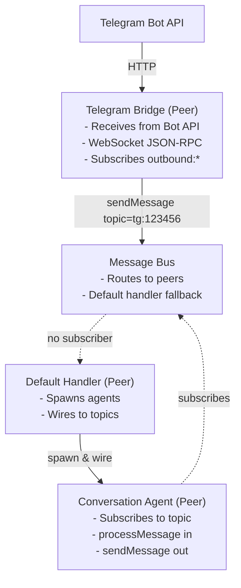
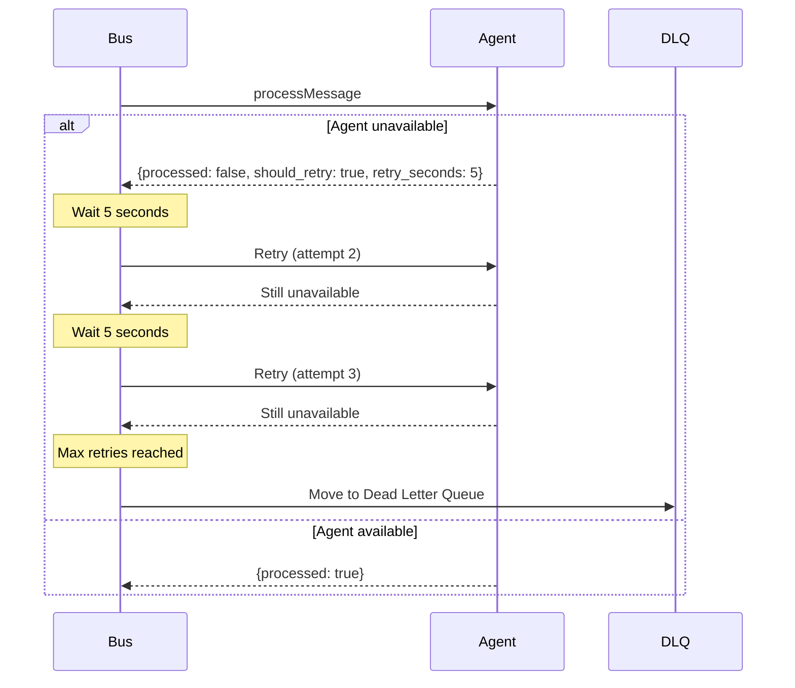
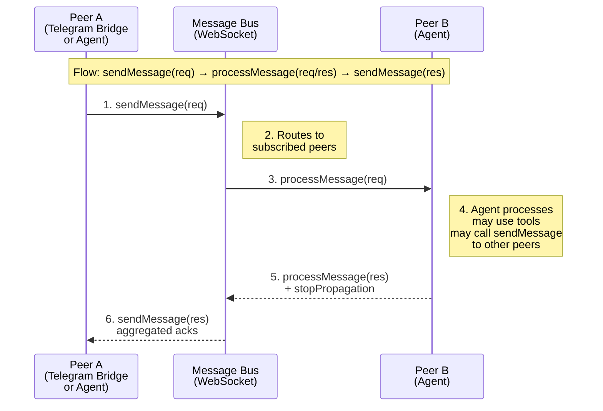
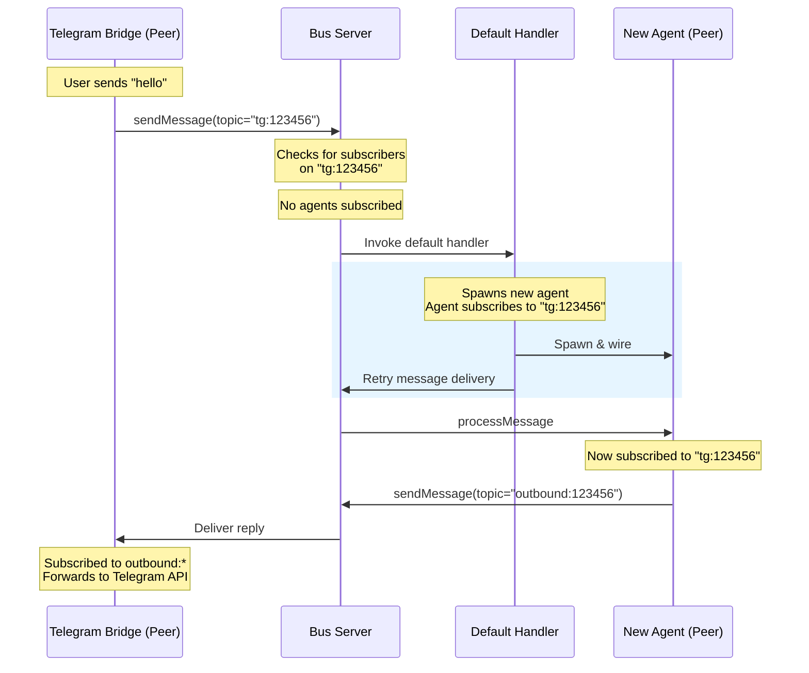

# Agent Communication Protocol

This document defines the JSON-RPC 2.0 protocol for agent-to-agent and agent-to-bus communication over WebSocket.

## Transport

- Protocol: JSON-RPC 2.0 over WebSocket
- Encoding: UTF-8 JSON
- WebSocket URL: `ws://host:port` or `wss://host:port` for TLS

## Design Philosophy

This protocol uses **request/response for message delivery** (instead of notifications) to support interceptor patterns. Subscribers can halt propagation, enabling middleware-like behaviors such as authentication, transformation, and logging.

### Message Flow

1. Publisher calls `sendMessage(topic, payload)` → Server
2. Server matches topic against all subscriber patterns
3. Server calls `sendMessage(topic, payload)` → each Subscriber (in order)
4. If any subscriber returns `stopPropagation: true`, remaining subscribers are skipped
5. Result is aggregated back to original publisher

### Built-in Topics

| Topic | Purpose | Direction |
|-------|---------|-----------|
| `inbound:{chat_id}` | Messages from channel bridges (Telegram, etc.) | Peer → Bus |
| `outbound:{chat_id}` | Messages to channel bridges for external delivery | Bus → Peer |
| `agent:*` | Agent lifecycle (spawn, complete, error) | Bidirectional |

### When to Use stopPropagation

Use `stopPropagation: true` when:

- **Authentication**: Message is unauthorized and should not reach other handlers
- **Transformation**: Message has been modified/deduplicated, original should not be processed
- **Rate Limiting**: Message quota exceeded for this subscriber
- **Completion**: This subscriber has fully handled the message, no further action needed

## Message Format

All messages follow JSON-RPC 2.0 specification:

**Request:**
```json
{
  "jsonrpc": "2.0",
  "method": "method_name",
  "params": {...},
  "id": 1
}
```

**Response:**
```json
{
  "jsonrpc": "2.0",
  "result": {...},
  "id": 1
}
```

**Error:**
```json
{
  "jsonrpc": "2.0",
  "error": {
    "code": -32600,
    "message": "Invalid Request",
    "data": "optional details"
  },
  "id": 1
}
```

**Notification (no id):**
```json
{
  "jsonrpc": "2.0",
  "method": "method_name",
  "params": {...}
}
```

## Connection Lifecycle

### 1. Initialize Handshake

Client connects to server and must send `initialize` as the first request.

**Client → Server:**
```json
{
  "jsonrpc": "2.0",
  "method": "initialize",
  "params": {
    "clientId": "agent-1",
    "clientInfo": {
      "name": "bub",
      "version": "0.2.0"
    }
  },
  "id": 1
}
```

**Server → Client:**
```json
{
  "jsonrpc": "2.0",
  "result": {
    "serverId": "bus-1",
    "serverInfo": {
      "name": "bub-bus",
      "version": "0.2.0"
    },
    "capabilities": {
      "subscribe": true,
      "publish": true,
      "topics": ["inbound:*", "outbound:*", "agent:*"]
    }
  },
  "id": 1
}
```

Error codes:
- `-32001`: Already initialized
- `-32002`: Invalid client info

## Core Methods

### subscribe

Subscribe to messages on a topic pattern.

**Request:**
```json
{
  "jsonrpc": "2.0",
  "method": "subscribe",
  "params": {
    "topic": "inbound:chat-*"
  },
  "id": 2
}
```

**Response:**
```json
{
  "jsonrpc": "2.0",
  "result": {
    "success": true
  },
  "id": 2
}
```

Topic patterns:
- Exact match: `"inbound:chat-1"`
- Wildcard: `"inbound:*"` matches all `inbound:xxx`
- Prefix: `"inbound:chat-"` matches `inbound:chat-1`, `inbound:chat-2`

Error codes:
- `-32600`: Invalid params (missing topic)
- `-32003`: Already subscribed to this topic

### unsubscribe

Unsubscribe from a topic pattern. Pass the exact same topic string used in subscribe.

**Request:**
```json
{
  "jsonrpc": "2.0",
  "method": "unsubscribe",
  "params": {
    "topic": "inbound:chat-*"
  },
  "id": 3
}
```

**Response:**
```json
{
  "jsonrpc": "2.0",
  "result": {
    "success": true
  },
  "id": 3
}
```

### sendMessage

Send a message to subscribers. Returns response with stopPropagation flag.

**Client → Server:**
```json
{
  "jsonrpc": "2.0",
  "method": "sendMessage",
  "params": {
    "topic": "inbound:chat-1",
    "payload": {
      "chat_id": "chat-1",
      "text": "hello",
      "from": "user-1"
    }
  },
  "id": 4
}
```

**Server → Client (broadcast to subscribers):**
```json
{
  "jsonrpc": "2.0",
  "method": "sendMessage",
  "params": {
    "topic": "inbound:chat-1",
    "payload": {
      "chat_id": "chat-1",
      "text": "hello",
      "from": "user-1"
    }
  },
  "id": 5
}
```

**Response:**
```json
{
  "jsonrpc": "2.0",
  "result": {
    "success": true,
    "stopPropagation": false
  },
  "id": 5
}
```

The server broadcasts to all clients subscribed to matching topics. If any subscriber returns `stopPropagation: true`, propagation stops.

### ping

Keep-alive ping.

**Request:**
```json
{
  "jsonrpc": "2.0",
  "method": "ping",
  "params": {},
  "id": 100
}
```

**Response:**
```json
{
  "jsonrpc": "2.0",
  "result": {
    "timestamp": "2025-02-14T12:00:00Z"
  },
  "id": 100
}
```

## Built-in Topics

| Topic | Direction | Description |
|-------|-----------|-------------|
| `inbound:*` | Peer→Bus | Incoming messages from channel bridges (e.g., Telegram) |
| `outbound:*` | Peer→Bus | Outgoing messages to channel bridges for external delivery |
| `agent:*` | Bidirectional | Agent lifecycle events |

## Error Codes

| Code | Meaning |
|------|---------|
| `-32600` | Invalid Request |
| `-32601` | Method not found |
| `-32602` | Invalid params |
| `-32603` | Internal error |
| `-32001` | Already initialized |
| `-32002` | Invalid client info |
| `-32003` | Already subscribed |
| `-32004` | Subscription not found |

## Implementation Notes

1. `initialize` must be the first request after WebSocket connection
2. Server rejects non-initialize requests until handshake completes
3. Subscriptions are per-connection (not persistent)
4. `sendMessage` uses request/response pattern with `stopPropagation` flag for flow control
5. Topic matching uses prefix + wildcard semantics (fnmatch-style)
6. Unsubscribe uses the same topic string passed to subscribe (not a subscription ID)

---

## Extended Protocol (Agent Federation)

This section defines extensions to the base protocol for agent-to-agent communication, multi-agent orchestration, and reliable message delivery.

### Design Goals

1. **Agent Identity**: Each agent has a persistent identity with assigned workspace and default communication topic
2. **Reliable Delivery**: Messages are processed with acknowledgment and retry semantics
3. **Flexible Communication**: Support both simple text messages and complex payload-based communication
4. **Default Handler Pattern**: A fallback agent handles unrouted messages from channel bridges (Telegram, etc.)

### Agent Environment

Agents are spawned with environment variables that define their communication context:

```bash
# Core agent identity
BUB_WORKSPACE=/path/to/workspace           # Workspace directory for this agent
BUB_DEFAULT_TOPIC=tg:123456789             # Default topic for send_message replies
BUB_AGENT_ID=agent-abc123                  # Unique agent identifier

# Bus connection
BUB_BUS_URL=ws://localhost:7892            # WebSocket URL for bus connection
```

When an agent starts, it:
1. Connects to the bus using `BUB_BUS_URL`
2. Subscribes to `agent:{BUB_AGENT_ID}` for direct messages
3. Uses `BUB_DEFAULT_TOPIC` as the implicit destination for `send_message` calls without explicit topic

### New Methods

#### processMessage (Bus → Agent)

Server calls this on agents to deliver messages for processing. Replaces the generic `sendMessage` for agent-targeted delivery.

**Server → Agent:**
```json
{
  "jsonrpc": "2.0",
  "method": "processMessage",
  "params": {
    "topic": "tg:123456789",
    "payload": {
      "type": "telegram_message",
      "text": "Hello, what can you do?",
      "from": "user-1",
      "chat_id": "123456789",
      "timestamp": "2025-02-17T10:30:00Z"
    }
  },
  "id": 6
}
```

**Payload Requirements:**
- `type` (string, mandatory): Message type discriminator. Use source-specific types (e.g., `telegram_message`, `plaintext_message`) that clearly indicate the payload format and origin.

**Common Type Values:**

| Type | Source | Payload Fields |
|------|--------|----------------|
| `telegram_message` | Telegram Bot API | `text`, `from`, `chat_id`, `timestamp`, `message_id` |
| `discord_message` | Discord Gateway | `content`, `author`, `channel_id`, `guild_id` |
| `plaintext_message` | Generic text | `text`, `sender`, `timestamp` |
| `task_request` | Agent-to-agent | `task_id`, `description`, `priority`, `deadline` |
| `task_result` | Agent-to-agent | `task_id`, `status`, `result`, `artifacts` |
| `agent_event` | System | `event`, `agent_id`, `timestamp` |
| `command` | CLI/Control | `command`, `args`, `request_id` |

**Supporting Polyglot Agents:**

Source-specific types (e.g., `telegram_message`, `discord_message`) allow agents written in different programming languages to correctly parse and handle messages. A Python agent and a Rust agent both know that `telegram_message` follows Telegram Bot API format, while `plaintext_message` is a simpler format for basic text exchange.

When creating custom message types:
1. Use descriptive, source-specific names: `slack_message`, `webhook_payload`, `email_notification`
2. Document expected payload fields in your agent's documentation
3. Keep payload structures simple and self-contained for cross-language parsing

**Agent Response:**
```json
{
  "jsonrpc": "2.0",
  "result": {
    "processed": true,
    "should_retry": false,
    "retry_seconds": 0,
    "message": "Message handled successfully"
  },
  "id": 6
}
```

Response fields:
- `processed` (bool): Whether the agent successfully handled the message
- `should_retry` (bool): If true, bus should retry delivery after `retry_seconds`
- `retry_seconds` (int): Delay before retry (only meaningful if `should_retry` is true)
- `message` (string): Human-readable status or error description

**Key Differences from sendMessage:**
- `processMessage` is explicitly for bus-to-agent delivery with processing semantics
- Returns structured result indicating success/failure and retry policy
- Agent must be connected and responsive; missing agents trigger retry/dead-letter logic

#### sendMessage (Agent → Bus) - Enhanced

Agent sends messages to the bus, which routes them to subscribers. Extended to support explicit topic targeting and delivery acknowledgment.

**Agent → Server:**
```json
{
  "jsonrpc": "2.0",
  "method": "sendMessage",
  "params": {
    "topic": "agent:other-agent-456",
    "payload": {
      "type": "task_request",
      "task_id": "task-789",
      "description": "Analyze the log file",
      "priority": "high",
      "deadline": "2025-02-18T12:00:00Z"
    }
  },
  "id": 7
}
```

**Server Response:**
```json
{
  "jsonrpc": "2.0",
  "result": {
    "success": true,
    "acks": [
      {
        "client_id": "agent-other-agent-456",
        "processed": true,
        "message": "Task accepted"
      }
    ]
  },
  "id": 7
}
```

Response fields:
- `success` (bool): Whether the message was successfully routed to at least one subscriber
- `acks` (array): List of acknowledgment from each subscriber that received the message
  - `client_id` (string): ID of the receiving client
  - `processed` (bool): Whether the subscriber processed the message successfully
  - `message` (string): Optional status message from the subscriber

**Topic Resolution:**
- If `topic` is provided in params, message is sent to that topic
- If `topic` is omitted, message is sent to `BUB_DEFAULT_TOPIC` from agent environment
- Agents can use `sendMessage` for both direct agent communication and channel bridge replies

**Payload Requirements:**
- `type` (string, mandatory): Message type discriminator. All payloads must include this field.

**Common Type Values:**
See processMessage section for the full list of message types.

### Default Handler Agent

To simplify external channel integration, a **default handler agent** manages unrouted messages. All channel bridges (Telegram, etc.) are peers that connect to the bus via WebSocket using the same JSON-RPC protocol:

**Architecture:**



**Behavior:**
1. Telegram Bridge receives message from Bot API
2. Bridge sends `sendMessage` to bus on topic `tg:123456789`
3. Bus checks for subscribed agents on that topic
4. If no agent subscribed, default handler spawns a new agent
5. New agent is configured with:
   - `BUB_WORKSPACE` = default workspace (or context-specific)
   - `BUB_DEFAULT_TOPIC` = source topic (e.g., `tg:123456789`)
   - `BUB_AGENT_ID` = auto-generated unique ID
6. Agent subscribes to its assigned topic (same protocol as bridge)
7. Original message is delivered via `processMessage`
8. Agent handles conversation, replies via `sendMessage` to `outbound:123456789`
9. Telegram Bridge receives reply (subscribed to `outbound:*`) and forwards to Telegram

**Key Insight:** The Telegram Bridge and agents are symmetric peers. Both connect via WebSocket, both use `sendMessage`/`processMessage`, both subscribe to topics. The only difference is the bridge also speaks HTTP to Telegram's API.

### Agent-to-Agent Communication Patterns

#### Pattern 1: Direct Agent Communication (LLM Tool)

Agents expose `send_message` as a tool for the LLM to communicate with other agents:

```python
# Tool definition exposed to LLM
{
  "name": "send_message",
  "description": "Send a message to another agent or topic",
  "parameters": {
    "topic": {"type": "string", "description": "Target topic or agent ID"},
    "payload": {"type": "object", "description": "Message payload"}
  }
}
```

**Limitation**: LLMs struggle with complex payload construction due to token costs and formatting constraints.

#### Pattern 2: CLI-Based Agent Communication (Recommended)

Agents call `bub` CLI commands for complex inter-agent communication:

```bash
# Agent reads communication params from environment
BUB_WORKSPACE=/workspaces/project-a \
BUB_DEFAULT_TOPIC=agent:analyzer-456 \
bub send-message --topic agent:analyzer-456 --payload @task.json
```

**Benefits:**
- Complex payloads loaded from files (`@task.json`)
- Full control over payload structure
- Leverages shell piping for data flow
- Reduces LLM token usage for complex operations

**Implementation Sketch:**
```python
# In agent code, spawn subprocess for complex communication
import subprocess
import json
import os

def send_complex_message(target_topic: str, payload: dict) -> dict:
    env = os.environ.copy()
    # BUB_WORKSPACE and BUB_DEFAULT_TOPIC already set in agent env
    
    result = subprocess.run(
        ["bub", "send-message", "--topic", target_topic, "--payload", "-"],
        input=json.dumps(payload),
        capture_output=True,
        text=True,
        env=env
    )
    return json.loads(result.stdout)
```

### Message Delivery Reliability

The extended protocol ensures reliable message delivery through:

1. **Synchronous Acknowledgment**: `processMessage` returns structured result immediately
2. **Retry Semantics**: Agent can request retry with exponential backoff
3. **Delivery Tracking**: `sendMessage` returns acknowledgments from all subscribers
4. **Dead Letter Queue**: Failed deliveries after max retries are stored for inspection

**Retry Flow:**



### Complete Message Flow

All peers (agents, Telegram bridge, etc.) communicate with the bus using the same JSON-RPC protocol over WebSocket. When a message arrives from any peer, the flow involves alternating `sendMessage` and `processMessage` calls:



**Flow Pattern:**
- `sendMessage(req)` - Any peer sends a message to the bus
- `processMessage(req)` - Bus delivers to subscribed peers (agents, bridges)
- Agent may internally trigger tools that call `sendMessage` to other peers
- `processMessage(res)` - Each peer returns result with `stopPropagation` flag
- `sendMessage(res)` - Bus returns aggregated acknowledgments to original caller

**Key Points:**
- All peers (Telegram bridge, agents) are equal - they all connect via WebSocket and use the same JSON-RPC methods
- The Telegram bridge is just another peer that:
  - Receives messages from Telegram Bot API (externally)
  - Sends them to the bus via `sendMessage` 
  - Listens for `outbound:*` messages to forward back to Telegram
- `stopPropagation` can halt message delivery at any point
- All `processMessage` calls complete before the final `sendMessage` response returns
- The bus acts as a pure message router with no protocol translation

### Default Handler Agent

When the bus receives a message on a topic with no subscribed agents:



This makes the architecture symmetric: the default handler, agents, and Telegram bridge are all peers using the same protocol.

### Topic Matching Policy

When multiple peers subscribe to overlapping topic patterns, the bus server must determine:
1. Which subscribers receive the message
2. In what order they are invoked
3. When to stop propagation

**Pattern Matching Strategy: Last Match Wins**

Following POSIX-style configuration conventions (e.g., `.gitignore`, firewall rules), topic patterns are evaluated in subscription order, with **later subscriptions taking precedence**:

```
Subscription Order:
  1. "inbound:*"        → Handler A (matches all inbound)
  2. "inbound:critical" → Handler B (specific override)
  3. "inbound:*"        → Handler C (re-subscription, replaces #1)

For message "inbound:critical":
  - Handler C (last wildcard match)
  - Handler B (specific match, last in order)
  
For message "inbound:normal":
  - Handler C (only match)
```

**Key Rules:**
- Subscriptions are stored in a list (not a set)
- Duplicate patterns are allowed; later duplicates override earlier ones
- More specific patterns don't automatically win—order matters
- Unsubscribe removes the first matching pattern (FIFO)

**Propagation Policies**

Policies control when message propagation stops:

| Policy | Behavior | Use Case |
|--------|----------|----------|
| `stopPropagationOnProcessed` | Stop if any subscriber returns `processed: true` | First successful handler wins; use for authentication, rate limiting |
| `stopPropagationOnStop` | Stop only if subscriber returns `stopPropagation: true` | Explicit opt-in; use when multiple handlers should normally run |
| `continueAll` | Never stop; invoke all matching subscribers | Audit logging, metrics; always invokes all handlers |

**Default Policy:** `stopPropagationOnProcessed`

Most use cases want the first successful handler to win (e.g., auth rejects → stop, first available agent handles → stop).

**Policy Scope:**
- Policies can be set per-topic at subscription time
- Bus-wide default policy configurable at server start
- Client can suggest policy in `subscribe` params; server may override

**Example Subscription with Policy:**

```json
{
  "jsonrpc": "2.0",
  "method": "subscribe",
  "params": {
    "topic": "inbound:*",
    "policy": "stopPropagationOnProcessed"
  },
  "id": 1
}
```

**Handler Response with Stop Propagation:**

```json
{
  "jsonrpc": "2.0",
  "result": {
    "processed": true,
    "stopPropagation": true,
    "message": "Rate limit exceeded"
  },
  "id": 5
}
```

### Topic Conventions

| Topic Pattern | Purpose | Example |
|--------------|---------|---------|
| `tg:{chat_id}` | Telegram chat messages | `tg:123456789` |
| `agent:{agent_id}` | Direct agent messaging | `agent:analyzer-abc` |
| `workspace:{workspace_id}` | Workspace-wide broadcasts | `workspace:project-a` |
| `task:{task_id}` | Task-specific coordination | `task:task-789` |
| `system:*` | System events (spawn, stop) | `system:agent.spawned` |

