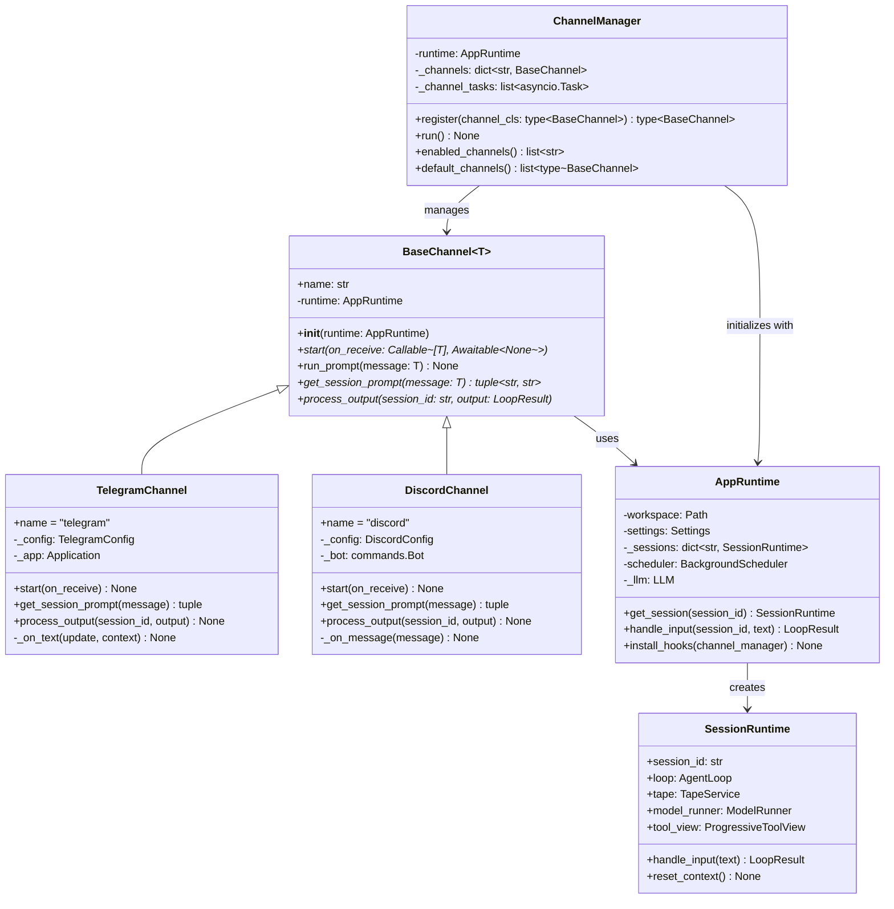

# Class Hierarchy

```mermaid
classDiagram
    class ChannelManager {
        -runtime: AppRuntime
        -_channels: dict~str, BaseChannel~
        -_channel_tasks: list~asyncio.Task~
        +register(channel_cls: type~BaseChannel~) type~BaseChannel~
        +run() None
        +enabled_channels() list~str~
        +default_channels() list~type~BaseChannel~
    }

    class BaseChannel~T~ {
        +name: str
        -runtime: AppRuntime
        +__init__(runtime: AppRuntime)
        +start(on_receive: Callable~[T], Awaitable~None~~)*
        +run_prompt(message: T) None
        +get_session_prompt(message: T) tuple~str, str~*
        +process_output(session_id: str, output: LoopResult)*
    }

    class TelegramChannel {
        +name = "telegram"
        -_config: TelegramConfig
        -_app: Application
        +start(on_receive) None
        +get_session_prompt(message) tuple
        +process_output(session_id, output) None
        -_on_text(update, context) None
    }

    class DiscordChannel {
        +name = "discord"
        -_config: DiscordConfig
        -_bot: commands.Bot
        +start(on_receive) None
        +get_session_prompt(message) tuple
        +process_output(session_id, output) None
        -_on_message(message) None
    }

    class AppRuntime {
        -workspace: Path
        -settings: Settings
        -_sessions: dict~str, SessionRuntime~
        -scheduler: BackgroundScheduler
        -_llm: LLM
        +get_session(session_id) SessionRuntime
        +handle_input(session_id, text) LoopResult
        +install_hooks(channel_manager) None
    }

    class SessionRuntime {
        +session_id: str
        +loop: AgentLoop
        +tape: TapeService
        +model_runner: ModelRunner
        +tool_view: ProgressiveToolView
        +handle_input(text) LoopResult
        +reset_context() None
    }

    ChannelManager --> BaseChannel : manages
    BaseChannel <|-- TelegramChannel
    BaseChannel <|-- DiscordChannel
    BaseChannel --> AppRuntime : uses
    ChannelManager --> AppRuntime : initializes with
    AppRuntime --> SessionRuntime : creates
```
# Test
