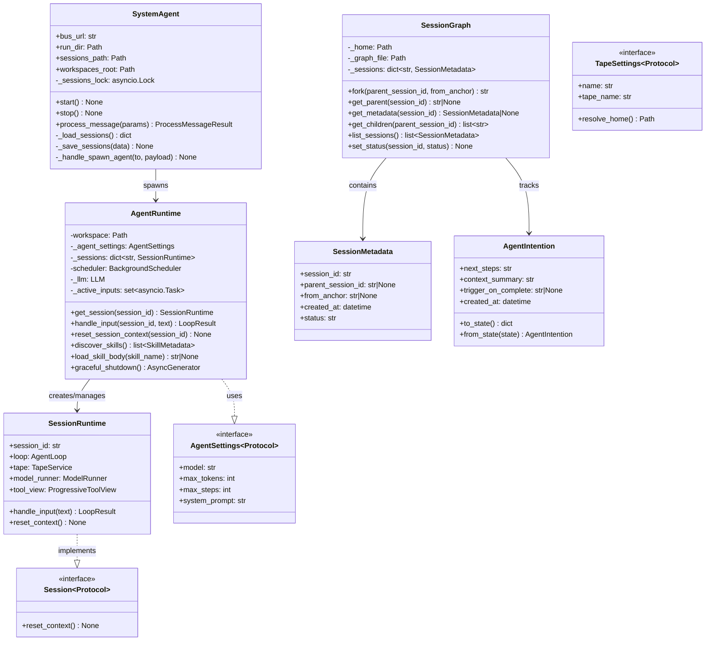
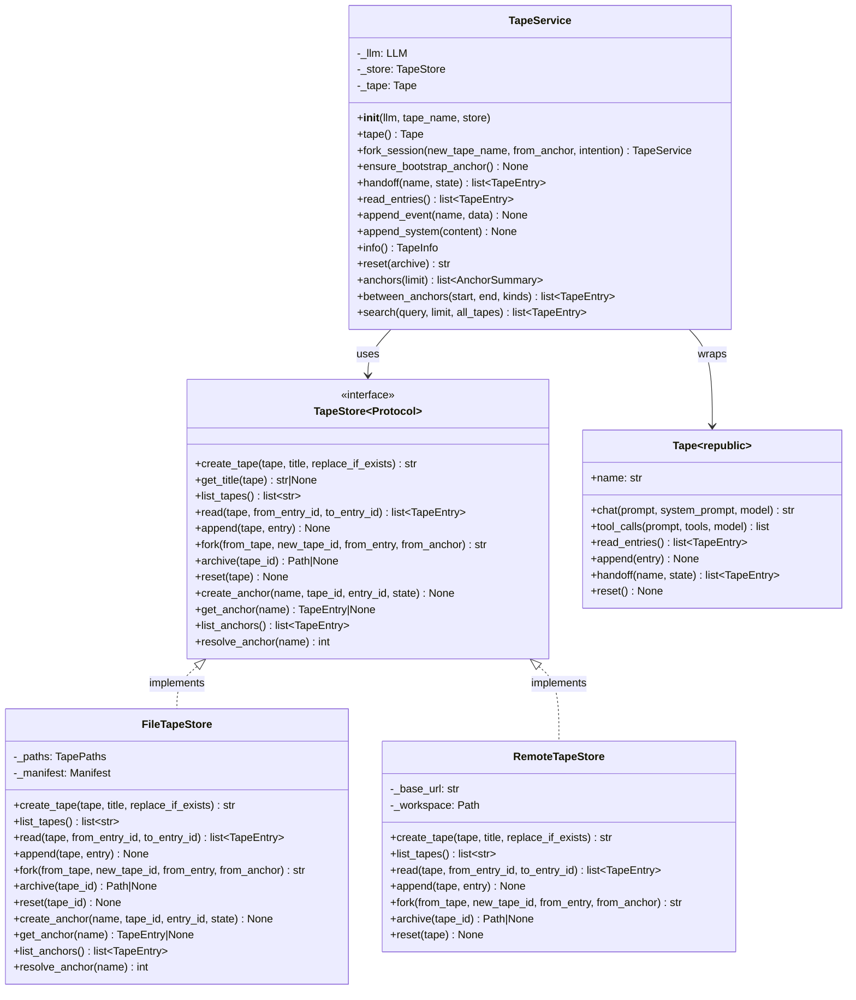
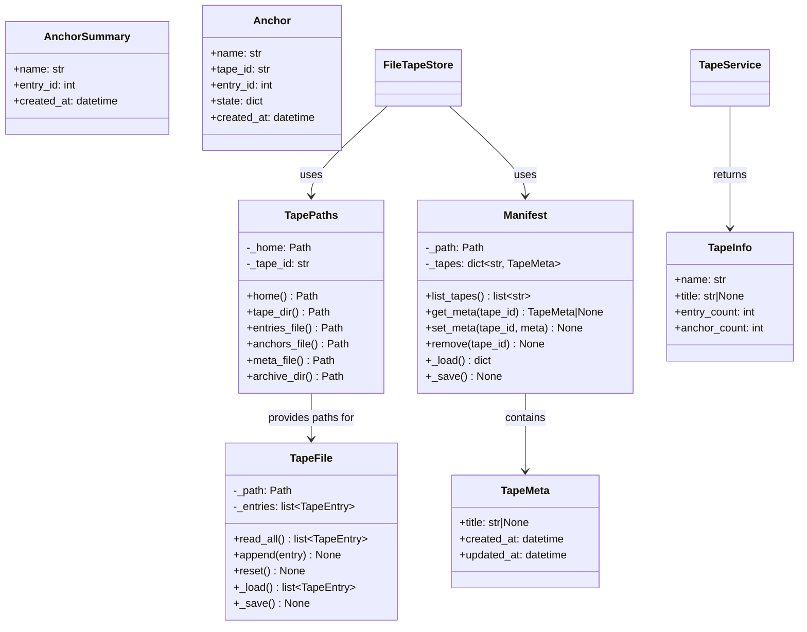
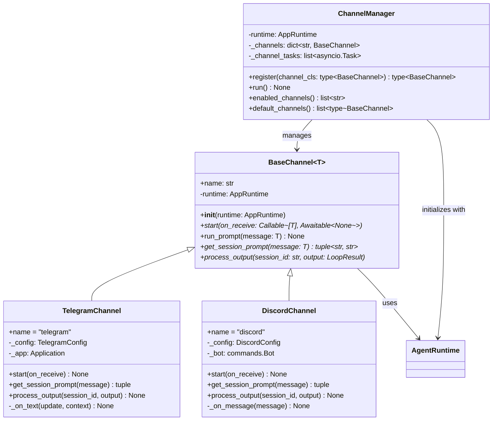

# Class Hierarchy

## Session Management Classes

## Tape Management Classes

## Tape Helper Classes

## Channel Classes

## File Locations

| Class | File | Purpose |
|-------|------|---------|
| `SessionRuntime` | `src/bub/app/runtime.py:37` | Runtime state for one session |
| `AgentRuntime` | `src/bub/app/runtime.py:66` | Manages multiple session loops |
| `SessionGraph` | `src/bub/tape/session.py:54` | Tracks session lineage/forks |
| `SessionMetadata` | `src/bub/tape/session.py:44` | Metadata for session in graph |
| `AgentIntention` | `src/bub/tape/session.py:14` | Intention for forked sessions |
| `SystemAgent` | `src/bub/system_agent.py:37` | Spawns conversation agents |
| `Session` (Protocol) | `src/bub/app/types.py:55` | Protocol for session interface |
| `AgentSettings` (Protocol) | `src/bub/app/types.py:13` | Protocol for agent settings |
| `TapeSettings` (Protocol) | `src/bub/app/types.py:25` | Protocol for tape settings |
| `TapeStore` (Protocol) | `src/bub/app/types.py:61` | Persistence interface |
| `FileTapeStore` | `src/bub/tape/store.py:159` | Local file storage |
| `RemoteTapeStore` | `src/bub/tape/remote.py:14` | HTTP client storage |
| `TapeService` | `src/bub/tape/service.py:48` | High-level tape operations |
| `TapeInfo` | `src/bub/tape/service.py:23` | Tape runtime info |
| `TapePaths` | `src/bub/tape/store.py:25` | Path resolution helper |
| `TapeFile` | `src/bub/tape/store.py:33` | File I/O helper |
| `TapeMeta` | `src/bub/tape/types.py:11` | Tape metadata |
| `Manifest` | `src/bub/tape/types.py:32` | Tape registry |
| `Anchor` | `src/bub/tape/types.py:22` | Anchor entry type |
| `AnchorSummary` | `src/bub/tape/anchors.py:9` | Anchor info summary |

## Cross-References

- [Tape Architecture](09-tape-architecture.md) - Detailed tape system design
- [Session Lifecycle](06-session-lifecycle.md) - How sessions use tapes
