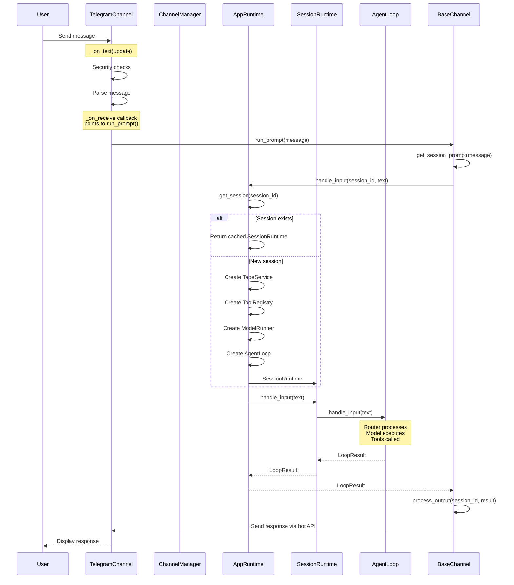

# Message Flow Sequence

```mermaid
sequenceDiagram
    participant User
    participant Telegram as TelegramChannel
    participant CM as ChannelManager
    participant RT as AppRuntime
    participant SR as SessionRuntime
    participant AL as AgentLoop

    User->>Telegram: Send message

    Note over Telegram: _on_text(update)
    Telegram->>Telegram: Security checks
    Telegram->>Telegram: Parse message

    Note over Telegram: _on_receive callback<br/>points to run_prompt()
    Telegram->>BaseChannel: run_prompt(message)

    BaseChannel->>BaseChannel: get_session_prompt(message)
    BaseChannel->>RT: handle_input(session_id, text)

    RT->>RT: get_session(session_id)

    alt Session exists
        RT->>RT: Return cached SessionRuntime
    else New session
        RT->>RT: Create TapeService
        RT->>RT: Create ToolRegistry
        RT->>RT: Create ModelRunner
        RT->>RT: Create AgentLoop
        RT->>SR: SessionRuntime
    end

    RT->>SR: handle_input(text)
    SR->>AL: handle_input(text)

    Note over AL: Router processes<br/>Model executes<br/>Tools called

    AL-->>SR: LoopResult
    SR-->>RT: LoopResult
    RT-->>BaseChannel: LoopResult

    BaseChannel->>BaseChannel: process_output(session_id, result)
    BaseChannel->>Telegram: Send response via bot API
    Telegram-->>User: Display response
```
