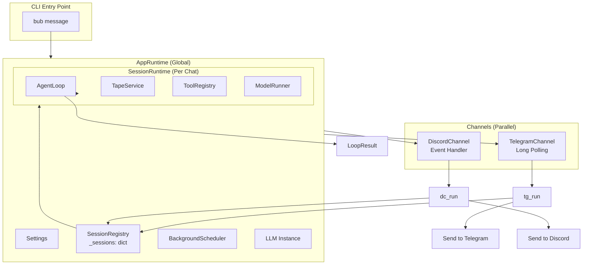

# NEW Architecture - Direct Coupling

```mermaid
flowchart TB
    subgraph CLI["CLI Entry Point"]
        cmd[bub message]
    end
    
    subgraph Runtime["AppRuntime (Global)"]
        settings[Settings]
        sessions[SessionRegistry<br/>_sessions: dict]
        scheduler[BackgroundScheduler]
        llm[LLM Instance]
        
        subgraph Session["SessionRuntime (Per Chat)"]
            loop[AgentLoop]
            tape[TapeService]
            tools[ToolRegistry]
            runner[ModelRunner]
        end
    end
    
    subgraph Channels["Channels (Parallel)"]
        tg[TelegramChannel<br/>Long Polling]
        dc[DiscordChannel<br/>Event Handler]
    end
    
    cmd --> Runtime
    Runtime --> tg
    Runtime --> dc
    
    tg --> tg_run
    dc --> dc_run
    
    tg_run --> sessions
    dc_run --> sessions
    
    sessions --> Session
    Session --> loop
    loop --> result[LoopResult]
    
    tg_run --> tg_out[Send to Telegram]
    dc_run --> dc_out[Send to Discord]
```
