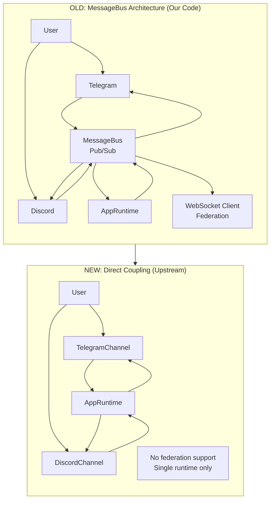

# OLD vs NEW Architecture Comparison

```mermaid
flowchart TB
    subgraph OLD["OLD: MessageBus Architecture (Our Code)"]
        direction TB
        user1[User] --> tg1[Telegram]
        user1 --> dc1[Discord]
        
        tg1 --> bus1[MessageBus<br/>Pub/Sub]
        dc1 --> bus1
        
        bus1 --> rt1[AppRuntime]
        bus1 --> ws1[WebSocket Client<br/>Federation]
        
        rt1 --> bus1
        
        bus1 --> tg1
        bus1 --> dc1
    end
    
    subgraph NEW["NEW: Direct Coupling (Upstream)"]
        direction TB
        user2[User] --> tg2[TelegramChannel]
        user2 --> dc2[DiscordChannel]
        
        tg2 --> rt2[AppRuntime]
        dc2 --> rt2
        
        rt2 --> tg2
        rt2 --> dc2
        
        note2[No federation support<br/>Single runtime only]
    end
    
    OLD --> NEW
```
