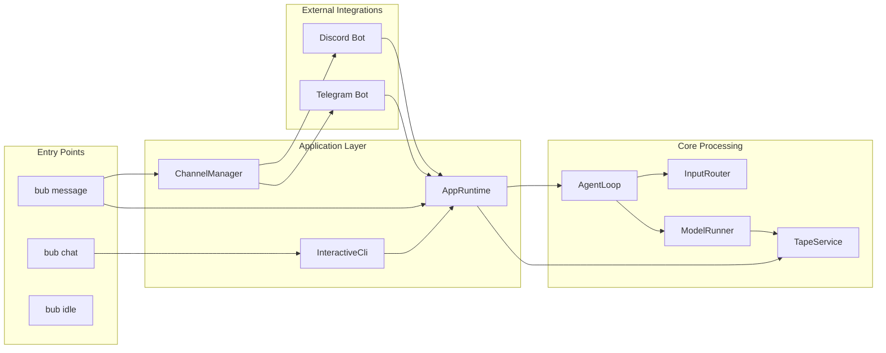

# Detailed Component Interaction

```mermaid
flowchart LR
    subgraph Entry["Entry Points"]
        chat[bub chat]
        message[bub message]
        idle[bub idle]
    end
    
    subgraph App["Application Layer"]
        runtime[AppRuntime]
        cm[ChannelManager]
        interactive[InteractiveCli]
    end
    
    subgraph Core["Core Processing"]
        router[InputRouter]
        agent[AgentLoop]
        model[ModelRunner]
        tape[TapeService]
    end
    
    subgraph External["External Integrations"]
        telegram[Telegram Bot]
        discord[Discord Bot]
    end
    
    chat --> interactive
    interactive --> runtime
    message --> runtime
    message --> cm
    
    cm --> telegram
    cm --> discord
    
    telegram --> runtime
    discord --> runtime
    
    runtime --> agent
    runtime --> tape
    agent --> router
    agent --> model
    model --> tape
```
