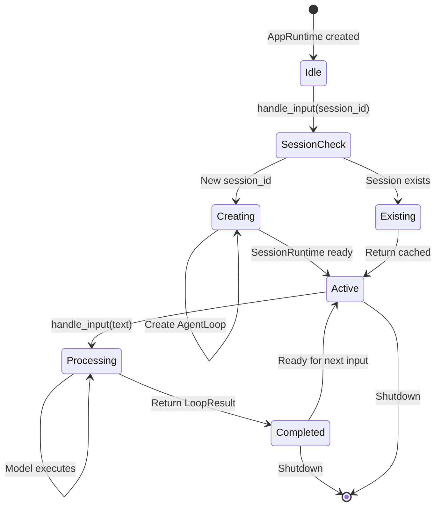

# Session Lifecycle

```mermaid
stateDiagram-v2
    [*] --> Idle: AppRuntime created

    Idle --> SessionCheck: handle_input(session_id)

    SessionCheck --> Existing: Session exists
    SessionCheck --> Creating: New session_id

    Creating --> Creating: Create TapeService
    Creating --> Creating: Create ToolRegistry
    Creating --> Creating: Create ModelRunner
    Creating --> Creating: Create AgentLoop
    Creating --> Active: SessionRuntime ready

    Existing --> Active: Return cached

    Active --> Processing: handle_input(text)
    Processing --> Processing: Router processes
    Processing --> Processing: Model executes
    Processing --> Completed: Return LoopResult

    Completed --> Active: Ready for next input
    Completed --> [*]: Shutdown

    Active --> [*]: Shutdown
```
