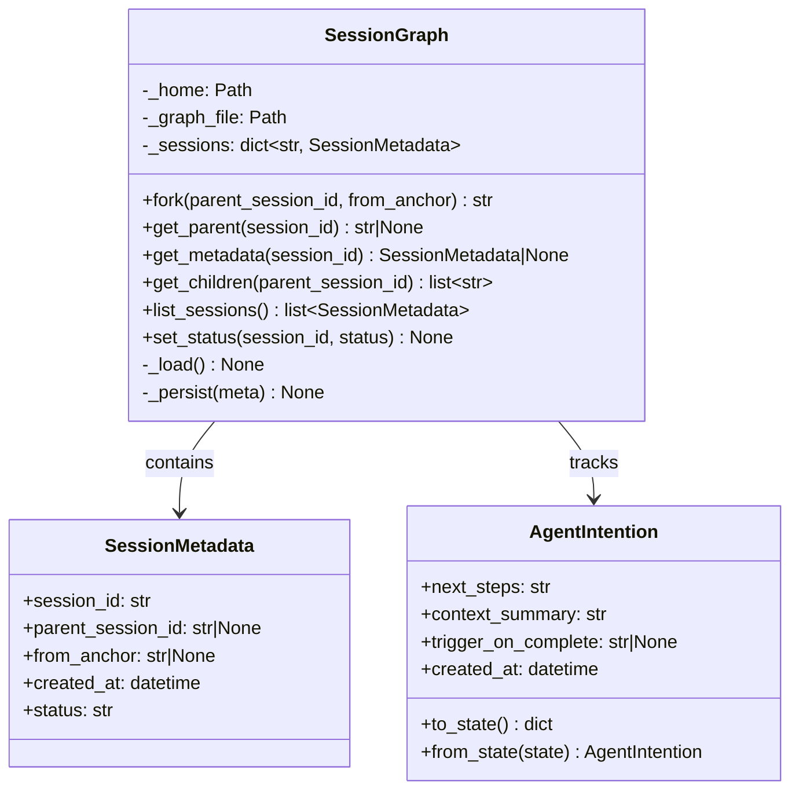
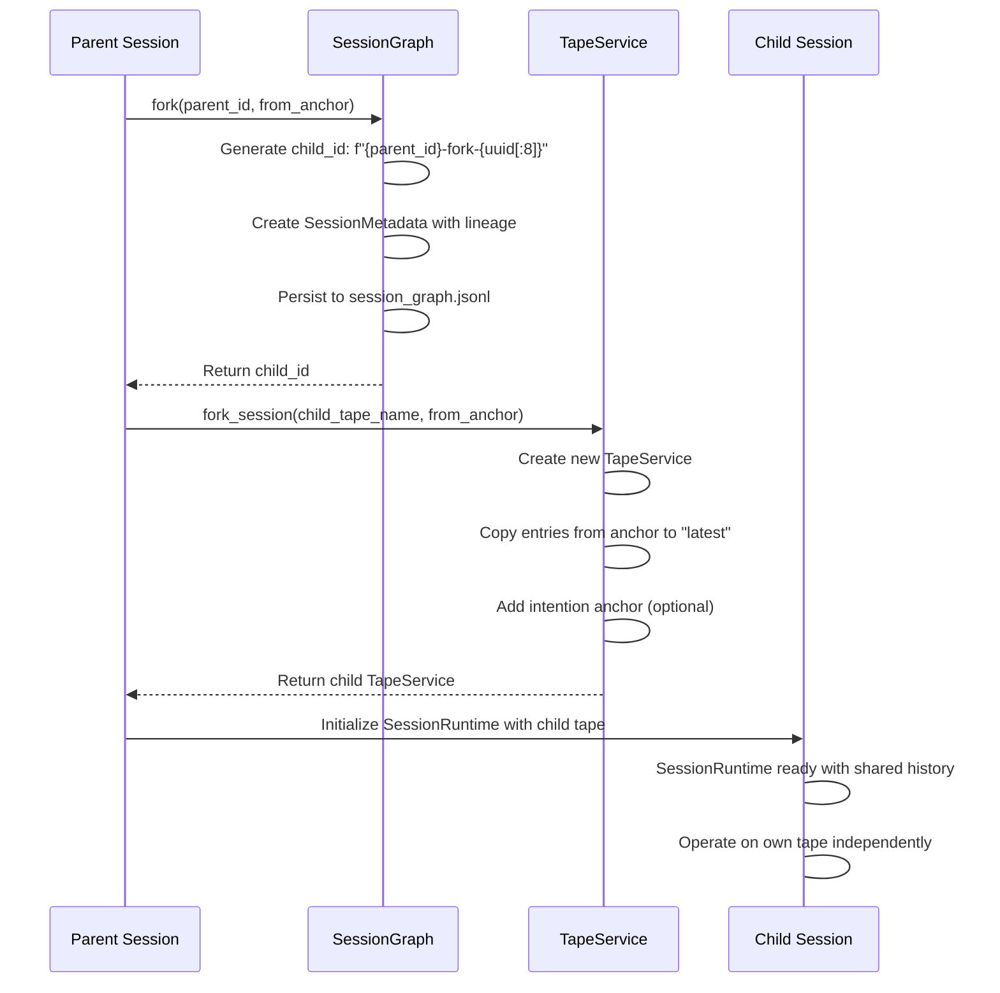

# Session Lifecycle

## Session State Machine


## Session Creation from Anchor

Sessions are created in `AgentRuntime.get_session()` with the following lifecycle:

```python
# 1. Create tape with deterministic name based on session_id
tape_name = f"{self._tape_settings.tape_name}:{_session_slug(session_id)}"
tape = TapeService(self._llm, tape_name, store=self._store)

# 2. Ensure bootstrap anchor exists (if new tape)
tape.ensure_bootstrap_anchor()
# OR load from existing anchor state (if session resumes)
```

The deterministic naming ensures:
- Same session_id always maps to same tape
- Prevents accidental duplicate sessions
- Enables session recovery after restart

## Session Graph and Forking

Sessions can be forked to create child sessions with shared lineage. The `SessionGraph` maintains parent-child relationships and session metadata:



### Session Forking Flow



**Key points of forking:**
- Fork creates a new tape that copies history from the parent's anchor point
- Child ID is deterministically generated with parent prefix for traceability
- Child tape starts fresh but shares pre-fork history with parent
- `SessionGraph.fork()` tracks lineage for later reconstruction

## Tape-Agent Correspondence

The system maintains a strict 1-1-1 correspondence between agents, services, and tapes:

```
SessionRuntime
    ↓ owns exactly 1
TapeService
    ↓ wraps exactly 1
republic.Tape
    ↓ with deterministic name from
session_id
```

This architecture ensures:

| Principle | Description |
|-----------|-------------|
| **Exclusive Ownership** | Each SessionRuntime has sole write access to its TapeService |
| **Clean Boundaries** | No shared state between concurrent sessions |
| **Determinism** | Same session_id → same tape name → reproducible recovery |
| **Traceability** | All agent actions recorded in dedicated tape |

**Tape naming convention:**
```
{base_tape_name}:{session_slug}
# Example: "bub:abc123def"
```

## Forking Workflow

When an agent needs to delegate work to a subagent, it uses the forking pattern:

### Phase 1: Fork Creation

```python
# Parent session identifies a task for delegation
child_id = session_graph.fork(parent_id, from_anchor="task-start")
child_tape = parent_tape.fork_session(
    new_tape_name=f"bub:{child_id}",
    from_anchor="task-start",
    intention=AgentIntention(
        next_steps="Implement feature X",
        context_summary="Parent is working on...",
        trigger_on_complete="notify_parent"
    )
)
```

### Phase 2: Subagent Operation

- Subagent operates on its own `TapeService` independently
- Records all actions to its private tape
- Cannot see parent's tape entries post-fork
- Continues until task completion

### Phase 3: Result Merging

When subagent completes:

1. **Capture Result**: Take the final result message from subagent's tape
2. **Capture Range**: Note the entry IDs processed (for reference)
3. **Append to Parent**: Write a single message to parent's tape at fork point
4. **Parent Continues**: Parent's tape now contains the merged result and continues

```
Parent Tape: [anchor:task-start] → [message 1] → [message 2] → ...
                                      ↑
                                      └── Subagent appends: "Result: Implemented X"

Subagent Tape: [anchor:task-start] → [plan] → [action 1] → [action 2] → [result]
```

### Key Benefits

- **Isolation**: Subagent failures don't corrupt parent session
- **Auditability**: Complete trace of subagent work in separate tape
- **Composition**: Parent can fork multiple subagents in parallel
- **Determinism**: Merge points are explicit anchor entries

## Session Persistence

- **Session Graph**: `~/.bub/session_graph.jsonl` - Append-only JSONL file tracking all session relationships
- **Sessions Index**: `run/sessions.json` - SystemAgent's tracking of active agent processes

## Key Classes Reference

| Class | Location | Purpose |
|-------|----------|---------|
| `AgentRuntime` | `src/bub/app/runtime.py:66` | Manages all sessions, creates SessionRuntime instances |
| `SessionRuntime` | `src/bub/app/runtime.py:37` | Runtime state for one deterministic session |
| `TapeService` | `src/bub/tape/service.py:48` | High-level tape operations, wraps republic.Tape |
| `TapeService.fork_session()` | `src/bub/tape/service.py:62` | Creates child tape from anchor point |
| `SessionGraph` | `src/bub/tape/session.py:54` | Tracks session lineage and forking |
| `SessionGraph.fork()` | `src/bub/tape/session.py:93` | Generates child session ID, persists lineage |
| `SessionMetadata` | `src/bub/tape/session.py:44` | Metadata for a session in the graph |
| `AgentIntention` | `src/bub/tape/session.py:14` | Intention recorded when forking sessions |

## Related Documentation

- [Class Hierarchy](01-class-hierarchy.md) - Complete UML diagram with all session classes
- [Data Flow](07-data-flow-with-type-mapping.md) - How data flows through sessions
- [Tape Architecture](09-tape-architecture.md) - How TapeService works with republic.Tape
- [Session Forking Pattern](10-session-forking-pattern.md) - Detailed context manager pattern for subagent delegation
