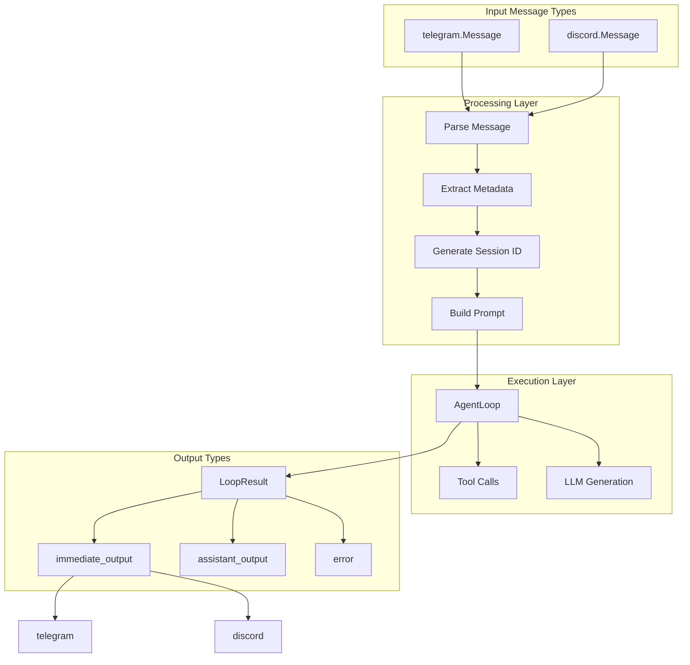

# Data Flow with Type Mapping

```mermaid
flowchart TD
    subgraph InputTypes["Input Message Types"]
        tg_msg[telegram.Message]
        dc_msg[discord.Message]
    end
    
    subgraph Processing["Processing Layer"]
        direction TB
        parse[Parse Message]
        extract[Extract Metadata]
        session[Generate Session ID]
        prompt[Build Prompt]
    end
    
    subgraph Execution["Execution Layer"]
        loop[AgentLoop]
        tools[Tool Calls]
        model[LLM Generation]
    end
    
    subgraph OutputTypes["Output Types"]
        result[LoopResult]
        immediate[immediate_output]
        assistant[assistant_output]
        error[error]
    end
    
    tg_msg --> parse
    dc_msg --> parse
    
    parse --> extract
    extract --> session
    session --> prompt
    
    prompt --> loop
    loop --> tools
    loop --> model
    
    loop --> result
    result --> immediate
    result --> assistant
    result --> error
    
    immediate --> telegram
    immediate --> discord
```
