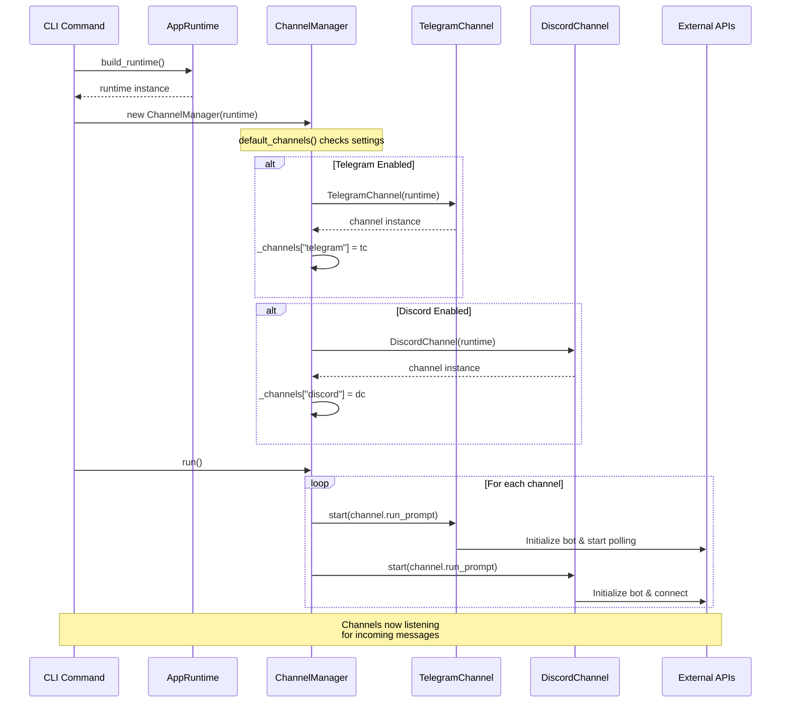

# Channel Initialization Flow

```mermaid
sequenceDiagram
    participant CLI as CLI Command
    participant RT as AppRuntime
    participant CM as ChannelManager
    participant TC as TelegramChannel
    participant DC as DiscordChannel
    participant API as External APIs

    CLI->>RT: build_runtime()
    RT-->>CLI: runtime instance

    CLI->>CM: new ChannelManager(runtime)
    Note over CM: default_channels() checks settings

    alt Telegram Enabled
        CM->>TC: TelegramChannel(runtime)
        TC-->>CM: channel instance
        CM->>CM: _channels["telegram"] = tc
    end

    alt Discord Enabled
        CM->>DC: DiscordChannel(runtime)
        DC-->>CM: channel instance
        CM->>CM: _channels["discord"] = dc
    end

    CLI->>CM: run()

    loop For each channel
        CM->>TC: start(channel.run_prompt)
        TC->>API: Initialize bot & start polling

        CM->>DC: start(channel.run_prompt)
        DC->>API: Initialize bot & connect
    end

    Note over CLI,API: Channels now listening<br/>for incoming messages
```
