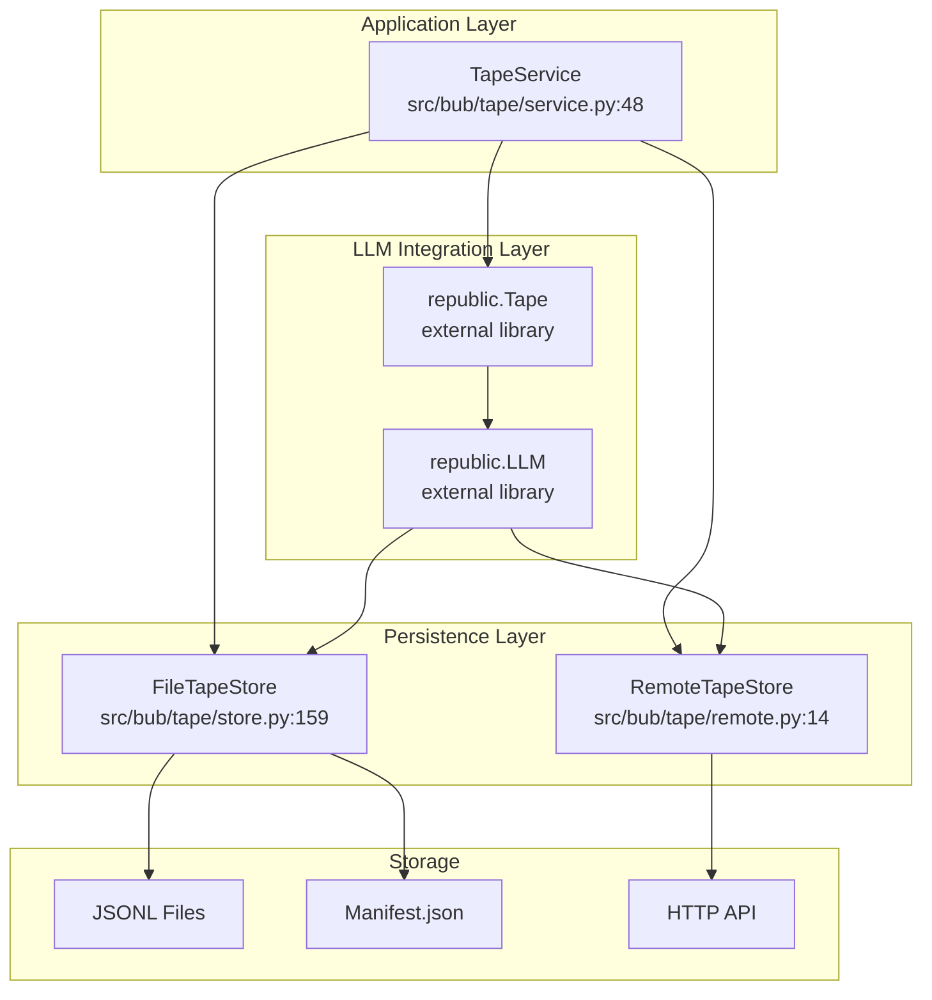
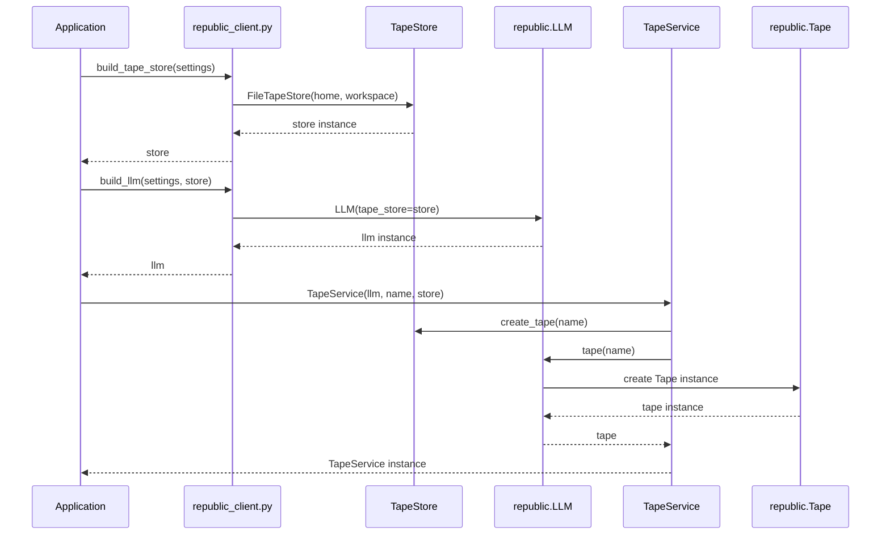

# 09 - Tape Architecture

The tape system provides conversation persistence, session forking, and history management for Bub. It consists of a layered architecture where the persistence layer (`TapeStore`), LLM session management (`Tape`), and application-level operations (`TapeService`) work together to maintain conversation state across agent lifecycles.

## Component Overview

The tape architecture has three distinct layers:

1. **Persistence Layer** - `TapeStore` implementations handle low-level storage operations
2. **LLM Integration Layer** - The `republic.Tape` class provides auto-persisting LLM sessions
3. **Application Layer** - `TapeService` wraps both layers with app-specific operations



## Architecture Flow

The tape system is initialized through the integration layer:

```
build_tape_store(settings) 
    → FileTapeStore|RemoteTapeStore (persistence layer)
    
build_llm(store)
    → LLM(tape_store=store) (inference + persistence binding)
    
TapeService(llm, name, store)
    → llm.tape(name) creates Tape (auto-persisting session)
    → store used directly for search/operations
```

### Initialization Sequence



## Core Components

### TapeStore Protocol

The `TapeStore` protocol defines the interface for all persistence implementations.

**Location:** `src/bub/app/types.py:61-83`

| Method | Purpose |
|--------|---------|
| `create_tape(tape, title, replace_if_exists)` | Creates a new tape, returns tape ID |
| `get_title(tape)` | Retrieves tape title from manifest |
| `list_tapes()` | Returns list of all tape IDs |
| `read(tape, from_entry_id, to_entry_id)` | Reads entries, optionally filtered by ID range |
| `append(tape, entry)` | Appends a `TapeEntry` to the tape |
| `fork(from_tape, new_tape_id, from_entry, from_anchor)` | Creates a copy of a tape from a specific point |
| `archive(tape_id)` | Archives tape to backup file |
| `reset(tape)` | Clears tape contents |
| `create_anchor(name, tape_id, entry_id, state)` | Creates a named anchor point |
| `get_anchor(name)` | Retrieves anchor by name |
| `list_anchors()` | Lists all anchors |
| `resolve_anchor(name)` | Returns entry ID for an anchor |

### FileTapeStore

Local JSONL-based implementation with manifest-based metadata.

**Location:** `src/bub/tape/store.py:159`

**Key Features:**
- Append-only JSONL storage per tape
- Manifest tracks metadata and anchors
- Thread-safe with file-level locking
- Internal helpers: `TapePaths`, `TapeFile`
- Supports forking from anchors or entry IDs
- Archive functionality with timestamped backups

**Storage Structure:**
```
.tape/
├── manifest.json           # Tape metadata and anchors
├── <workspace_hash>__<tape_id>.jsonl
└── <workspace_hash>__<tape_id>.jsonl.20240115T120000Z.bak  # Archived
```

### RemoteTapeStore

HTTP client for connecting to a remote tape server.

**Location:** `src/bub/tape/remote.py:14`

**Key Features:**
- Same interface as `FileTapeStore`
- HTTP/REST API over local storage
- Supports tape server deployment scenarios
- Automatic JSON serialization of entries

### TapeService

Application-level wrapper that combines LLM session management with store operations.

**Location:** `src/bub/tape/service.py:48`

**Not a protocol** - this is a concrete class that coordinates between the LLM's `Tape` and the `TapeStore`.

| Method | Purpose |
|--------|---------|
| `fork_session(new_name, from_anchor, intention)` | Creates child session from anchor point |
| `ensure_bootstrap_anchor()` | Adds initial `session/start` anchor if none exist |
| `handoff(name, state)` | Creates anchor with associated state |
| `read_entries()` | Returns full tape history |
| `search(query, limit, all_tapes)` | Fuzzy search across tape(s) |
| `reset(archive)` | Archives and clears tape, adds new start anchor |
| `between_anchors(start, end)` | Query entries between two anchors |
| `info()` | Returns tape metadata (entry count, anchors, etc.) |

### republic.Tape (External)

The `Tape` class from the `republic` library is not just storage—it's an active LLM session.

**Key Behaviors:**
- **Auto-persistence**: All LLM calls automatically save prompts and responses
- **Context awareness**: Reads conversation history on each call
- **Message conversion**: Uses `context` parameter to transform entries → messages
- **Session continuity**: Maintains state across multiple calls

**Created via:** `LLM.tape(name)`

**Key Methods:**
- `chat()` / `tool_calls()` - LLM operations with auto-save
- `read_entries()` - Get conversation history
- `append()` - Manually add entries
- `handoff()` - Create anchor points
- `query()` - Build queries for filtering entries

### republic.LLM (External)

The LLM client from `republic` that binds tape storage to inference.

**Initialization:**
```python
LLM(
    model="gpt-4",
    tape_store=store,  # TapeStore implementation
    context=context,   # Message conversion context
)
```

**Factory Method:**
- `llm.tape(name)` - Creates or loads a `Tape` instance bound to this LLM

## Design Rationale

### Why TapeService Needs Both LLM and Store

The `TapeService` takes both an `LLM` and a `TapeStore` as dependencies because:

1. **Tape (from LLM)**: Provides the auto-persisting LLM session. Every `chat()` or `tool_calls()` automatically appends to the tape. This is the "write" path for conversation.

2. **Store (direct)**: Used for operations that bypass the LLM layer:
   - `search()` - Scans tape content without loading into LLM context
   - `fork()` - Creates new tapes from existing content
   - `reset()` / `archive()` - Administrative operations
   - Direct entry queries (`between_anchors`, `after_anchor`)

This separation allows the LLM layer to focus on inference with transparent persistence, while the application layer can still perform direct storage operations when needed.

### Storage Abstraction

The `TapeStore` protocol enables:

- **Local development**: `FileTapeStore` with JSONL files
- **Production deployment**: `RemoteTapeStore` connecting to tape servers
- **Testing**: Mock implementations
- **Future backends**: Database, cloud storage, etc.

All implementations share the same interface, allowing seamless switching without changing application code.

## Key Classes Reference

| Component | Type | File | Line | Purpose |
|-----------|------|------|------|---------|
| `TapeStore` | Protocol | `src/bub/app/types.py` | 61-83 | Persistence interface |
| `FileTapeStore` | Class | `src/bub/tape/store.py` | 159 | Local JSONL implementation |
| `RemoteTapeStore` | Class | `src/bub/tape/remote.py` | 14 | HTTP client implementation |
| `TapeService` | Class | `src/bub/tape/service.py` | 48 | Application wrapper |
| `TapeFile` | Class | `src/bub/tape/store.py` | 33 | Single tape file operations |
| `TapePaths` | Dataclass | `src/bub/tape/store.py` | 24 | Path resolution helper |
| `TapeInfo` | Dataclass | `src/bub/tape/service.py` | 23 | Runtime tape summary |
| `build_tape_store` | Function | `src/bub/integrations/republic_client.py` | 76 | Factory for stores |
| `build_llm` | Function | `src/bub/integrations/republic_client.py` | 97 | Factory for LLM |

## Related Documentation

- **Session Lifecycle**: See [06-session-lifecycle.md](06-session-lifecycle.md) for how tapes are forked during agent handoff
- **Class Hierarchy**: See [01-class-hierarchy.md](01-class-hierarchy.md) for overall component relationships
- **TapeServer REST API**: `src/bub/tape/server.py` exposes tape operations via HTTP
- **Anchor System**: Anchors enable session forking and state capture at specific conversation points

## Tape Entry Types

Entries in a tape have different `kind` values:

- `message` - LLM chat messages (user, assistant, system)
- `tool_call` - Tool invocation requests
- `tool_result` - Tool execution results
- `anchor` - Named checkpoints for forking
- `event` - Application-specific events
- `system` - System-level annotations

The `payload` field contains type-specific data, while `meta` holds metadata like timestamps and IDs.
