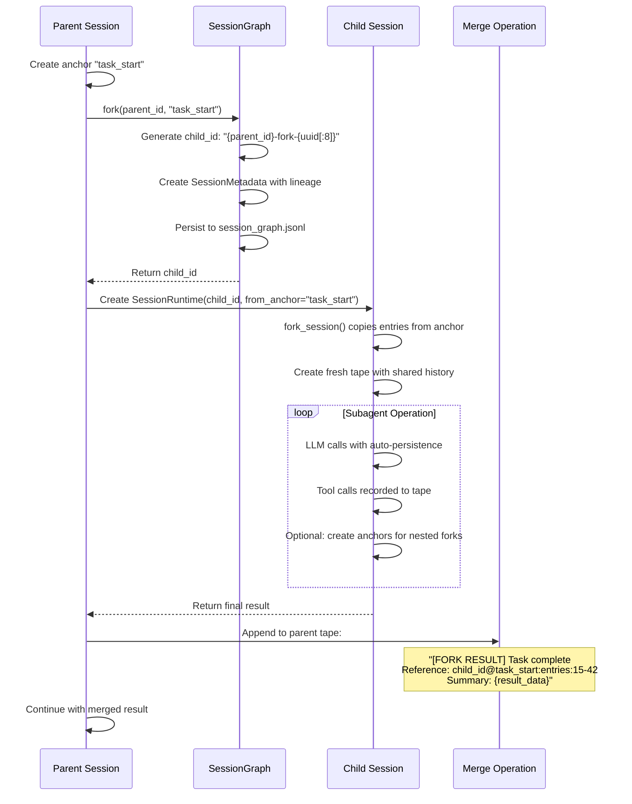

# Session Forking Pattern

The session forking pattern is a core architectural mechanism for delegating work to subagents while maintaining clean tape boundaries, deterministic state, and auditability. This pattern enables parent agents to spawn child agents that operate on isolated tapes while preserving the ability to merge results back into the parent's history.

## Overview

At its heart, session forking solves a fundamental problem in agent systems: how to delegate work without corrupting the parent's conversation state or creating concurrent write conflicts. The pattern works by:

1. Creating an anchor point in the parent's tape at the current position
2. Forking a new child tape that copies history from that anchor point
3. Letting the child operate independently with its own exclusive tape
4. Merging results back to the parent when the child completes

> **Design Note:** "I think that's a good example of a workflow: fork a subagent, do something, on context close, the merge operation is to take the result of the fork, and the range reference, as a single message appended to the start point at fork, then this final tape continues to serve as current agent's thread."

This creates a clean delegation boundary where the parent can continue operating while the child works, and results are integrated deterministically when ready.

## The 1-1-1 Correspondence Principle

The forking pattern relies on a strict invariant:

```
One SessionRuntime → One TapeService → One republic.Tape
```

This means:
- Each SessionRuntime has exactly one TapeService
- Each TapeService wraps exactly one republic.Tape instance
- Each tape has a deterministic name derived from its session_id

> **Key Constraint:** "The key constraint here is we need to make sure a 1-1 correspondence at any time for tape - agent."

### Why This Matters

| Principle | Description |
|-----------|-------------|
| **Prevents Concurrent Writes** | Only one SessionRuntime can write to a tape at any time |
| **Clear Ownership Boundaries** | No ambiguity about which agent owns which tape state |
| **Deterministic State** | Same session_id → same tape → reproducible behavior |
| **Easy Merge Semantics** | Child can be safely discarded or merged without side effects |

When a child is forked, it receives its **own** TapeService wrapping a **fresh** republic.Tape. This ensures the child has exclusive write access to its history, even though it shares pre-fork content with the parent.

> **Implementation Approach:** "One way is we create a SessionRuntime by passing it an anchor, and then it creates a fresh tape out of it to ensure exclusive ownership."

## Context Manager Pattern

The idiomatic way to use session forking is through a context manager that handles the full lifecycle:

```python
# Pseudo-code showing the pattern
with fork_session(from_anchor="analysis") as child_session:
    # Child operates on its own fresh tape
    # Copied from anchor point in parent
    result = child_session.run("Analyze this code")
    # Child's tape has full history of work
    
# On context exit:
# 1. Capture child result
# 2. Take range reference (start_entry_id to end_entry_id)
# 3. Append single summary message to parent at fork point
# 4. Parent's tape continues with merged result
```

### What Happens During Fork

1. **Pre-Fork**: Parent creates an anchor at current position (e.g., `"task_start"`)
2. **Fork**: Parent calls `fork_session()`, which:
   - Generates a child session ID via `SessionGraph.fork()`
   - Creates a new `TapeService` with a fresh `republic.Tape`
   - Copies entries from parent's anchor point to current into child tape
   - Optionally records an `AgentIntention` anchor in the child tape
3. **Child Operation**: Child operates independently with its own tape
4. **Merge**: Context manager exit captures results and appends to parent

## Fork-Merge Workflow

### Phase 1: Fork

The fork phase establishes the child session with shared history but independent future:

```python
# Parent creates anchor at current position
parent_tape.handoff("task_start", state={"context": "Working on feature X"})

# Generate child session ID with lineage tracking
child_id = session_graph.fork(
    parent_session_id=parent_id,
    from_anchor="task_start"
)
# child_id format: "{parent_id}-fork-{uuid[:8]}"

# Fork the tape from anchor point
child_tape = parent_tape.fork_session(
    new_tape_name=f"bub:{child_id}",
    from_anchor="task_start",
    intention=AgentIntention(
        next_steps="Implement feature X",
        context_summary="Parent needs feature X implemented",
        trigger_on_complete="notify_parent"
    )
)

# Create child SessionRuntime with fresh tape
child_session = SessionRuntime(
    session_id=child_id,
    tape=child_tape,
    # ... other dependencies
)
```

**Key operations:**
- Parent creates anchor at current position
- Calls `TapeService.fork_session(new_name, from_anchor)` to create child tape
- `SessionGraph.fork()` tracks lineage for reconstruction
- New `SessionRuntime` created with exclusive ownership of child tape

### Phase 2: Subagent Operation

The child operates completely independently:

- Subagent makes LLM calls through its own `TapeService`
- All prompts, responses, tool calls, and results recorded to child's tape
- Child can create its own anchors for nested forking
- Parent can either wait for completion or continue asynchronously

```
Child Tape Timeline:
[task_start anchor] → [intention anchor] → [LLM call 1] → [tool call] 
                                                      → [tool result] 
                                                      → [LLM response]
                                                      → [LLM call 2]
                                                      → ...
                                                      → [final result]
```

### Phase 3: Merge

When the context manager exits or child completes:

1. **Capture Result**: Extract the final result message from child's tape
2. **Capture Range**: Note entry IDs from fork point to latest (`15-42`)
3. **Append to Parent**: Write a single message to parent's tape at fork anchor:
   ```
   [FORK RESULT] Analysis complete
   Reference: child_session_id@anchor:task_start:entries:15-42
   Summary: {result_summary}
   ```
4. **Parent Continues**: Parent's tape now contains the merged result and can proceed

```
Parent Tape Before Merge:
[...previous entries...] → [task_start anchor] → (parent continues here)

Parent Tape After Merge:
[...previous entries...] → [task_start anchor] → [FORK RESULT: child complete]
                                               → (parent continues here)
```

## Implementation Details

### Key Classes and Methods

| Class/Method | Location | Purpose |
|--------------|----------|---------|
| `TapeService.fork_session()` | `src/bub/tape/service.py:62` | Creates child tape from anchor point with copied history |
| `SessionGraph.fork()` | `src/bub/tape/session.py:93` | Generates child session ID and tracks lineage |
| `AgentIntention` | `src/bub/tape/session.py:14` | Records purpose/context when forking |
| `SessionMetadata` | `src/bub/tape/session.py:44` | Stores session lineage and status |
| `TapeService.handoff()` | `src/bub/tape/service.py:125` | Creates named anchor points |

### Fork Session Implementation

From `src/bub/tape/service.py:62-93`:

```python
def fork_session(
    self,
    new_tape_name: str,
    from_anchor: str | None = None,
    intention: AgentIntention | None = None,
) -> TapeService:
    """Create a new session (tape) continuing from an anchor in this tape."""
    # Copy entries from anchor point (or all entries if no anchor)
    entries = self.between_anchors(from_anchor, "latest") if from_anchor else self.read_entries()
    
    # Create fresh TapeService with new tape
    new_tape = TapeService(self._llm, new_tape_name, store=self._store)
    
    # Copy entries to child (skipping the anchor entry itself)
    for entry in entries:
        if from_anchor and entry.payload.get("name") == from_anchor:
            continue
        new_tape.tape.append(entry)
    
    # Record intention or ensure bootstrap anchor
    if intention:
        new_tape.handoff("intention", state=intention.to_state())
    else:
        new_tape.ensure_bootstrap_anchor()
    
    logger.info("Forked session '{}' from anchor '{}'", new_tape_name, from_anchor)
    return new_tape
```

### Session Graph Fork

From `src/bub/tape/session.py:93-106`:

```python
def fork(
    self,
    parent_session_id: str | None,
    from_anchor: str | None,
) -> str:
    # Generate child ID with parent prefix for traceability
    child_id = f"{parent_session_id}-fork-{uuid.uuid4().hex[:8]}" if parent_session_id else uuid.uuid4().hex[:16]
    
    # Create metadata with lineage info
    meta = SessionMetadata(
        session_id=child_id,
        parent_session_id=parent_session_id,
        from_anchor=from_anchor,
    )
    
    # Track in memory and persist
    self._sessions[child_id] = meta
    self._persist(meta)
    return child_id
```

## Benefits

### Clean Separation of Concerns

Each agent has its own tape with clear boundaries. The parent doesn't need to know about the child's internal operations—only the final result.

### Reversible

A child session can be discarded without affecting the parent. If the child fails or produces unwanted results, the parent simply doesn't merge and continues from its original anchor point.

### Auditable

The child's tape contains the complete history of its work: every LLM call, tool invocation, intermediate thought, and final result. This enables debugging, replay, and compliance.

### Composable

Child sessions can fork further. A deeply nested delegation chain maintains the same guarantees at each level—each child has exclusive ownership of its tape and can merge results up the chain.

### Deterministic

The merge point is always a well-defined anchor entry. Given the same parent state and child implementation, the merged result will always be identical.

## Sequence Diagram



## Related Patterns

| Pattern | Documentation | Relationship |
|---------|---------------|--------------|
| Session Lifecycle | [06-session-lifecycle.md](06-session-lifecycle.md) | Session creation, forking flow, and state machine |
| Tape Architecture | [09-tape-architecture.md](09-tape-architecture.md) | How `fork_session()` works at the tape layer |
| Class Hierarchy | [01-class-hierarchy.md](01-class-hierarchy.md) | Complete UML of session and tape classes |

## Trade-offs

### Advantages

- **Isolation**: Child failures don't corrupt parent state
- **Parallelism**: Parent can continue while child works (if designed for async)
- **Auditability**: Complete history preserved in child tape
- **Composability**: Children can fork further
- **Reversibility**: Can discard child without side effects

### Considerations

- **Storage Overhead**: Each fork creates a new tape file with copied history
- **Memory**: Child tape loads entries into memory during operation
- **Coordination**: Parent must explicitly wait for or poll child completion
- **Merge Complexity**: Applications must implement merge logic (not automatic)

## Usage Example

```python
from bub.tape.service import TapeService
from bub.tape.session import SessionGraph, AgentIntention
from bub.app.runtime import SessionRuntime

class ForkManager:
    def __init__(self, parent_session: SessionRuntime, graph: SessionGraph):
        self.parent = parent_session
        self.graph = graph
    
    def fork_task(self, anchor_name: str, task: str) -> str:
        """Fork a child session to complete a task."""
        # Phase 1: Fork
        parent_id = self.parent.session_id
        child_id = self.graph.fork(parent_id, from_anchor=anchor_name)
        
        child_tape = self.parent.tape.fork_session(
            new_tape_name=f"bub:{child_id}",
            from_anchor=anchor_name,
            intention=AgentIntention(
                next_steps=task,
                context_summary=f"Delegated by {parent_id}",
            )
        )
        
        # Create child runtime (simplified)
        child_session = SessionRuntime(
            session_id=child_id,
            tape=child_tape,
            # ... other dependencies
        )
        
        return child_id, child_session
    
    def merge_result(self, child_session: SessionRuntime, anchor_name: str):
        """Merge child results back to parent."""
        # Get child result from its tape
        entries = child_session.tape.read_entries()
        result_entry = entries[-1]  # Final entry
        
        # Create merge message
        merge_message = {
            "role": "system",
            "content": f"[FORK RESULT] Task complete\n"
                       f"Reference: {child_session.session_id}@{anchor_name}\n"
                       f"Summary: {result_entry.payload}"
        }
        
        # Append to parent tape
        self.parent.tape.append(merge_message)
```

## Key Takeaways

1. **Always maintain 1-1-1 correspondence**: One SessionRuntime per TapeService per Tape
2. **Use anchors to mark fork points**: Enables deterministic merge semantics
3. **Copy history, not references**: Child gets its own tape entries, not shared state
4. **Track lineage via SessionGraph**: Essential for debugging and reconstruction
5. **Merge explicitly**: The pattern provides the mechanism, applications provide the policy
