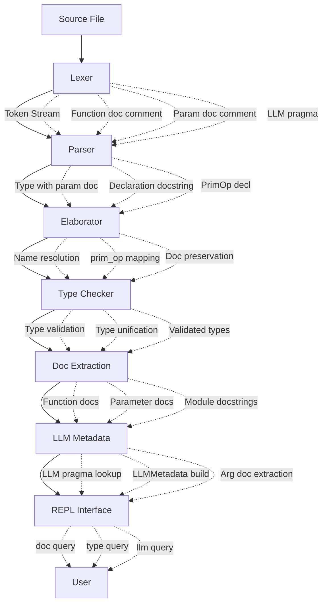

# System F LLM Integration Design Document

**Status:** Design Complete  
**Date:** 2026-02-28  
**Scope:** LLM Function Syntax & Multi-Pass Architecture  
**Authors:** System F Design Team  

---

## Executive Summary

This document presents the complete design for integrating LLM (Large Language Model) functions into System F, an experimental dependently-typed programming language. The design incorporates lessons from Idris2 and Lean4 compilers while keeping the implementation pragmatic for a REPL-first tool.

!!! tip "Key Innovation"
    Parameter docstrings are embedded in type annotations (`-- ^`), enabling universal support across all type constructs (functions, data constructors, records) without special cases.

---

## Part 1: Conversation Summary

### 1.1 Topics Explored

#### 1.1.1 Pragma & Docstring Handling Strategy

**The Problem:** How should System F handle metadata annotations like LLM pragmas and documentation strings? Three approaches were considered:

1. **Multi-pass architecture** (like some research compilers)
   - Parse standalone comment nodes
   - Separate attachment pass
   - Pros: Clean separation of concerns
   - Cons: More complex, unnecessary for current scope

2. **Inline attachment** (Idris2-style)
   - Parse and attach during parsing
   - Pros: Simpler implementation
   - Cons: Less flexible for orphan comments

3. **Environment extensions** (Lean4-style)
   - Store externally from AST
   - Pros: Async-safe, cross-module
   - Cons: Overkill for REPL-only tools

**Research:** Spawned two subagents to analyze Idris2 (`upstream/idris2/src/Idris/Syntax/Pragmas.idr`) and Lean4 (`upstream/lean4/src/Lean/DocString.lean`) implementations.

#### 1.1.2 LLM Function Syntax Design

**The Problem:** LLM functions need:
- No user implementation (runtime calls LLM)
- Rich metadata (model, temperature, prompts)
- Documentation (function + parameter docs)

**Approaches Considered:**
1. `extern` marker: `func = \x -> extern` - awkward, inconsistent
2. `prim_op` keyword: `prim_op func : Type` - aligns with primitives
3. Special syntax: `@llm func : Type` - adds new keyword

!!! note "Decision"
    Use `prim_op` with `-- ^` for parameter docs

#### 1.1.3 AST Architecture

**The Problem:** Where do docstrings live in the AST?

**Key Insight from Research:**
- Idris2: AST-embedded fields (`doc : String` in constructors)
- Lean4: Environment extensions (external maps)

**Trade-offs:**

| Aspect | AST-Embedded | Environment Extensions |
|--------|--------------|----------------------|
| Lookup Speed | O(1) dict | O(log n) tree |
| Complexity | Simple | Complex machinery |
| Async Safety | Requires locks | Persistent structures |
| REPL Use | Perfect fit | Overkill |

!!! note "Decision"
    AST-embedded (Idris2-style) for REPL-first design

#### 1.1.4 REPL Query Architecture

**The Problem:** How fast should docstring/type lookups be in the REPL?

**Analysis:**
- REPL is sequential (no async)
- No cross-module loading in simple case
- Sessions are ephemeral (no persistence needed)

!!! note "Verdict"
    O(1) hash map lookups are perfect. Lean4's O(log n) with persistence is overkill.

### 1.2 Decisions Made

| Decision | Choice | Rationale | Alternatives Rejected |
|----------|--------|-----------|---------------------|
| **Docstring Storage** | AST-embedded (Idris2-style) | O(1) lookups, simpler code, sufficient for REPL | Lean4 environment extensions - too complex |
| **Multi-pass Strategy** | Single-pass inline attachment | Simpler parser, good enough | Separate attachment pass - unnecessary complexity |
| **LLM Syntax** | `prim_op` keyword | Aligns with primitive system (`prim_type`, `prim_op`), clean | `extern` body - awkward; `@llm` decorator - new keyword |
| **Parameter Docs** | Type-embedded (`-- ^` on types) | Universal across all constructs, consistent | Declaration-level only - loses param docs; Lambda docs - complex |
| **Extraction Timing** | After type checking | Validated types, single extraction point, type errors caught early | During elaboration - unvalidated types |
| **Global vs Local** | Asymmetry accepted | LLM functions must be global (need registration, metadata), locals are for closures | Universal support - unnecessary complexity |
| **Type Annotations** | Mandatory for globals | System F philosophy (explicit typing), catches errors early | Optional - inconsistent with explicit typing |
| **Pragma Format** | Dict-based storage | Extensible (can add more pragma types later) | Single string - not extensible |

### 1.3 Rejected Options

| Option | Why Rejected | When It Would Make Sense |
|--------|--------------|------------------------|
| **Lean4-style environment extensions** | Adds ~5x code complexity for benefits (async, persistence) not needed in REPL | If adding LSP, async elaboration, or .olean file support |
| **Multi-pass comment attachment** | Parser-combinator libraries (parsy) make inline attachment cleaner | If using custom parser generator or needing complex comment reordering |
| **Old `extern` body syntax** | `func = \x -> extern` is artificial, doesn't align with primitives | If we needed user-provided fallback implementations |
| **Lambda parameter docs** | Complicates Surface AST for rare use case | If users frequently need documented local helpers |
| **Separate pragma declaration** | `pragma LLM model=gpt-4` - creates ordering issues | If pragmas could affect multiple declarations |
| **Type-level pragmas** | `{#- LLM model=gpt-4 #-} Int -> Int` - confusing | If we had type-directed pragmas (rare) |

### 1.4 Key Rationales

**1. Idris2 vs Lean4 for REPL:**
Both advisors confirmed through source analysis:
- Idris2 uses O(1) dict lookups in `SyntaxInfo.defDocstrings`
- Lean4 uses O(log n) binary search in `MapDeclarationExtension`
- For REPL-only without LSP/async, O(1) is better and simpler

**2. Type-Embedded Parameter Docs:**
Traditional approach: Attach docs to declarations
```systemf
-- ^ param doc  -- WHERE does this attach?
func : Type -> Type
```

Our approach: Docs attach to type positions
```systemf
func : Type   -- ^ attaches HERE
  -> Type    -- ^ attaches HERE
```
This works for:
- Simple types: `String -- ^ doc`
- Function types: `(Int -> Int) -- ^ doc`
- Polymorphic: `forall a. a -- ^ doc`

**3. Post-Typecheck Extraction:**
Before extraction: Types might be unvalidated
```systemf
func : UndefinedType -- ^ doc -> String
```

After typecheck: Types are validated
```systemf
func : ValidatedType -- ^ doc -> ValidatedType
```
LLMMetadata needs validated types for prompt generation.

**4. Global-Only LLM Functions:**
LLM functions need:
- Registration in evaluator
- Global lookup by name
- Persistent metadata
- Module-level visibility

Locals (let bindings) are:
- Lexically scoped
- Ephemeral
- For closure creation
- Don't need external metadata

---

## Part 2: Final Design

### 2.1 Component Overview



**Data Flow Summary:**
1. Source → Tokens (preserve comments)
2. Tokens → Surface AST (inline docs)
3. Surface → Core AST (elaboration)
4. Core → Validated (type checking)
5. Validated → Extracted docs (pass 1)
6. Extracted → LLM metadata (pass 2)
7. All → REPL queries

### 2.2 Surface AST

Surface AST represents the user's code before elaboration. It uses name-based binding and preserves all syntactic sugar.

#### 2.2.1 Type Annotations with Embedded Docs

```python
@dataclass(frozen=True)
class SurfaceTypeArrow:
    """Function type: arg -> ret with optional parameter docstring.
    
    Example:
        String -- ^ Input text -> String
        
    Representation:
        SurfaceTypeArrow(
            arg=SurfaceTypeConstructor("String"),
            ret=SurfaceTypeConstructor("String"),
            param_doc="Input text",
            location=loc
        )
    """
    arg: SurfaceType
    ret: SurfaceType
    param_doc: Optional[str] = None  # Populated when parser sees -- ^ after type
    location: Location
```

**Edge Cases:**
- Multi-line docs: `String\n  -- ^ doc\n  -> String` - parser collects lines
- No doc: `String -> String` - param_doc is None
- Nested arrows: `(a -> b) -- ^ f -> a -- ^ x -> b` - each arg gets doc

#### 2.2.2 Declarations

**Global Term Declaration:**
```python
@dataclass(frozen=True)
class SurfaceTermDeclaration:
    """Named term declaration at module level.
    
    Syntax:
        -- | Function description
        func : Type -- ^ param -> Type
        func = \x -> body
        
    Or with pragma:
        {-# LLM model=gpt-4 #-}
        -- | Translate text
        prim_op func : Type -- ^ param -> Type
    """
    name: str
    type_annotation: SurfaceType  # REQUIRED - changed from Optional
    body: SurfaceTerm
    location: Location
    docstring: Optional[str] = None  # -- | style, attaches to this declaration
    pragma: dict[str, str] | None = None  # {"LLM": "model=gpt-4 temp=0.7"}
```

**Why type_annotation is required:**
System F is explicitly typed. Top-level declarations must have types for:
1. Documentation (users know the type)
2. Error messages (better type errors)
3. IDE support (hover to see type)
4. LLM functions (need types for prompt generation)

**Primitive Operation Declaration:**
```python
@dataclass(frozen=True)
class SurfacePrimOpDecl:
    """Primitive operation without user implementation.
    
    Used for:
    - Built-in primitives: prim_op int_plus : Int -> Int -> Int
    - LLM functions: prim_op translate : String -- ^ doc -> String
    
    The body is implicit - elaborator generates PrimOp("$prim.name") 
    or PrimOp("llm.name") automatically.
    """
    name: str
    type_annotation: SurfaceType  # Has param_doc embedded in arrow types
    location: Location
    docstring: Optional[str] = None  # -- | style function doc
    # Note: pragma comes from preceding SurfaceTermDeclaration if any
```

**Local Let Binding:**
```python
@dataclass(frozen=True)
class SurfaceLet:
    """Local let binding within an expression.
    
    Syntax:
        let x : Int = 42 in x + 1
        
    Note: type annotation is optional for locals since they can be inferred.
    """
    var: str
    var_type: Optional[SurfaceType]  # NEW - explicit annotation support
    value: SurfaceTerm
    body: SurfaceTerm
    location: Location
```

**Comparison: Global vs Local**

| Feature | Global (SurfaceTermDeclaration) | Local (SurfaceLet) |
|---------|----------------------------------|-------------------|
| Type annotation | Required | Optional |
| Docstring | Yes (-- |) | No |
| Pragma | Yes ({#- -#}) | No |
| Name scope | Module-level | Lexical scope |
| REPL accessible | Yes | No |
| Can be LLM func | Yes | No |

### 2.3 Core AST

Core AST is the elaborated form. It uses de Bruijn indices and has no syntactic sugar. Docstrings are NOT here - they've been extracted to Module.

```python
@dataclass(frozen=True)
class TermDeclaration:
    """Core term declaration after elaboration.
    
    All docstrings have been extracted to Module.docstrings by this point.
    The Core AST is clean and focused on semantics.
    """
    name: str
    type_annotation: Type  # Validated type
    body: Term
    pragma: Optional[str] = None  # Raw pragma string (e.g., "model=gpt-4")
    # Note: NO docstring field - extracted separately
```

**Why pragma remains:**
Pragma content is needed at runtime for LLM API calls (model name, temperature).

### 2.4 Module Structure

Module is the final artifact after all compilation phases. It contains everything needed for execution and REPL queries.

```python
@dataclass(frozen=True)
class Module:
    """Complete module after compilation.
    
    Contains:
    - Compiled declarations (executable)
    - Type information (for :t queries)
    - Documentation (for :doc queries)
    - LLM metadata (for LLM function execution)
    - Errors/warnings (for diagnostics)
    """
    name: str
    declarations: list[Declaration]  # Core declarations, ready to execute
    
    # Type information (for REPL queries)
    constructor_types: dict[str, Type]  # Data constructor signatures
    global_types: dict[str, Type]       # Term types (functions, values)
    primitive_types: dict[str, PrimitiveType]  # Int, String, etc.
    
    # Documentation (extracted after type checking)
    # Keys use naming convention (see 2.6)
    docstrings: dict[str, str]
    
    # LLM metadata (extracted after type checking)
    llm_functions: dict[str, LLMMetadata]
    
    # Diagnostics
    errors: list[ElaborationError]
    warnings: list[str]
```

**Access Patterns:**
- Execution: `module.declarations` (iterate and evaluate)
- Type query: `module.global_types[name]` (O(1) dict)
- Doc query: `module.docstrings[name]` (O(1) dict)
- LLM query: `module.llm_functions[name]` (O(1) dict)

### 2.5 LLMMetadata

Rich metadata for LLM function execution.

```python
@dataclass(frozen=True)
class LLMMetadata:
    """Complete metadata for an LLM function.
    
    Used by the evaluator to:
    1. Craft prompts (using docs and types)
    2. Call LLM APIs (using pragma_params)
    3. Parse responses (using return type)
    4. Handle errors (fallback to identity)
    
    All types are validated by type checker before extraction.
    """
    function_name: str
    function_docstring: Optional[str]  # -- | style doc
    
    # Arguments (parallel arrays)
    arg_names: list[str]        # ["x", "y"] - extracted from type
    arg_types: list[Type]       # [String, Int] - validated types
    arg_docstrings: list[Optional[str]]  # ["doc for x", None] - from -- ^
    
    # Pragma content (opaque, parsed at runtime)
    pragma_params: Optional[str]  # "model=gpt-4 temperature=0.7"
```

**Example:**
```systemf
{-# LLM model=gpt-4 temperature=0.7 #-}
-- | Translate English to French
prim_op translate : String
  -- ^ The English text
  -> String
```

Becomes:
```python
LLMMetadata(
    function_name="translate",
    function_docstring="Translate English to French",
    arg_names=["arg0"],  # Generated if not in lambda
    arg_types=[PrimitiveType("String")],  # Validated!
    arg_docstrings=["The English text"],
    pragma_params="model=gpt-4 temperature=0.7"
)
```

### 2.6 Naming Conventions for Docstring Keys

Unified naming scheme for all documentation lookups.

**Key Format:**
```
{name}                    - Function/type declaration doc
{name}.${n}               - nth parameter doc (1-indexed)
{name}.${field}          - Record field doc
{name}.${ctor}.${n}      - Constructor parameter doc
```

**Examples:**
```python
# Function
docstrings["translate"] = "Translate English to French"
docstrings["translate.$1"] = "The English text"

# Multi-parameter
docstrings["classify.$1"] = "Categories"
docstrings["classify.$2"] = "Text to classify"

# Data type
docstrings["Person"] = "A person record"
docstrings["Person.$name"] = "Full name"
docstrings["Person.$age"] = "Age in years"

# Constructor
docstrings["Maybe.$Just.$1"] = "The value"
```

**Why this format:**
- Hierarchical: `func.$1` implies "function's first param"
- Extensible: Can add more levels later
- Query-friendly: `name.startswith("func.")` finds all func docs

### 2.7 Syntax Examples

**Single Parameter LLM Function:**
```systemf
-- Pragma with model configuration
{-# LLM model=gpt-4 temperature=0.7 #-}

-- Function-level doc (-- | style)
-- | Translate English text to French

-- Declaration with parameter doc (-- ^ style)
prim_op translate : String
  -- ^ The English text to translate
  -> String
  -- Result is the French translation
```

**Multi-Parameter Function:**
```systemf
{-# LLM model=gpt-4 #-}
-- | Classify text into one of the provided categories
prim_op classify : String
  -- ^ Comma-separated list of valid categories
  -> String
  -- ^ The text to classify
  -> String
  -- ^ The selected category
```

**Higher-Order Function:**
```systemf
-- | Apply a function to a value
prim_op apply : (a -> b)
  -- ^ Function to apply
  -> a
  -- ^ Input value
  -> b
  -- ^ Result of applying function to value
```

**Polymorphic Function:**
```systemf
-- | Identity function (for reference, not LLM)
identity : forall a. a -> a
identity = \x -> x

-- | Map function over list
prim_op map : (a -> b)
  -- ^ Function to apply to each element
  -> List a
  -- ^ Input list
  -> List b
```

**Data Type with Docs:**
```systemf
-- | A person in the system
data Person = Person
  { name : String  -- ^ Full legal name
  , age : Int     -- ^ Age in years
  }
```

**Local Let with Annotation:**
```systemf
-- Type annotation guides inference
let squared : Int = x * x in squared + 1
```

---

## Part 3: Execution Plan

### Phase 1: Foundation (Boundaries & Core Types)

**Goal:** Establish the data structures that all other components depend on.

**Step 1.1: Update Surface AST**

*Task:* Modify type definitions in `src/systemf/surface/ast.py`

*Changes:*
1. Add `param_doc: Optional[str]` to `SurfaceTypeArrow`
   - Default: None
   - Used when parser sees `-- ^` after type
   
2. Make `type_annotation` required in `SurfaceTermDeclaration`
   - Change: `Optional[SurfaceType]` → `SurfaceType`
   - Validation: Raise error if missing during elaboration
   
3. Add `var_type: Optional[SurfaceType]` to `SurfaceLet`
   - Syntax: `let x : Type = value in body`
   - Parser needs to handle optional `: Type`
   
4. Ensure `SurfacePrimOpDecl` supports docstring
   - Already has it, verify implementation

*Dependencies:* None (this is the foundation)

*Tests:* Unit tests for AST construction

**Step 1.2: Update Core AST**

*Task:* Clean up `src/systemf/core/ast.py`

*Changes:*
1. Verify `TermDeclaration` has pragma field
2. Ensure NO docstring fields in Core AST
3. Update any code that creates Core declarations

*Dependencies:* Step 1.1

*Tests:* Verify Core AST creates successfully

**Step 1.3: Update Module**

*Task:* Confirm Module structure in `src/systemf/core/module.py`

*Changes:*
1. Verify `docstrings: dict[str, str]` field exists
2. Verify `llm_functions: dict[str, LLMMetadata]` field exists
3. Document extraction timing (post-typecheck)

*Dependencies:* Step 1.2

*Tests:* Module creation tests

*Milestone:* Core types compile, tests pass

### Phase 2: Examples & Tests (Validation)

**Goal:** Define what success looks like through concrete examples.

**Step 2.1: Update Example Files**

*Files:*
- `tests/llm_examples.sf` - basic examples
- `tests/llm_multiparam.sf` - multi-param
- `tests/llm_complex.sf` - complex types

*Content:* Use new syntax (see 2.7)

*Validation:* Examples should be parseable by target implementation

**Step 2.2: Create Parser Test Specifications**

*Tests needed:*
1. `test_parse_type_with_param_doc`
   - Input: `String -- ^ doc -> String`
   - Assert: `SurfaceTypeArrow.param_doc == "doc"`
   
2. `test_parse_multi_param_type_with_docs`
   - Input: Multi-line type with multiple --^
   - Assert: Each arrow has correct param_doc
   
3. `test_parse_prim_op_declaration`
   - Input: `prim_op name : Type -- ^ doc -> Type`
   - Assert: Creates SurfacePrimOpDecl
   
4. `test_parse_let_with_type_annotation`
   - Input: `let x : Int = 42 in x`
   - Assert: SurfaceLet.var_type is Some(Int)

5. `test_parse_mandatory_type_annotation`
   - Input: Global decl without type
   - Assert: Error raised

*Dependencies:* Step 1.1

**Step 2.3: Create Elaborator Test Specifications**

*Tests needed:*
1. `test_elab_prim_op_generates_primop_body`
   - Assert: SurfacePrimOpDecl → Core PrimOp body
   
2. `test_elab_function_preserves_docstring`
   - Assert: Docstring flows Surface → Core
   
3. `test_elab_passes_pragma_to_core`
   - Assert: Pragma dict → Core pragma string

*Dependencies:* Step 2.2

**Step 2.4: Create Integration Test Specifications**

*Tests needed:*
1. `test_full_pipeline_basic_llm`
   - Parse → Elaborate → Typecheck → Extract
   - Verify Module.docstrings populated
   
2. `test_full_pipeline_multi_param`
   - Complex example with multiple params
   - Verify all param docs extracted
   
3. `test_llm_metadata_has_validated_types`
   - LLMMetadata.arg_types are validated Type objects
   - Not just SurfaceType (unvalidated)

*Dependencies:* Step 2.3

*Milestone:* All test specs written, examples ready

### Phase 3: Component Implementation

**Goal:** Implement each component according to spec.

**Step 3.1: Parser Changes**

*Location:* `src/systemf/surface/parser.py`

*Implementation:*

1. **Type parser modifications:**
   ```python
   @generate
   def arrow_type():
       """Parse arrow type with optional param doc."""
       arg = yield app_type
       
       # Try to parse -- ^ doc (optional)
       param_doc = yield (DOC_COMMENT_CARET >> text).optional()
       
       arrow = yield (ARROW >> arrow_type).optional()
       if arrow is not None:
           return SurfaceTypeArrow(arg, arrow, param_doc, loc)
       return arg
   ```

2. **prim_op declaration parser:**
   ```python
   @generate
   def prim_op_decl():
       yield PRIM_OP
       name = yield ident
       yield COLON
       type_ann = yield type_parser
       return SurfacePrimOpDecl(name, type_ann, loc)
   ```

3. **Let binding with type:**
   ```python
   @generate
   def let_expr():
       yield LET
       var = yield ident
       var_type = yield (COLON >> type_parser).optional()
       yield EQUALS
       value = yield term_parser
       yield IN
       body = yield term_parser
       return SurfaceLet(var, var_type, value, body, loc)
   ```

*Error Handling:*
- Missing type annotation for global: Clear error message
- Malformed doc comment: Treat as regular comment
- Invalid type syntax: Standard parse error

*Dependencies:* Step 2.2

*Tests:* Parser unit tests from Step 2.2

**Step 3.2: Elaborator Changes**

*Location:* `src/systemf/surface/elaborator.py`

*Implementation:*

1. **Handle prim_op:**
   ```python
   def elaborate_prim_op_decl(self, decl: SurfacePrimOpDecl):
       # Elaborate type
       core_type = self._elaborate_type(decl.type_annotation)
       
       # Register in global_types
       self.global_types[decl.name] = core_type
       
       # Auto-generate PrimOp body
       body = core.PrimOp(f"llm.{decl.name}")
       
       # Build Core declaration
       return core.TermDeclaration(
           name=decl.name,
           type_annotation=core_type,
           body=body,
           pragma=...  # Extract from preceding decl or surface
       )
   ```

2. **Pass through docs:**
   - Surface docstring → Core (temporarily, for extraction later)
   - Don't extract yet, just pass through

*Dependencies:* Step 3.1

*Tests:* Elaborator unit tests from Step 2.3

**Step 3.3: Type Checker Changes**

*Location:* `src/systemf/core/checker.py`

*Implementation:*

1. **Handle PrimOp("llm.name"):**
   ```python
   case PrimOp(name):
       if name.startswith("llm."):
           func_name = name[4:]
           if func_name in self.global_types:
               return self.global_types[func_name]
           raise TypeError(f"Unknown LLM function: {func_name}")
       # ... handle regular primitives
   ```

2. **Validate all types:**
   - Ensure type constructors exist
   - Unify variables
   - Return global_types mapping

*Dependencies:* Step 3.2

*Tests:* Type checker tests

**Step 3.4: Doc Extraction Module (NEW)**

*Location:* NEW `src/systemf/docs/extractor.py`

*Implementation:*

```python
def extract_docs(module: Module, global_types: dict[str, Type]) -> dict[str, str]:
    """Extract all docstrings from validated module.
    
    Algorithm:
    1. Iterate all declarations
    2. Extract declaration-level doc
    3. Walk type annotation, extract param docs
    4. Build keys using naming convention
    """
    docs = {}
    
    for decl in module.declarations:
        if isinstance(decl, TermDeclaration):
            # Function doc
            if decl.docstring:
                docs[decl.name] = decl.docstring
            
            # Param docs from type
            param_docs = _extract_param_docs(decl.type_annotation)
            for i, doc in enumerate(param_docs, 1):
                if doc:
                    docs[f"{decl.name}.${i}"] = doc
    
    return docs

def _extract_param_docs(ty: Type) -> list[Optional[str]]:
    """Walk type and extract param docs."""
    docs = []
    current = ty
    
    while isinstance(current, TypeArrow):
        # In Core AST, we lost param_doc from Surface
        # Need to preserve it somehow...
        # TODO: Add param_doc to Core TypeArrow?
        docs.append(None)  # Placeholder
        current = current.ret
    
    return docs
```

*Issue:* Core AST `Type` doesn't have `param_doc`. Need to decide:
- Option A: Add `param_doc` to `TypeArrow` in Core
- Option B: Extract before elaboration (from Surface AST)
- Option C: Store separately during elaboration

*Recommendation:* Option A - add to Core `TypeArrow`. It's a semantic annotation.

*Dependencies:* Decision on Core AST modification

*Tests:* Doc extraction unit tests

**Step 3.5: LLM Metadata Extraction**

*Location:* `src/systemf/llm/extractor.py`

*Implementation:*

```python
def extract_llm_metadata(module: Module, global_types: dict[str, Type]) -> dict[str, LLMMetadata]:
    """Extract LLM metadata after type checking."""
    llm_functions = {}
    
    for decl in module.declarations:
        if isinstance(decl, TermDeclaration) and decl.pragma:
            if "LLM" in decl.pragma:
                # Extract metadata
                metadata = _build_llm_metadata(decl, global_types)
                llm_functions[decl.name] = metadata
    
    return llm_functions

def _build_llm_metadata(decl: TermDeclaration, global_types: dict[str, Type]) -> LLMMetadata:
    """Build LLMMetadata from declaration."""
    # Get validated type
    validated_type = global_types.get(decl.name)
    
    # Extract arg info by walking type
    arg_types = []
    arg_docs = []
    current = validated_type
    
    while isinstance(current, TypeArrow):
        arg_types.append(current.arg)
        arg_docs.append(current.param_doc)  # If we add it
        current = current.ret
    
    return LLMMetadata(
        function_name=decl.name,
        function_docstring=decl.docstring,
        arg_names=[f"arg{i}" for i in range(len(arg_types))],
        arg_types=arg_types,
        arg_docstrings=arg_docs,
        pragma_params=decl.pragma.get("LLM")
    )
```

*Dependencies:* Step 3.4

*Tests:* LLM extraction unit tests

*Milestone:* All components implemented, unit tests pass

### Phase 4: Integration & Cleanup

**Goal:** Wire everything together and polish.

**Step 4.1: REPL Integration**

*Location:* `src/systemf/eval/repl.py`

*Implementation:*

```python
def process_declarations(self, source: str):
    # Parse
    decls = parse_program(source)
    
    # Elaborate
    module = self.elaborator.elaborate(decls)
    
    # Type check
    types = self.checker.check_program(module.declarations)
    
    # Extract docs (NEW)
    module.docstrings = extract_docs(module, types)
    
    # Extract LLM metadata (NEW)
    module.llm_functions = extract_llm_metadata(module, types)
    
    # Execute
    values = self.evaluator.evaluate_program(module.declarations)
    
    return values
```

*Dependencies:* Step 3.5

**Step 4.2: Test Review**

*Tasks:*
1. Run all tests
2. Remove obsolete tests (old syntax)
3. Add any missing coverage
4. Fix failing tests

*Dependencies:* Step 4.1

**Step 4.3: Documentation**

*Tasks:*
1. Update user manual with new syntax
2. Document naming conventions
3. Add examples to README
4. Update CHANGELOG

*Dependencies:* All tests passing

*Milestone:* All tests pass, documentation updated, ready for use

---

## Part 4: Component Specifications

### Component: SurfaceTypeArrow

**Location:** `src/systemf/surface/ast.py`

**Change:** Add `param_doc` field

**Before:**
```python
@dataclass(frozen=True)
class SurfaceTypeArrow:
    arg: SurfaceType
    ret: SurfaceType
    location: Location
```

**After:**
```python
@dataclass(frozen=True)
class SurfaceTypeArrow:
    arg: SurfaceType
    ret: SurfaceType
    param_doc: Optional[str] = None
    location: Location
```

**Spec:**
- **param_doc:** Docstring for the argument (left side of `->`)
- **Populated when:** Parser sees `-- ^` comment immediately after type
- **Multi-line support:** Parser collects consecutive `-- ^` lines
- **Default:** None (no documentation)

**Example:**
```systemf
String
  -- ^ The input string
  -> Int
```

Results in:
```python
SurfaceTypeArrow(
    arg=SurfaceTypeConstructor("String"),
    ret=SurfaceTypeConstructor("Int"),
    param_doc="The input string",
    location=loc
)
```

**Edge Cases:**
1. No doc: `String -> Int` → param_doc=None
2. Empty doc: `String -- ^ -> Int` → param_doc=""
3. Multi-line: Multiple `-- ^` lines concatenated with newlines

### Component: SurfaceTermDeclaration

**Location:** `src/systemf/surface/ast.py`

**Change:** Make `type_annotation` required (was Optional)

**Before:**
```python
@dataclass(frozen=True)
class SurfaceTermDeclaration:
    name: str
    type_annotation: Optional[SurfaceType]  # Could be None
    body: SurfaceTerm
    ...
```

**After:**
```python
@dataclass(frozen=True)
class SurfaceTermDeclaration:
    name: str
    type_annotation: SurfaceType  # REQUIRED
    body: SurfaceTerm
    location: Location
    docstring: Optional[str] = None
    pragma: dict[str, str] | None = None
```

**Spec:**
- **type_annotation:** Must be present for all global declarations
- **Rationale:** System F requires explicit typing; helps with error messages
- **Error:** Elaborator raises error if missing

**Validation:**
```python
def elaborate_term_decl(self, decl: SurfaceTermDeclaration):
    if decl.type_annotation is None:
        raise ElaborationError(
            f"Declaration {decl.name} missing type annotation",
            decl.location
        )
    # ... continue elaboration
```

**Pragma Format:**
```python
# Input: {-# LLM model=gpt-4 temperature=0.7 #-}
# Stored as: {"LLM": "model=gpt-4 temperature=0.7"}
```

**Extensibility:** Can add other pragma types:
```python
# Future: {-# INLINE #-}
# Stored as: {"INLINE": ""}
```

### Component: SurfaceLet

**Location:** `src/systemf/surface/ast.py`

**Change:** Add `var_type` field

**Before:**
```python
@dataclass(frozen=True)
class SurfaceLet:
    var: str
    value: SurfaceTerm
    body: SurfaceTerm
    location: Location
```

**After:**
```python
@dataclass(frozen=True)
class SurfaceLet:
    var: str
    var_type: Optional[SurfaceType]  # NEW
    value: SurfaceTerm
    body: SurfaceTerm
    location: Location
```

**Spec:**
- **var_type:** Optional type annotation for bidirectional checking
- **Syntax:** `let x : Type = value in body`
- **Inference:** If None, type is inferred from value

**Parser Changes:**
```python
# Old: let x = 42 in ...
# New: let x : Int = 42 in ...

@generate
def let_expr():
    yield LET
    var = yield ident
    var_type = yield (COLON >> type_parser).optional()  # NEW
    yield EQUALS
    value = yield term_parser
    yield IN
    body = yield term_parser
    return SurfaceLet(var, var_type, value, body, loc)
```

**Elaboration:**
```python
def elaborate_let(self, let: SurfaceLet):
    if let.var_type:
        # Use explicit type
        core_type = self._elaborate_type(let.var_type)
        self._add_type_binding(let.var, core_type)
    else:
        # Infer type from value
        pass
    # ... elaborate body
```

### Component: SurfacePrimOpDecl

**Location:** `src/systemf/surface/ast.py` (already exists)

**Purpose:** Declare primitive operations without implementation

**Syntax:**
```systemf
prim_op name : Type
```

**Semantics:**
- No user-provided body
- Implementation provided by runtime (evaluator)
- For LLM: generates `PrimOp("llm.name")` body
- For primitives: generates `PrimOp("$prim.name")` body

**Relationship to SurfaceTermDeclaration:**

| Aspect | SurfaceTermDeclaration | SurfacePrimOpDecl |
|--------|----------------------|-------------------|
| Has body | Yes | No (implicit) |
| Type annotation | Required | Required |
| Docstring | Yes | Yes |
| Pragma | Yes | No (via preceding decl) |

**Elaboration:**
```python
def elaborate_prim_op(self, decl: SurfacePrimOpDecl):
    # Elaborate type
    core_type = self._elaborate_type(decl.type_annotation)
    
    # Determine body based on context
    if is_llm_context:
        body = core.PrimOp(f"llm.{decl.name}")
    else:
        body = core.PrimOp(f"$prim.{decl.name}")
    
    return core.TermDeclaration(
        name=decl.name,
        type_annotation=core_type,
        body=body,
        pragma=...  # From preceding decl or explicit
    )
```

### Component: Parser (Type Annotations with Docs)

**Location:** `src/systemf/surface/parser.py`

**Sub-component 1: Type Arrow Parser**

**Spec:**
```
arrow_type := app_type ("-- ^" text)? "->" arrow_type
            | app_type
```

**Implementation:**
```python
@generate
def arrow_type():
    """Parse arrow type with optional parameter docstring."""
    arg = yield app_type
    
    # Optional: -- ^ docstring
    param_doc = yield parse_doc_comment_caret().optional()
    
    # Arrow and rest
    arrow = yield (ARROW >> arrow_type).optional()
    
    if arrow is not None:
        return SurfaceTypeArrow(arg, arrow, param_doc, arg.location)
    return arg

@generate
def parse_doc_comment_caret():
    """Parse -- ^ style doc comment."""
    yield DOC_CARET
    text = yield rest_of_line
    return text.strip()
```

**Multi-line Support:**
```systemf
Type
  -- ^ Line 1
  -- ^ Line 2
  -> ReturnType
```

Parser collects consecutive `-- ^` lines.

**Sub-component 2: prim_op Declaration Parser**

**Spec:**
```
prim_op_decl := "prim_op" ident ":" type
```

**Implementation:**
```python
@generate
def prim_op_decl():
    yield PRIM_OP
    name = yield ident
    yield COLON
    type_ann = yield type_parser
    return SurfacePrimOpDecl(name, type_ann, location)
```

**Sub-component 3: Let with Type Annotation**

**Spec:**
```
let_expr := "let" ident (":" type)? "=" term "in" term
```

**Implementation:**
```python
@generate
def let_expr():
    yield LET
    var = yield ident
    var_type = yield (COLON >> type_parser).optional()
    yield EQUALS
    value = yield term_parser
    yield IN
    body = yield term_parser
    return SurfaceLet(var, var_type, value, body, loc)
```

### Component: Elaborator

**Location:** `src/systemf/surface/elaborator.py`

**Sub-component 1: prim_op Elaboration**

**Algorithm:**
1. Elaborate type annotation to Core type
2. Register type in `global_types` for type checker
3. Determine if LLM context (has LLM pragma)
4. Generate appropriate PrimOp body
5. Create Core TermDeclaration

**Pseudocode:**
```python
def elaborate_prim_op_decl(decl: SurfacePrimOpDecl, pragma: dict | None):
    # 1. Elaborate type
    core_type = self._elaborate_type(decl.type_annotation)
    
    # 2. Register for type checker
    self.global_types[decl.name] = core_type
    
    # 3. Determine context
    is_llm = pragma and "LLM" in pragma
    
    # 4. Generate body
    if is_llm:
        body = core.PrimOp(f"llm.{decl.name}")
    else:
        body = core.PrimOp(f"$prim.{decl.name}")
    
    # 5. Build Core declaration
    return core.TermDeclaration(
        name=decl.name,
        type_annotation=core_type,
        body=body,
        pragma=pragma.get("LLM") if pragma else None,
        docstring=decl.docstring  # Pass through for extraction
    )
```

**Sub-component 2: Regular Function Elaboration**

**Algorithm:**
1. Verify type annotation present (required)
2. Elaborate type
3. Add name to global_terms (for recursion)
4. Elaborate body with name in scope
5. Create Core declaration

**Pseudocode:**
```python
def elaborate_term_decl(decl: SurfaceTermDeclaration):
    # 1. Verify type annotation
    if not decl.type_annotation:
        raise ElaborationError("Missing type annotation", decl.location)
    
    # 2. Elaborate type
    core_type = self._elaborate_type(decl.type_annotation)
    self.global_types[decl.name] = core_type
    
    # 3. Add to scope for recursion
    self._add_global_term(decl.name)
    
    # 4. Elaborate body
    core_body = self.elaborate_term(decl.body)
    
    # 5. Build Core declaration
    return core.TermDeclaration(
        name=decl.name,
        type_annotation=core_type,
        body=core_body,
        pragma=...,  # Extract from decl.pragma
        docstring=decl.docstring  # Pass through
    )
```

**Sub-component 3: Type Elaboration**

**Algorithm:**
- Convert Surface types to Core types
- Preserve structure (arrows, constructors, etc.)
- **NEW:** Need to decide if we preserve param_doc in Core types

**Decision:** Yes, add `param_doc` to `TypeArrow` in Core AST.

### Component: Type Checker

**Location:** `src/systemf/core/checker.py`

**Sub-component 1: PrimOp Type Lookup**

**Algorithm:**
```python
def infer_primop(self, name: str) -> Type:
    if name.startswith("llm."):
        func_name = name[4:]
        if func_name in self.global_types:
            return self.global_types[func_name]
        raise TypeError(f"Unknown LLM function: {func_name}")
    
    if name.startswith("$prim."):
        prim_name = name[6:]
        full_name = f"$prim.{prim_name}"
        if full_name in self.global_types:
            return self.global_types[full_name]
    
    raise TypeError(f"Unknown primitive: {name}")
```

**Sub-component 2: Type Validation**

**Algorithm:**
```python
def check_type_valid(self, ty: Type) -> None:
    match ty:
        case TypeConstructor(name, args):
            if name not in self.known_types:
                raise TypeError(f"Unknown type constructor: {name}")
            for arg in args:
                self.check_type_valid(arg)
        case TypeArrow(arg, ret, _):
            self.check_type_valid(arg)
            self.check_type_valid(ret)
        # ... other cases
```

**Sub-component 3: Return global_types**

After type checking, return the validated `global_types` mapping for extraction passes.

### Component: Doc Extraction Pass

**Location:** NEW `src/systemf/docs/extractor.py`

**Algorithm:**

```python
def extract_docs(module: Module, global_types: dict[str, Type]) -> dict[str, str]:
    """
    Extract all docstrings from a validated module.
    
    Returns a dict mapping qualified names to docstrings:
    - "func" -> function-level doc
    - "func.$1" -> first parameter doc
    - "func.$2" -> second parameter doc
    """
    docs = {}
    
    for decl in module.declarations:
        if isinstance(decl, TermDeclaration):
            # Extract function doc
            if decl.docstring:
                docs[decl.name] = decl.docstring
            
            # Extract param docs from type annotation
            param_docs = _extract_param_docs_from_type(decl.type_annotation)
            for i, doc in enumerate(param_docs, 1):
                if doc:
                    docs[f"{decl.name}.${i}"] = doc
    
    return docs


def _extract_param_docs_from_type(ty: Type) -> list[Optional[str]]:
    """
    Walk a (possibly curried) function type and extract parameter docs.
    
    String -- ^ doc1 -> Int -- ^ doc2 -> Bool
    Returns: ["doc1", "doc2"]
    """
    docs = []
    current = ty
    
    while isinstance(current, TypeArrow):
        docs.append(getattr(current, 'param_doc', None))
        current = current.ret
    
    return docs
```

**Dependencies:**
- Requires `param_doc` field in Core `TypeArrow`
- Or: Extract from Surface AST before elaboration

**Recommendation:** Add `param_doc` to Core `TypeArrow` for consistency.

### Component: LLM Metadata Extraction

**Location:** `src/systemf/llm/extractor.py`

**Algorithm:**

```python
def extract_llm_metadata(
    module: Module, 
    global_types: dict[str, Type]
) -> dict[str, LLMMetadata]:
    """
    Extract LLM function metadata after type checking.
    
    Only processes declarations with pragma containing "LLM".
    """
    llm_functions = {}
    
    for decl in module.declarations:
        if not isinstance(decl, TermDeclaration):
            continue
        
        if not decl.pragma:
            continue
        
        if "LLM" not in decl.pragma:
            continue
        
        metadata = _build_llm_metadata(decl, global_types)
        llm_functions[decl.name] = metadata
    
    return llm_functions


def _build_llm_metadata(
    decl: TermDeclaration,
    global_types: dict[str, Type]
) -> LLMMetadata:
    """Build LLMMetadata from a validated declaration."""
    
    # Get the validated type
    validated_type = global_types.get(decl.name)
    if not validated_type:
        raise RuntimeError(f"Type not found for {decl.name}")
    
    # Walk type to extract arg info
    arg_types = []
    arg_docs = []
    current = validated_type
    
    while isinstance(current, TypeArrow):
        arg_types.append(current.arg)
        arg_docs.append(getattr(current, 'param_doc', None))
        current = current.ret
    
    # Generate arg names (or extract from lambda if available)
    arg_names = [f"arg{i}" for i in range(len(arg_types))]
    
    return LLMMetadata(
        function_name=decl.name,
        function_docstring=decl.docstring,
        arg_names=arg_names,
        arg_types=arg_types,
        arg_docstrings=arg_docs,
        pragma_params=decl.pragma
    )
```

**Key Points:**
- Only processes declarations with `pragma` containing "LLM"
- Uses validated types (from type checker)
- Arg names generated (could extract from lambda in future)
- Returns dict for O(1) REPL lookup

### Component: REPL Integration

**Location:** `src/systemf/eval/repl.py`

**Integration Points:**

1. **After type checking:**
```python
types = self.checker.check_program(module.declarations)

# NEW: Extract docs
module.docstrings = extract_docs(module, types)

# NEW: Extract LLM metadata
module.llm_functions = extract_llm_metadata(module, types)
```

2. **For :doc command:**
```python
def command_doc(self, name: str):
    doc = self.current_module.docstrings.get(name)
    if doc:
        print(doc)
    else:
        print(f"No documentation for {name}")
```

3. **For :llm command (future):**
```python
def command_llm(self, name: str):
    if name in self.current_module.llm_functions:
        metadata = self.current_module.llm_functions[name]
        print(f"LLM Function: {metadata.function_name}")
        print(f"Model: {metadata.pragma_params}")
        print(f"Args: {metadata.arg_names}")
    else:
        print(f"Not an LLM function: {name}")
```

**Error Handling:**
- Extraction errors should be caught and added to module.errors
- Don't crash REPL on extraction failure

---

## Appendix A: Detailed Test Plan

### A.1 Parser Unit Tests

**Test: Basic Type with Param Doc**
```python
def test_parse_type_with_param_doc():
    source = "String -- ^ Input text -> String"
    ty = parse_type(source)
    
    assert isinstance(ty, SurfaceTypeArrow)
    assert ty.param_doc == "Input text"
```

**Test: Multi-Param Type**
```python
def test_parse_multi_param_type():
    source = """
String
  -- ^ First param
  -> Int
  -- ^ Second param
  -> Bool
"""
    ty = parse_type(source)
    
    # Walk the nested arrows
    assert ty.param_doc == "First param"
    assert ty.ret.param_doc == "Second param"
```

**Test: prim_op Declaration**
```python
def test_parse_prim_op():
    source = """
{-# LLM model=gpt-4 #-}
-- | Translate text
prim_op translate : String
  -- ^ Input
  -> String
"""
    decls = parse_program(source)
    
    assert len(decls) == 1
    decl = decls[0]
    assert isinstance(decl, SurfacePrimOpDecl)
    assert decl.name == "translate"
    assert decl.docstring == "Translate text"
```

### A.2 Integration Tests

**Test: Full Pipeline**
```python
def test_full_pipeline():
    source = read_file("tests/llm_examples.sf")
    
    # Parse
    decls = parse_program(source)
    
    # Elaborate
    module = elaborate(decls)
    
    # Type check
    types = type_check(module)
    
    # Extract
    module.docstrings = extract_docs(module, types)
    module.llm_functions = extract_llm_metadata(module, types)
    
    # Verify
    assert "translate" in module.llm_functions
    metadata = module.llm_functions["translate"]
    assert metadata.function_docstring == "Translate English to French"
```

### A.3 Edge Cases

1. **Empty doc comment:**
   ```systemf
   String -- ^ -> Int
   ```
   Expected: param_doc = ""

2. **Multiple consecutive docs:**
   ```systemf
   String
     -- ^ Line 1
     -- ^ Line 2
     -> Int
   ```
   Expected: param_doc = "Line 1\nLine 2"

3. **No space after --^:**
   ```systemf
   String --^doc -> Int
   ```
   Expected: Should this be valid? Decide in parser.

4. **Doc in nested type:**
   ```systemf
   (a -- ^ type var -> b) -> c
   ```
   Expected: Both `a -> b` and outer arrow have docs

---

## Appendix B: Open Questions & Decisions

### B.1 Should Core TypeArrow have param_doc?

**Options:**
1. **Yes, add to Core:** Consistent with Surface, extraction is simple
2. **No, extract from Surface:** Core stays minimal, but extraction must happen before elaboration
3. **Store separately during elaboration:** Complex bookkeeping

**Recommendation:** Option 1 - add `param_doc: Optional[str]` to Core `TypeArrow`. It's a semantic annotation, belongs in Core.

### B.2 How to handle arg names?

**Options:**
1. **Generate names:** "arg0", "arg1" - simple, always works
2. **Extract from lambda:** If body is `\x -> ...`, use "x" - more meaningful
3. **Require explicit names:** New syntax for named params

**Recommendation:** Option 1 for now (generate), Option 2 as enhancement later.

### B.3 What about record fields?

**Future enhancement:** Support docs on record fields:
```systemf
data Person = Person
  { name : String -- ^ Full name
  , age : Int    -- ^ Age in years
  }
```

**Key:** `Person.$name`, `Person.$age`

### B.4 Should pragmas be typed?

**Options:**
1. **Dict of strings:** Flexible, parsed at runtime
2. **Typed ADT:** `Pragma = LLM {model: str, temp: float} | Inline | ...`

**Recommendation:** Option 1 for now (experimental). Option 2 when stable.

---

## Appendix C: Migration Guide

### C.1 For Users

**Old syntax (being removed):**
```systemf
translate : String -> String
translate = \text -- ^ doc -> extern
```

**New syntax:**
```systemf
{-# LLM model=gpt-4 #-}
-- | Translate text
prim_op translate : String
  -- ^ Input text
  -> String
```

### C.2 For Contributors

**Files to modify:**
1. `surface/ast.py` - Add param_doc to types
2. `surface/parser.py` - Parse --^ in types
3. `surface/elaborator.py` - Handle prim_op
4. `core/ast.py` - Add param_doc to TypeArrow
5. `core/checker.py` - Validate PrimOp types
6. `docs/extractor.py` - NEW
7. `llm/extractor.py` - Use validated types
8. `eval/repl.py` - Call extraction

**Files to add tests:**
1. `tests/test_surface/test_parser_docs.py`
2. `tests/test_docs/test_extractor.py`
3. Update existing test files

---

*End of Enriched Design Document*
