# Handoff Architecture

This document defines the complete semantics, implementation, and usage patterns of **handoff** - the phase transition primitive that manages LLM context window, session boundaries, and state persistence in Bub.

## Table of Contents

1. [Core Semantics](#1-core-semantics)
2. [Mental Model](#2-mental-model)
3. [Data Model](#3-data-model)
4. [Agent Loop Integration](#4-agent-loop-integration)
5. [Context Window Management](#5-context-window-management)
6. [Session Storage Architecture](#6-session-storage-architecture)
7. [Runtime Integration](#7-runtime-integration)
8. [Use Cases and Patterns](#8-use-cases-and-patterns)
9. [Multi-Agent Extensions](#9-multi-agent-extensions)
10. [API Reference](#10-api-reference)
11. [Design Decisions](#11-design-decisions)

---

## 1. Core Semantics

### 1.1 Definition

**Handoff** is a **checkpoint primitive** that:

1. **Marks a phase boundary** - Annotates a point in the append-only tape
2. **Attaches state** - Binds arbitrary key-value data to the checkpoint
3. **Truncates context** - Controls which tape entries the LLM sees
4. **Enables recovery** - Provides restart points for session resumption

### 1.2 Key Properties

| Property | Description |
|----------|-------------|
| **Immutable** | Once written, a handoff cannot be modified |
| **Ordered** | Handoffs appear in tape sequence; latest wins for context |
| **State-bearing** | Attaches arbitrary JSON-serializable state |
| **Context-truncating** | By default, LLM only sees entries after last handoff |

### 1.3 Handoff vs Related Concepts

| Concept | Relationship to Handoff |
|---------|------------------------|
| **Anchor** | Handoff *creates* an anchor entry. "Anchor" is the entry type; "handoff" is the operation. |
| **Session** | A session is a series of entries bounded by handoffs. Sessions can fork from handoffs. |
| **Reset** | Reset clears the tape but creates a bootstrap handoff (`session/start`). |
| **Fork** | Fork creates a new tape starting from a handoff point, copying context forward. |

---

## 2. Mental Model

### 2.1 Human Work Analogy

Think of handoff like how a human manages complex work:

| Human Behavior | Handoff Equivalent |
|----------------|-------------------|
| "Let me save my progress" | `handoff("checkpoint", {summary: "what I did"})` |
| "Starting a new task phase" | `handoff("phase/name", {next_steps: "..."})` |
| "My notebook is full, let me summarize" | `handoff("summary", {context: "..."})` then truncate |
| "Handing this to my colleague" | Fork from handoff to new session |

### 2.2 Tape as Append-Only Log

```mermaid
graph LR
    subgraph Tape["Tape (append-only JSONL)"]
        direction LR
        E1["1: anchor<br/>session/start<br/>state: {owner: human}"]
        E2["2: message<br/>user: Help me..."]
        E3["3: message<br/>assistant: I'll help..."]
        E4["4: tool_call<br/>fs.read"]
        E5["5: tool_result<br/>{...}"]
        DOTS["..."]
        E50["50: anchor<br/>phase/design-complete<br/>state: {...}"]
        E51["51: message<br/>user: Now implement..."]
        E52["52: message<br/>assistant: Starting..."]
    end

    E1 --> E2 --> E3 --> E4 --> E5 --> DOTS --> E50 --> E51 --> E52

    style E1 fill:#2d2d2d,stroke:#666
    style E50 fill:#2d2d2d,stroke:#666
```



### 2.3 Context Window Visualization

```mermaid
graph TB
    subgraph FullTape["Full Tape (all entries)"]
        direction LR
        E1["[1]"]
        E2["[2]"]
        E3["[3]"]
        E4["[4]"]
        DOTS1["..."]
        E50["[50]"]
        E51["[51]"]
        E52["[52]"]
        E53["[53]"]
        E54["[54]"]
        DOTS2["..."]
        E100["[100]"]
    end

    subgraph Context["LLM Context Window"]
        direction LR
        C1["[51]"]
        C2["[52]"]
        C3["[53]"]
        C4["[54]"]
        CDOTS["..."]
    end

    E50 -. "context STARTS here" .-> C1

    E1 --> E2 --> E3 --> E4 --> DOTS1 --> E50 --> E51 --> E52 --> E53 --> E54 --> DOTS2 --> E100

    style E1 fill:#2d2d2d,stroke:#666
    style E50 fill:#2d2d2d,stroke:#666
    style Context fill:#1a1a2e,stroke:#4a4a6a
```



---

## 3. Data Model

### 3.1 Handoff Operation

```python
# src/bub/tape/service.py
def handoff(self, name: str, *, state: dict[str, Any] | None = None) -> list[TapeEntry]:
    """Create anchor handoff with optional state.
    
    Args:
        name: Unique identifier for this phase (e.g., "session/start", "phase/db-done")
        state: Arbitrary JSON-serializable state to attach
        
    Returns:
        List of entries created (anchor + event)
    """
```

### 3.2 Entry Types Created

Each handoff creates **two entries**:

```json
// Entry 1: anchor
{
  "id": 50,
  "kind": "anchor",
  "payload": {
    "name": "phase/design-complete",
    "state": {
      "summary": "Database schema designed",
      "tables": 5,
      "next_steps": "Implement models"
    }
  },
  "meta": {"run_id": "run_abc123"}
}

// Entry 2: event (for audit/debug)
{
  "id": 51,
  "kind": "event",
  "payload": {
    "name": "handoff",
    "data": {
      "name": "phase/design-complete",
      "state": {"summary": "...", "tables": 5, "next_steps": "..."}
    }
  },
  "meta": {"run_id": "run_abc123"}
}
```

### 3.3 State Schema Patterns

Common state patterns from production usage:

```python
# 1. Bootstrap
state = {"owner": "human"}

# 2. Progress tracking
state = {
    "summary": "Tests pass, 12 endpoints implemented",
    "next_steps": "Deploy to staging"
}

# 3. Intention (for forked sessions)
state = {
    "next_steps": "Investigate auth bug independently",
    "context_summary": "User reported login failures on line 45",
    "trigger_on_complete": "notify_parent"
}

# 4. Archive reference
state = {
    "owner": "human",
    "archived": "/path/to/old/tape.jsonl"
}
```

---

## 4. Agent Loop Integration

### 4.1 Handoff Trigger Points

Handoffs can be triggered by:

1. **User command**: `,handoff name=phase-1 summary="Setup done"`
2. **Tool call**: Agent calls `tape.handoff` tool
3. **Automatic**: System creates bootstrap handoff on session start
4. **Programmatic**: Code calls `tape_service.handoff()`

### 4.2 Flow in Agent Loop

```python
# src/bub/core/agent_loop.py
class AgentLoop:
    async def handle_input(self, raw: str) -> LoopResult:
        # 1. Route input (detect commands)
        route = await self._router.route_user(raw)
        
        if route.exit_requested:
            return LoopResult(...)
        
        if not route.enter_model:
            # Command executed (possibly handoff tool)
            return LoopResult(immediate_output=route.immediate_output, ...)
        
        # 2. Build context for LLM (respects handoff boundaries)
        messages = self._tape.tape.read_messages()
        # ^ Only returns messages after last anchor
        
        # 3. Run model
        model_result = await self._model_runner.run(route.model_prompt)
        
        # 4. Record result to tape
        self._record_result(model_result)
        
        return LoopResult(...)
```

### 4.3 Router Integration

```python
# src/bub/core/router.py
# Handoff is a built-in tool, not a comma command

# User types:
# ",handoff name=phase-1 summary=done"
# 
# Router detects comma prefix → executes tool call
# → Tool calls tape.handoff()
# → Handoff written to tape
# → Next LLM call sees truncated context
```

---

## 5. Context Window Management

### 5.1 Default Behavior: LAST_ANCHOR

By default, the LLM only sees entries **after the most recent anchor**:

```python
# src/bub/tape/context.py
class TapeContext:
    anchor: AnchorSelector = LAST_ANCHOR  # Default
    
def _slice_after_anchor(entries, anchor):
    if anchor is None:
        return entries  # Full tape
    
    # Find last anchor
    for idx in range(len(entries) - 1, -1, -1):
        if entries[idx].kind == "anchor":
            return entries[idx + 1:]  # Everything after
    
    return entries  # No anchor found, return all
```

### 5.2 Context Modes

| Mode | Behavior | Use Case |
|------|----------|----------|
| `LAST_ANCHOR` | Entries after most recent anchor | Default, context compaction |
| `"anchor-name"` | Entries after specific anchor | Resume from checkpoint |
| `None` | All entries | Full history, debugging |

### 5.3 Context Window Problem

```python
# From model_runner.py system prompt:
"""
<context_contract>
Excessively long context may cause model call failures. In this case, you 
SHOULD first use tape.handoff tool to shorten the length of the retrieved 
history. The current limit is 200k tokens.
</context_contract>
"""
```

**Solution**: When context approaches limit, agent creates handoff, which truncates visible history.

---

## 6. Session Storage Architecture

### 6.1 Storage Stack

```mermaid
graph TB
    subgraph Session["Session (Workspace)"]
        subgraph TS["TapeService"]
            subgraph T["Tape (republic.tape.session.Tape)"]
                subgraph TM["TapeManager"]
                    subgraph FTS["FileTapeStore (JSONL)"]
                    end
                end
            end
        end
    end

    style Session fill:#1a1a2e,stroke:#4a4a6a
    style TS fill:#16213e,stroke:#3a4a6a
    style T fill:#0f3460,stroke:#2a4a6a
    style TM fill:#1a1a2e,stroke:#4a4a6a
    style FTS fill:#2d2d2d,stroke:#666
```



### 6.2 File Layout

```mermaid
graph TD
    WS["workspace/"]
    TAPE["tape/"]
    ARCH["archived/"]

    WS --> TAPE
    WS --> SG["session_graph.jsonl<br/>Fork lineage tracking"]

    TAPE --> MAIN["main.jsonl<br/>Main tape file (append-only)"]
    TAPE --> MANIFEST["manifest.json<br/>Tape metadata & anchor index"]
    TAPE --> ARCH

    ARCH --> ARCHIVED["main_2026-02-21_*.jsonl<br/>Archived tapes"]

    style WS fill:#2d2d2d,stroke:#666
    style TAPE fill:#2d2d2d,stroke:#666
    style ARCH fill:#2d2d2d,stroke:#666
```



### 6.3 Tape Entry Format

```jsonl
// main.jsonl - append-only
{"id": 1, "kind": "anchor", "payload": {"name": "session/start", "state": {"owner": "human"}}, "meta": {}}
{"id": 2, "kind": "message", "payload": {"role": "user", "content": "Hello"}, "meta": {}}
{"id": 3, "kind": "message", "payload": {"role": "assistant", "content": "Hi!"}, "meta": {}}
{"id": 4, "kind": "anchor", "payload": {"name": "phase/intro", "state": {"summary": "Greeting done"}}, "meta": {}}
{"id": 5, "kind": "event", "payload": {"name": "handoff", "data": {"name": "phase/intro"}}, "meta": {}}
```

---

## 7. Runtime Integration

### 7.1 Session Initialization

```python
# src/bub/app/runtime.py
class AgentRuntime:
    def _init_tape(self, session_id: str) -> TapeService:
        # 1. Create or load tape for this session
        tape_service = TapeService(self._llm, session_id, store=self._tape_store)
        
        # 2. Ensure bootstrap handoff exists
        tape_service.ensure_bootstrap_anchor()
        #    ^ Creates "session/start" anchor if none exist
        
        return tape_service
```

### 7.2 Fork Session (Multi-Agent Support)

```python
# src/bub/tape/service.py
def fork_session(
    self,
    new_tape_name: str,
    from_anchor: str | None = None,
    intention: AgentIntention | None = None,
) -> TapeService:
    """Create new session continuing from a handoff point."""
    
    # 1. Get entries from anchor point
    entries = self.between_anchors(from_anchor, "latest") if from_anchor else self.read_entries()
    
    # 2. Create new tape
    new_tape = TapeService(self._llm, new_tape_name, store=self._store)
    
    # 3. Copy entries forward
    for entry in entries:
        new_tape.tape.append(entry)
    
    # 4. Add intention handoff
    if intention:
        new_tape.handoff("intention", state=intention.to_state())
    else:
        new_tape.ensure_bootstrap_anchor()
    
    # 5. Record lineage
    self._session_graph.fork(parent_session_id=self._tape.name, from_anchor=from_anchor)
    
    return new_tape
```

### 7.3 Query Methods

```python
# src/bub/tape/service.py

# Get entries between two handoffs
entries = tape.between_anchors("phase/start", "phase/end")

# Get entries after specific handoff
entries = tape.after_anchor("phase/start")

# Get entries after last handoff (default context)
entries = tape.from_last_anchor()

# List all handoffs
anchors = tape.anchors(limit=50)
# Returns: [AnchorSummary(name="session/start", state={...}), ...]
```

---

## 8. Use Cases and Patterns

### 8.1 Pattern 1: Context Compaction

**Problem**: Context approaching token limit  
**Solution**: Summarize and handoff

```
User: [50 messages of complex discussion]
Agent: [extensive debugging, tool calls]

Agent: ,handoff name=debug-complete 
       summary="Found bug in auth.py line 45, fix: add null check"

User: Now implement the fix
Agent: [fresh context - only sees handoff + new messages]
```

### 8.2 Pattern 2: Phase Tracking

```
Agent: ,handoff name=project/start state={goal: "Build API"}

[work on database]
Agent: ,handoff name=phase/db-done state={tables: 5, next: "Routes"}

[work on API]  
Agent: ,handoff name=phase/api-done state={endpoints: 12, next: "Tests"}

User: What have we done?
Agent: ,anchors
→ project/start
→ phase/db-done  
→ phase/api-done
```

### 8.3 Pattern 3: Session Recovery

```python
# Agent crashes and restarts
# On startup:

anchors = tape.anchors()
if anchors:
    last = anchors[-1]
    print(f"Resuming from: {last.name}")
    print(f"State: {last.state}")
    # Continue from last handoff
```

### 8.4 Pattern 4: Fork for Parallel Work

```python
# Parent agent
parent_tape.handoff("parallel-work-identified", state={
    "task": "Analyze security",
    "file": "auth.py"
})

# Fork to child agent
child_tape = parent_tape.fork_session(
    "security-analysis-123",
    from_anchor="parallel-work-identified",
    intention=AgentIntention(
        next_steps="Review auth.py for security issues",
        context_summary="User reported suspicious logins",
        trigger_on_complete="notify_parent"
    )
)

# Child works independently with context from handoff point
# Parent continues with other work
```

---

## 9. Multi-Agent Extensions

### 9.1 Current Limitations

Current handoff is **single-agent**:
- One tape per session
- No direct agent-to-agent context transfer
- Fork creates new tape (not shared)

### 9.2 Proposed Multi-Agent Handoff

For cross-agent context sharing:

```json
{
  "type": "context_handoff",
  "from": "agent:worker-abc123",
  "to": "agent:worker-def456",
  "timestamp": "2026-02-21T12:00:00Z",
  "content": {
    "reason": "Specialist required for security analysis",
    "summary": "Found suspicious pattern in auth.py",
    "tape_ref": "tape://workspace/telegram:123/entry/45",
    "intention": {
      "next_steps": "Review auth.py lines 40-60",
      "context_summary": "Potential SQL injection vulnerability"
    },
    "ownership": "transfer"
  }
}
```

### 9.3 Shared Tape Access

Agents can reference shared tape locations:

```
tape://{workspace}/{tape_id}/entry/{entry_id}
tape://{workspace}/{tape_id}/anchor/{anchor_name}
```

---

## 10. API Reference

### 10.1 TapeService Methods

```python
class TapeService:
    def handoff(self, name: str, *, state: dict | None = None) -> list[TapeEntry]:
        """Create handoff anchor with state."""
        
    def anchors(self, *, limit: int = 20) -> list[AnchorSummary]:
        """List recent handoffs."""
        
    def between_anchors(self, start: str, end: str, *, 
                       kinds: tuple[str, ...] = ()) -> list[TapeEntry]:
        """Get entries between two handoffs."""
        
    def after_anchor(self, anchor: str, *, 
                    kinds: tuple[str, ...] = ()) -> list[TapeEntry]:
        """Get entries after specific handoff."""
        
    def from_last_anchor(self, *, 
                        kinds: tuple[str, ...] = ()) -> list[TapeEntry]:
        """Get entries after most recent handoff."""
        
    def fork_session(self, new_tape_name: str, 
                    from_anchor: str | None = None,
                    intention: AgentIntention | None = None) -> TapeService:
        """Create new session from handoff point."""
```

### 10.2 CLI Commands

```bash
# Create handoff
,handoff name=phase-1 summary="Setup complete" next_steps="Implementation"

# List handoffs
,anchors

# Reset tape (archives and creates new bootstrap handoff)
,tape.reset archive=true
```

### 10.3 Tool Schema

```json
{
  "name": "tape.handoff",
  "description": "Create tape anchor with optional summary and next_steps state",
  "parameters": {
    "type": "object",
    "properties": {
      "name": {"type": "string", "description": "Anchor name (e.g., 'phase-1')"},
      "summary": {"type": "string", "description": "Progress summary"},
      "next_steps": {"type": "string", "description": "Next steps to take"}
    },
    "required": ["name"]
  }
}
```

---

## 11. Design Decisions

### 11.1 Why Anchors Truncate Context

**Decision**: By default, LLM only sees entries after the last anchor.  
**Rationale**:
1. **Token limits**: Prevents context overflow on long sessions
2. **Relevance**: Old entries may not be relevant to current phase
3. **Determinism**: Clear boundaries make reasoning about state easier
4. **Recovery**: Can resume from any anchor with known state

### 11.2 Why Separate Anchor and Event Entries

**Decision**: Handoff creates both `anchor` and `event` entries.  
**Rationale**:
- `anchor`: Used for context slicing (special semantics)
- `event`: Audit trail, debuggable, shows when handoffs occurred

### 11.3 Why State is Arbitrary JSON

**Decision**: Handoff state has no fixed schema.  
**Rationale**:
- Flexibility: Different use cases need different state
- Extensibility: New patterns don't require schema changes
- Simplicity: No validation overhead

### 11.4 Why Fork Copies Entries

**Decision**: Fork creates new tape with copied entries.  
**Rationale**:
- **Isolation**: Child can't corrupt parent tape
- **Independence**: Child can be reset without affecting parent
- **Audit**: Each tape has complete history

**Trade-off**: Uses more storage than shared read-only view.

---

## Related Documentation

- `docs/architecture.md` - Core architecture principles
- `docs/tape-service-rest-api.md` - Tape service API
- `docs/agent-protocol.md` - Inter-agent messaging
- `docs/cli.md` - Interactive CLI commands
