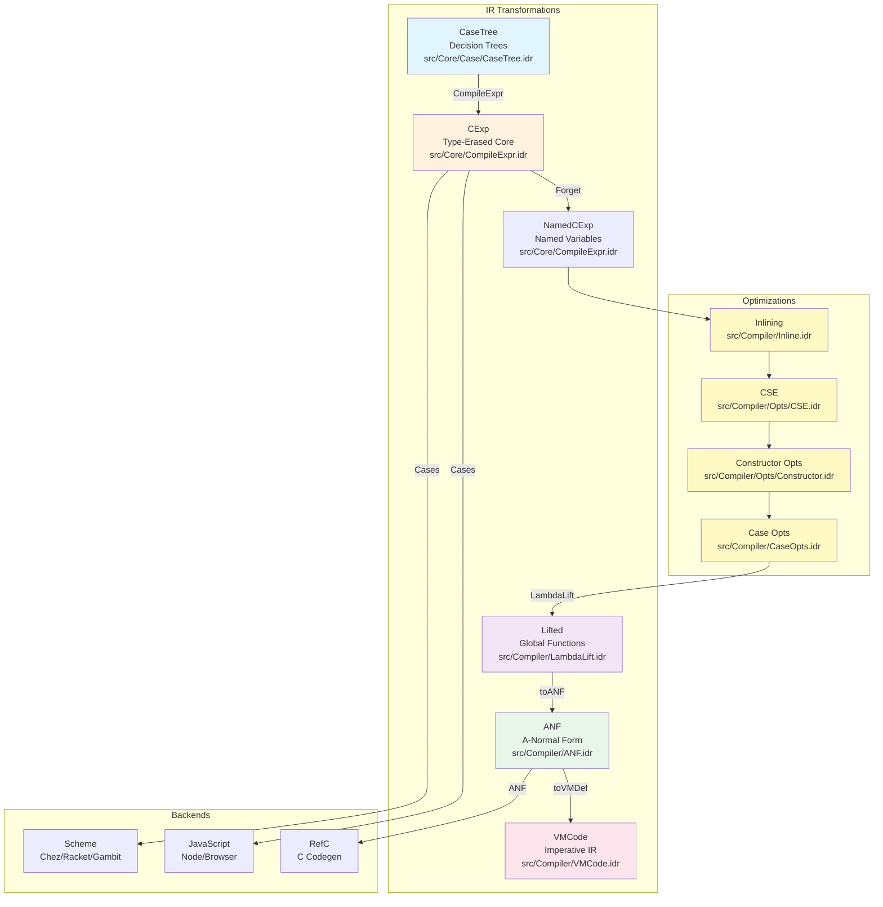

# Idris2 Recursive Types - Implementation Analysis

---

## Frontmatter

| Field | Value |
|-------|-------|
| **Title** | Idris2 Recursive Types - Implementation Analysis |
| **Source** | Upstream Idris2 repository (`/home/liu/Documents/bub/upstream/idris2/`) |
| **Analysis Date** | 2026-02-27 |
| **Focus** | Recursive data types, strict positivity, termination checking, totality defaults, compilation pipeline |
| **Total Files Analyzed** | 40 |

### Key Files Analyzed

| File Path | Lines | Description |
|-----------|-------|-------------|
| `/home/liu/Documents/bub/upstream/idris2/src/Core/TT/Term.idr` | 1-558 | Core term AST |
| `/home/liu/Documents/bub/upstream/idris2/src/Core/Context/Context.idr` | 1-436 | Definition types (Def, TCon, DCon) |
| `/home/liu/Documents/bub/upstream/idris2/src/Core/Context/Data.idr` | 1-124 | Data definition processing |
| `/home/liu/Documents/bub/upstream/idris2/src/Core/Termination/Positivity.idr` | 1-168 | Strict positivity checking |
| `/home/liu/Documents/bub/upstream/idris2/src/Core/Termination/SizeChange.idr` | 1-339 | Size-change termination |
| `/home/liu/Documents/bub/upstream/idris2/src/Core/Termination/CallGraph.idr` | 1-414 | Call graph construction |
| `/home/liu/Documents/bub/upstream/idris2/src/Core/Termination.idr` | 1-121 | Termination checking entry points |
| `/home/liu/Documents/bub/upstream/idris2/src/Core/Case/CaseTree.idr` | 1-301 | Pattern matching compilation |
| `/home/liu/Documents/bub/upstream/idris2/src/TTImp/ProcessData.idr` | 1-566 | Data declaration elaboration |
| `/home/liu/Documents/bub/upstream/idris2/src/TTImp/ProcessDef.idr` | 1-1079 | Function definition processing |
| `/home/liu/Documents/bub/upstream/idris2/src/TTImp/TTImp.idr` | 1-400 | Surface syntax types |
| `/home/liu/Documents/bub/upstream/idris2/src/Core/TT.idr` | 1-556 | Supporting types (Totality, etc.) |
| `/home/liu/Documents/bub/upstream/idris2/src/Idris/Parser.idr` | 1612-1620 | `mutual` keyword parsing |
| `/home/liu/Documents/bub/upstream/idris2/src/Idris/Desugar/Mutual.idr` | 16-58 | Two-pass mutual block splitting |
| `/home/liu/Documents/bub/upstream/idris2/src/Core/Context.idr` | 1778-1796 | `mutData` tracking functions |
| `/home/liu/Documents/bub/upstream/idris2/src/Core/SchemeEval/Compile.idr` | 526-528 | `mutwith` pattern matching |
| `/home/liu/Documents/bub/upstream/idris2/src/Core/Options.idr` | 242, 249 | Default totality settings |
| `/home/liu/Documents/bub/upstream/idris2/src/Idris/Syntax/Pragmas.idr` | 26, 97, 123 | `%default` pragma definition |
| `/home/liu/Documents/bub/upstream/idris2/src/Idris/Desugar.idr` | 1409 | `DefaultTotality` desugaring |
| `/home/liu/Documents/bub/upstream/idris2/src/Core/Context/Context.idr` | 203-237 | `DefFlag`, `SetTotal` |
| `/home/liu/Documents/bub/upstream/idris2/src/TTImp/ProcessDecls/Totality.idr` | 11-51 | Totality checking entry point |
| `/home/liu/Documents/bub/upstream/idris2/libs/prelude/Builtin.idr` | 9-22 | `assert_total` definition |

### Compilation Pipeline Files

| File Path | Lines | Description |
|-----------|-------|-------------|
| `/home/liu/Documents/bub/upstream/idris2/src/Core/CompileExpr.idr` | 1-689 | CExp IR definitions (compiled expressions) |
| `/home/liu/Documents/bub/upstream/idris2/src/Compiler/CompileExpr.idr` | 1-626 | CaseTree → CExp transformation |
| `/home/liu/Documents/bub/upstream/idris2/src/Compiler/LambdaLift.idr` | 1-627 | Lambda lifting: CExp → Lifted |
| `/home/liu/Documents/bub/upstream/idris2/src/Compiler/ANF.idr` | 1-327 | ANF IR and Lifted → ANF transformation |
| `/home/liu/Documents/bub/upstream/idris2/src/Compiler/VMCode.idr` | 1-242 | VMCode IR and ANF → VMCode transformation |
| `/home/liu/Documents/bub/upstream/idris2/src/Compiler/Common.idr` | 1-601 | Pipeline orchestration: `getCompileData` |
| `/home/liu/Documents/bub/upstream/idris2/src/Compiler/Inline.idr` | 1-601 | Inlining optimization pass |
| `/home/liu/Documents/bub/upstream/idris2/src/Compiler/Opts/CSE.idr` | 1-517 | Common subexpression elimination |
| `/home/liu/Documents/bub/upstream/idris2/src/Compiler/Opts/Constructor.idr` | 1-290 | Constructor optimizations (Nat hack) |
| `/home/liu/Documents/bub/upstream/idris2/src/Compiler/CaseOpts.idr` | 1-380 | Case expression optimizations |
| `/home/liu/Documents/bub/upstream/idris2/src/Compiler/Scheme/Common.idr` | 1-696 | Scheme backend code generation |
| `/home/liu/Documents/bub/upstream/idris2/src/Compiler/ES/Codegen.idr` | 1-839 | JavaScript/ES backend |
| `/home/liu/Documents/bub/upstream/idris2/src/Compiler/RefC/RefC.idr` | 1-1100+ | RefC C backend |

---

## Executive Summary

Idris2 implements recursive types using a **direct nominal approach** without explicit fixpoint operators. Rather than using `fix` or `mu` combinators, Idris2 relies on global name resolution through its context system. Type constructors (`TCon`) and data constructors (`DCon`) are defined with unique names, and recursive references are simply `Ref` terms pointing to these names. This design choice simplifies the core language while maintaining expressive power through pattern matching and termination checking.

The implementation enforces **strict positivity** during elaboration to ensure logical consistency and prevent paradoxes. The positivity checker (`calcPositive`) traverses constructor types to ensure the type being defined only appears in strictly positive positions—namely, as parameters to other type constructors and to the right of function arrows. Negative occurrences (to the left of arrows) are rejected with `NotTerminating NotStrictlyPositive`.

For term-level recursion, Idris2 uses **structural termination checking** based on the size-change principle (Lee, Jones, Ben-Amram, 2001). Rather than requiring explicit recursion combinators, functions are defined via pattern matching clauses that are compiled to case trees. The termination checker builds a call graph tracking how argument sizes change across recursive calls, ensuring at least one argument decreases structurally in every recursive path. This approach aligns well with SystemF's current design of nominal recursion and pre-registration, though SystemF currently lacks strict positivity checking.

---

## Core Data Structures (Index)

### Term - Core AST

**File:** `/home/liu/Documents/bub/upstream/idris2/src/Core/TT/Term.idr`  
**Lines:** 97-123

```idris
public export
data Term : Scoped where
     Local : FC -> (isLet : Maybe Bool) ->
             (idx : Nat) -> (0 p : IsVar name idx vars) -> Term vars
     Ref : FC -> NameType -> (name : Name) -> Term vars
     Meta : FC -> Name -> Int -> List (Term vars) -> Term vars
     Bind : FC -> (x : Name) ->
            (b : Binder (Term vars)) ->
            (scope : Term (Scope.bind vars x)) -> Term vars
     App : FC -> (fn : Term vars) -> (arg : Term vars) -> Term vars
     As : FC -> UseSide -> (as : Term vars) -> (pat : Term vars) -> Term vars
     TDelayed : FC -> LazyReason -> Term vars -> Term vars
     TDelay : FC -> LazyReason -> (ty : Term vars) -> (arg : Term vars) -> Term vars
     TForce : FC -> LazyReason -> Term vars -> Term vars
     PrimVal : FC -> (c : Constant) -> Term vars
     Erased : FC -> WhyErased (Term vars) -> Term vars
     TType : FC -> Name -> Term vars
```

**Role in Recursion:**

The `Term` type is the core intermediate representation. Recursive types are represented nominally via `Ref` with a `NameType` tag indicating whether the reference is to a `TyCon` (type constructor) or `DataCon` (data constructor). There is **no explicit fixpoint operator**—recursion is implicit through name resolution. The `App` constructor builds applications, enabling the construction of constructor terms like `Cons a (List a)` where `List` is a `Ref` to the type constructor.

---

### NameType - Classification of Names

**File:** `/home/liu/Documents/bub/upstream/idris2/src/Core/TT/Term.idr`  
**Lines:** 24-28

```idris
public export
data NameType : Type where
     Bound   : NameType
     Func    : NameType
     DataCon : (tag : Int) -> (arity : Nat) -> NameType
     TyCon   : (arity : Nat) -> NameType
```

**Role in Recursion:**

`NameType` tags references with their binding category. When checking recursive definitions, the compiler uses these tags to distinguish between:
- **Bound**: Local variables (lambda-bound, pattern-bound)
- **Func**: Function definitions
- **DataCon**: Data constructors (introduce values of recursive types)
- **TyCon**: Type constructors (define recursive types)

The `DataCon` stores a `tag` (for efficient pattern matching) and `arity` (number of arguments), while `TyCon` stores its arity.

---

### Def - Definition Storage

**File:** `/home/liu/Documents/bub/upstream/idris2/src/Core/Context/Context.idr`  
**Lines:** 75-131

```idris
public export
data Def : Type where
    None : Def
    PMDef : (pminfo : PMDefInfo) ->
            (args : Scope) ->
            (treeCT : CaseTree args) ->
            (treeRT : CaseTree args) ->
            (pats : List (vs : Scope ** (Env Term vs, Term vs, Term vs))) ->
            Def
    ExternDef : (arity : Nat) -> Def
    ForeignDef : (arity : Nat) -> List String -> Def
    Builtin : {arity : Nat} -> PrimFn arity -> Def
    DCon : (tag : Int) -> (arity : Nat) ->
           (newtypeArg : Maybe (Bool, Nat)) ->
           Def
    TCon : (arity : Nat) ->
           (parampos : NatSet) ->
           (detpos : NatSet) ->
           (flags : TypeFlags) ->
           (mutwith : List Name) ->
           (datacons : Maybe (List Name)) ->
           (detagabbleBy : Maybe NatSet) ->
           Def
    Hole : (numlocs : Nat) -> HoleFlags -> Def
    BySearch : RigCount -> (maxdepth : Nat) -> (defining : Name) -> Def
    Guess : (guess : ClosedTerm) -> (envbind : Nat) ->
            (constraints : List Int) -> Def
    ImpBind : Def
    UniverseLevel : Integer -> Def
    Delayed : Def
```

**Role in Recursion:**

`Def` is the top-level definition type stored in the global context. For recursive types:
- **`TCon`** stores type constructor metadata: arity, parameter positions, determining arguments, flags, mutually-defined types, and list of data constructors
- **`DCon`** stores data constructor metadata: tag, arity, and newtype optimization info
- **`PMDef`** (Pattern Matching Definition) stores function definitions with case trees

The `mutwith` field in `TCon` tracks mutually recursive type definitions, enabling forward declarations and mutual recursion support.

---

### TCon - Type Constructor Details

**File:** `/home/liu/Documents/bub/upstream/idris2/src/Core/Context/Context.idr`  
**Lines:** 104-114

```idris
TCon : (arity : Nat) ->
       (parampos : NatSet) ->       -- Positions of parameters
       (detpos : NatSet) ->         -- Determining arguments
       (flags : TypeFlags) ->
       (mutwith : List Name) ->     -- Mutually defined types
       (datacons : Maybe (List Name)) ->
       (detagabbleBy : Maybe NatSet) ->
       Def
```

**Role in Recursion:**

`TCon` is the runtime representation of a type constructor definition:
- **`arity`**: Number of arguments the type constructor takes
- **`parampos`**: Bitset indicating which argument positions are parameters (uniform across all constructors)
- **`mutwith`**: Names of mutually-defined types (for mutually recursive definitions)
- **`datacons`**: List of data constructor names belonging to this type

The separation of parameters from indices is crucial for strict positivity checking—types can appear recursively in parameter positions of other types.

---

### DCon - Data Constructor Details

**File:** `/home/liu/Documents/bub/upstream/idris2/src/Core/Context/Context.idr`  
**Lines:** 94-103

```idris
DCon : (tag : Int) -> (arity : Nat) ->
       (newtypeArg : Maybe (Bool, Nat)) ->
       Def
```

**Role in Recursion:**

`DCon` represents data constructors:
- **`tag`**: Integer tag for efficient pattern matching compilation
- **`arity`**: Number of arguments the constructor takes
- **`newtypeArg`**: If this is a single-constructor type with one non-erased argument, this optimization enables zero-cost representation

Data constructors implicitly reference their type constructor through the type system—each constructor's type returns the appropriate type constructor application.

---

### CaseTree - Pattern Matching IR

**File:** `/home/liu/Documents/bub/upstream/idris2/src/Core/Case/CaseTree.idr`  
**Lines:** 16-51

```idris
mutual
  public export
  data CaseTree : Scoped where
       Case : {name : _} ->
              (idx : Nat) ->
              (0 p : IsVar name idx vars) ->
              (scTy : Term vars) -> List (CaseAlt vars) ->
              CaseTree vars
       STerm : Int -> Term vars -> CaseTree vars
       Unmatched : (msg : String) -> CaseTree vars
       Impossible : CaseTree vars

  public export
  data CaseAlt : Scoped where
       ConCase : Name -> (tag : Int) -> (args : List Name) ->
                 CaseTree (Scope.addInner vars args) -> CaseAlt vars
       DelayCase : (ty : Name) -> (arg : Name) ->
                   CaseTree (Scope.addInner vars [ty, arg]) -> CaseAlt vars
       ConstCase : Constant -> CaseTree vars -> CaseAlt vars
       DefaultCase : CaseTree vars -> CaseAlt vars
```

**Role in Recursion:**

`CaseTree` is the compiled intermediate representation for pattern matching:
- **`Case`**: Dispatch on a variable at given index, with alternatives
- **`ConCase`**: Match a data constructor, bind its arguments, continue with subtree
- **`STerm`**: Successful match—return the right-hand side term
- **`Impossible`**: Absurd pattern (empty type)

Recursive functions compile to case trees where constructor patterns decompose recursive arguments, enabling structural recursion.

---

### SCCall - Size-Change Call Record

**File:** `/home/liu/Documents/bub/upstream/idris2/src/Core/Context/Context.idr`  
**Lines:** 272-281

```idris
public export
record SCCall where
     constructor MkSCCall
     fnCall : Name -- Function called
     fnArgs : Matrix SizeChange
        -- relationship to arguments of calling function; argument position
        -- (in the calling function), and how its size changed in the call.
        -- 'Nothing' if it's not related to any of the calling function's
        -- arguments
     fnLoc : FC
```

**Role in Recursion:**

`SCCall` records a function call for termination analysis:
- **`fnCall`**: Name of the function being called
- **`fnArgs`**: Matrix encoding how each argument in the callee relates to arguments in the caller
- **`SizeChange`**: Can be `Smaller`, `Same`, or `Unknown`

These call records are collected into call graphs and analyzed for decreasing arguments.

---

### ImpData - Surface Syntax for Data Declarations

**File:** `/home/liu/Documents/bub/upstream/idris2/src/TTImp/TTImp.idr`  
**Lines:** 319-327

```idris
public export
data ImpData' : Type -> Type where
     MkImpData : FC -> (n : Name) ->
                 -- if we have already declared the type using `MkImpLater`,
                 -- we are allowed to leave the telescope out here.
                 (tycon : Maybe (RawImp' nm)) ->
                 (opts : List DataOpt) ->
                 (datacons : List (ImpTy' nm)) -> ImpData' nm
     MkImpLater : FC -> (n : Name) -> (tycon : RawImp' nm) -> ImpData' nm
```

**Role in Recursion:**

`ImpData` is the surface syntax representation of data declarations:
- **`MkImpData`**: Full data definition with optional type constructor signature and list of constructor types
- **`MkImpLater`**: Forward declaration for mutually recursive types

The `MkImpLater` constructor enables two-pass elaboration: first register all type names, then elaborate their definitions with full knowledge of mutually recursive types.

---

### Terminating - Totality Status

**File:** `/home/liu/Documents/bub/upstream/idris2/src/Core/TT.idr`  
**Lines:** 312-316

```idris
public export
data Terminating
       = Unchecked
       | IsTerminating
       | NotTerminating PartialReason
```

**File:** `/home/liu/Documents/bub/upstream/idris2/src/Core/TT.idr`  
**Lines:** 274-280

```idris
public export
data PartialReason
       = NotStrictlyPositive
       | BadCall (List Name)
       | BadPath (List (FC, Name)) Name
       | RecPath (List (FC, Name))
```

**Role in Recursion:**

`Terminating` tracks totality checking results:
- **`Unchecked`**: Not yet analyzed
- **`IsTerminating`**: Passes all checks
- **`NotTerminating NotStrictlyPositive`**: Failed positivity check
- **`NotTerminating (BadCall ns)`**: Calls non-terminating functions
- **`NotTerminating (RecPath loop)`**: Recursive path without decreasing argument

---

## Algorithms and Checks (Manifest)

### calcPositive - Positivity Checker Entry Point

**File:** `/home/liu/Documents/bub/upstream/idris2/src/Core/Termination/Positivity.idr`  
**Lines:** 152-168

```idris
export
calcPositive : {auto c : Ref Ctxt Defs} ->
               FC -> Name -> Core (Terminating, List Name)
calcPositive loc n
    = do defs <- get Ctxt
         logC "totality.positivity" 6 $ do pure $ "Calculating positivity: " ++ show !(toFullNames n)
         case !(lookupDefTyExact n (gamma defs)) of
              Just (TCon _ _ _ _ tns dcons _, ty) =>
                  let dcons = fromMaybe [] dcons in
                  case !(totRefsIn defs ty) of
                       IsTerminating =>
                            do log "totality.positivity" 30 $
                                 "Now checking constructors of " ++ show !(toFullNames n)
                              t <- blockingAssertTotal loc $ checkData defs (n :: tns) dcons
                              pure (t , dcons)
                       bad => pure (bad, dcons)
              Just _ => throw (GenericMsg loc (show n ++ " not a data type"))
              Nothing => undefinedName loc n
```

**Algorithm:**

1. Look up the type constructor definition
2. Get its list of data constructors (`dcons`)
3. Check that type references in the constructor types are terminating
4. Call `checkData` to verify each constructor's arguments are strictly positive
5. Return the result and the list of constructors

**Enables/Prevents:**
- **Prevents**: Types with negative occurrences (e.g., `data Bad = Bad (Bad -> Int)`)
- **Enables**: Nested types where recursion appears only in parameter positions

---

### Positivity Checking Invocation Chain

**Files:** 
- `/home/liu/Documents/bub/upstream/idris2/src/TTImp/ProcessDecls/Totality.idr` (Lines 26, 58-64)
- `/home/liu/Documents/bub/upstream/idris2/src/Core/Termination.idr` (Lines 83-95)
- `/home/liu/Documents/bub/upstream/idris2/src/Idris/ProcessIdr.idr` (Line 391)

**Overview:**

Contrary to the assumption that positivity checking runs during data elaboration (`processData`), the call chain analysis reveals that **positivity checking is deferred to a separate totality pass that runs AFTER all declarations are elaborated**. However, within that pass, positivity checking is performed eagerly for all type constructors before termination checking.

**Complete Call Chain:**

| Function | File | Line | Purpose |
|----------|------|------|---------|
| `processMod` | `Idris/ProcessIdr.idr` | 391 | Main module processing pipeline |
| `getTotalityErrors` | `TTImp/ProcessDecls/Totality.idr` | 58-64 | Totality pass entry point - iterates over all saved names |
| `checkTotalityOK` | `TTImp/ProcessDecls/Totality.idr` | 15-51 | Per-definition totality checker |
| `checkPositive` | `Core/Termination.idr` | 83-95 | Wrapper with caching via `setTerminating` |
| `calcPositive` | `Core/Termination/Positivity.idr` | 152-168 | Core positivity algorithm |

**Key Code - Eager Positivity Check:**

From `checkTotalityOK` in `TTImp/ProcessDecls/Totality.idr` (lines 23-27):

```idris
-- #524: need to check positivity even if we're not in a total context
-- because a definition coming later may need to know it is positive
case definition gdef of
  TCon {} => ignore $ checkPositive fc n   -- Eager check for data types
  _ => pure ()
```

This comment (from issue #524) explains why positivity is checked eagerly even when the totality requirement is `PartialOK`—later definitions may depend on knowing whether a type is strictly positive.

**Caching Mechanism:**

From `checkPositive` in `Core/Termination.idr` (lines 90-94):

```idris
case isTerminating tot of
     Unchecked =>
         do (tot', cons) <- calcPositive loc n
            setTerminating loc n tot'
            traverse_ (\c => setTerminating loc c tot') cons
            pure tot'
     t => pure t  -- Return cached result if already checked
```

Results are cached in the context via `setTerminating` to avoid recomputation when the same type is referenced multiple times.

**Timing and Phases:**

1. **Elaboration Phase**: `processData` elaborates data declarations but does NOT call any positivity functions
2. **Totality Pass**: After all declarations are processed, `getTotalityErrors` runs:
   - Iterates over all names in `toSave defs`
   - For each `TCon`: calls `checkPositive` immediately (eager)
   - For functions: calls `checkTotal` which may invoke termination checking
3. **Caching**: Results stored via `setTerminating`, subsequent checks return cached values

**Why This Design?**

- **Deferred checking**: Allows mutual recursion—all definitions are available before checking begins
- **Separate pass**: Ensures complete coverage; no definition is missed
- **Eager within pass**: Positivity information may be needed by subsequent definitions in the same file

---

### posArg - Strict Positivity Argument Check

**File:** `/home/liu/Documents/bub/upstream/idris2/src/Core/Termination/Positivity.idr`  
**Lines:** 50-98

```idris
posArg  : {auto c : Ref Ctxt Defs} ->
          Defs -> List Name -> ClosedNF -> Core Terminating

-- a tyn can only appear in the parameter positions of
-- tc; report positivity failure if it appears anywhere else
posArg defs tyns nf@(NTCon loc tc _ args) =
  do logNF "totality.positivity" 50 "Found a type constructor" Env.empty nf
     testargs <- case !(lookupDefExact tc (gamma defs)) of
                    Just (TCon _ params _ _ _ _ _) => do
                         log "totality.positivity" 50 $
                           unwords [show tc, "has", show (size params), "parameters"]
                         pure $ NatSet.partition params (map snd args)
                    _ => throw (GenericMsg loc (show tc ++ " not a data type"))
     let (params, indices) = testargs
     False <- anyM (nameIn defs tyns) !(traverse (evalClosure defs) indices)
       | True => pure (NotTerminating NotStrictlyPositive)
     posArgs defs tyns params

-- a tyn can not appear as part of ty
posArg defs tyns nf@(NBind fc x (Pi _ _ e ty) sc)
  = do logNF "totality.positivity" 50 "Found a Pi-type" Env.empty nf
       if !(nameIn defs tyns !(evalClosure defs ty))
         then pure (NotTerminating NotStrictlyPositive)
         else do let nm = Ref fc Bound (MN ("POSCHECK_" ++ show x) 1)
                 let arg = toClosure defaultOpts Env.empty nm
                 sc' <- sc defs arg
                 posArg defs tyns sc'
```

**Algorithm:**

1. **Type constructor case** (`NTCon`):
   - Partition arguments into parameters vs indices
   - Ensure the type being checked (`tyns`) doesn't appear in indices
   - Recursively check parameter arguments

2. **Pi-type case** (`NBind` with `Pi`):
   - Check if the type being defined appears in the argument type
   - If yes → **not strictly positive** (negative occurrence)
   - If no → recursively check the result type

3. **Other cases**: Return `IsTerminating`

**Key insight:** The algorithm distinguishes between:
- **Parameters** (uniform across constructors): OK for recursion
- **Indices** (vary per constructor): NOT OK for recursion
- **Function arguments** (left of arrow): NOT OK (negative occurrence)

---

### checkData - Check All Constructors

**File:** `/home/liu/Documents/bub/upstream/idris2/src/Core/Termination/Positivity.idr`  
**Lines:** 128-136

```idris
checkData : {auto c : Ref Ctxt Defs} ->
            Defs -> List Name -> List Name -> Core Terminating
checkData defs tyns [] = pure IsTerminating
checkData defs tyns (c :: cs)
    = do log "totality.positivity" 40 $
           "Checking positivity of constructor " ++ show c
         case !(checkCon defs tyns c) of
           IsTerminating => checkData defs tyns cs
           bad => pure bad
```

**Algorithm:**

Fold over all data constructors, checking each one with `checkCon`. Short-circuit on first failure.

---

### checkCon - Check Single Constructor

**File:** `/home/liu/Documents/bub/upstream/idris2/src/Core/Termination/Positivity.idr`  
**Lines:** 113-126

```idris
checkCon : {auto c : Ref Ctxt Defs} ->
           Defs -> List Name -> Name -> Core Terminating
checkCon defs tyns cn
    = case !(lookupTyExact cn (gamma defs)) of
        Nothing => do log "totality.positivity" 20 $
                        "Couldn't find constructor " ++ show cn
                      pure Unchecked
        Just ty =>
          case !(totRefsIn defs ty) of
            IsTerminating =>
              do tyNF <- nf defs Env.empty ty
                 logNF "totality.positivity" 20 "Checking the type " Env.empty tyNF
                 checkPosArgs defs tyns tyNF
            bad => pure bad
```

**Algorithm:**

1. Look up the constructor's type
2. Check that all type references in the constructor type are terminating
3. Normalize the constructor type
4. Check all argument positions with `checkPosArgs`

---

### calcTerminating - Size-Change Termination Entry

**File:** `/home/liu/Documents/bub/upstream/idris2/src/Core/Termination/SizeChange.idr`  
**Lines:** 303-323

```idris
export
calcTerminating : {auto c : Ref Ctxt Defs} ->
                  FC -> Name -> Core Terminating
calcTerminating loc n
    = do defs <- get Ctxt
         logC "totality.termination.calc" 7 $ do pure $ "Calculating termination: " ++ show !(toFullNames n)
         Just def <- lookupCtxtExact n (gamma defs)
           | Nothing => undefinedName loc n
         IsTerminating <- totRefs defs (nub !(addCases defs (keys (refersTo def))))
           | bad => pure bad
         Right (work, pred) <- initWork defs def
           | Left bad => pure bad
         let s = transitiveClosure work initSCSet
         let Nothing = findNonTerminatingLoop s
           | Just (g, loop) =>
               ifThenElse (def.fullname == g)
                 (pure $ NotTerminating (RecPath loop.seq))
                 (do setTerminating EmptyFC g (NotTerminating (RecPath loop.seq))
                     let init = prefixCallSeq pred g
                     setPrefixTerminating init g
                     pure $ NotTerminating (BadPath init g))
         pure IsTerminating
```

**Algorithm:**

Based on "The Size-Change Principle for Program Termination" (Lee, Jones, Ben-Amram, 2001):

1. Collect all functions transitively reachable from the target function
2. Initialize worklist with direct calls from the target function
3. Build transitive closure of the call graph by composing size-change graphs
4. Check for idempotent graphs (loops) with no decreasing arc
5. If such a loop exists → function may not terminate
6. Otherwise → function is terminating

**Key insight:** A function is terminating if every infinite call sequence would require an infinitely decreasing sequence of argument sizes, which is impossible for well-founded data types.

---

### composeChange / composeGraph - Graph Composition

**File:** `/home/liu/Documents/bub/upstream/idris2/src/Core/Termination/SizeChange.idr`  
**Lines:** 125-136

```idris
||| Diagrammatic composition:
||| Given a (Change f g) and a (Change g h), compute a (Change f h)
composeChange : Change {- f g -} -> Change {- g h -} -> Change {- f h -}
composeChange
    -- We use the SizeChange monoid: Unknown is a 0, Same is a neutral
    = mult

||| Diagrammatic composition:
||| Given an (Graph f g) and an (Graph g h), compute an (Graph f h)
composeGraph : Graph {- f g -} -> Graph {- g h -} -> Graph {- f h -}
composeGraph a1 a2
    = MkGraph
        (composeChange a1.change a2.change)
        (composeChange a1.change a2.change)
        (a1.seq ++ a2.seq)
```

**Algorithm:**

Compose two size-change graphs using matrix multiplication over the `SizeChange` semiring:
- `Smaller × _ = Smaller`
- `Same × Same = Same`
- `Unknown × _ = Unknown`
- `Same × Smaller = Smaller`

This propagates size relationships through call chains.

---

### findSC - Find Size-Change Calls

**File:** `/home/liu/Documents/bub/upstream/idris2/src/Core/Termination/CallGraph.idr`  
**Lines:** 71-123

```idris
mutual
  findSC : {vars : _} ->
           {auto c : Ref Ctxt Defs} ->
           Defs -> Env Term vars -> Guardedness ->
           List (Term vars) -> -- LHS args
           Term vars -> -- RHS
           Core (List SCCall)
  findSC {vars} defs env g pats (Bind fc n b sc)
       = pure $
            !(findSCbinder b) ++
            !(findSC defs (b :: env) g (map weaken pats) sc)
  findSC defs env Guarded pats (TDelay _ _ _ tm)
      = findSC defs env InDelay pats tm
  -- ...
  findSC defs env g pats tm
      = do let (fn, args) = getFnArgs tm
           False <- isAssertTotal fn
               | True => pure []
           -- ...
           case (g, fn', args) of
             (InDelay, Ref fc (DataCon {}) cn, args) =>
                 do scs <- traverse (findSC defs env InDelay pats) args
                    pure (concat scs)
             (_, Ref fc Func fn, args) =>
                 do logC "totality" 50 $
                       pure $ "Looking up type of " ++ show !(toFullNames fn)
                    findSCcall defs env Unguarded pats fc fn args
```

**Algorithm:**

Traverse the right-hand side of function clauses to find function calls:
1. Track `Guardedness` state (Toplevel, Unguarded, Guarded, InDelay)
2. Skip calls under `assert_total`
3. Calls under `Delay` constructors are "guarded" and don't need to decrease
4. For function calls, compare argument sizes to LHS patterns

---

### processData - Data Declaration Elaboration

**File:** `/home/liu/Documents/bub/upstream/idris2/src/TTImp/ProcessData.idr`  
**Lines:** 394-445, 446-566

```idris
export
processData : {vars : _} ->
              List ElabOpt -> NestedNames vars ->
              Env Term vars -> FC ->
              WithDefault Visibility Private -> Maybe TotalReq ->
              ImpData -> Core ()

-- Forward declaration case (for mutual recursion)
processData {vars} eopts nest env fc def_vis mbtot (MkImpLater dfc n_in ty_raw)
    = do n <- inCurrentNS n_in
         -- ...
         -- Add the type constructor as a placeholder
         tidx <- addDef n (newDef fc n top vars fullty def_vis
                          (TCon arity NatSet.empty NatSet.empty defaultFlags [] Nothing Nothing))
         addMutData (Resolved tidx)
         -- ...
         setMutWith fc (Resolved tidx) (mutData defs)

-- Full definition case
processData {vars} eopts nest env fc def_vis mbtot (MkImpData dfc n_in mty_raw opts cons_raw)
    = do n <- inCurrentNS n_in
         -- ...
         -- Add the type constructor as a placeholder while checking constructors
         tidx <- addDef n (newDef fc n linear vars fullty (specified vis)
                          (TCon arity NatSet.empty NatSet.empty defaultFlags [] Nothing Nothing))
         -- ...
         cons <- traverse (checkCon eopts nest env cvis n_in (Resolved tidx)) cons_raw
         let ddef = MkData (Mk [dfc, NoFC n, arity] fullty) cons
         ignore $ addData vars vis tidx ddef
         -- ...
         calcConInfo fc (Resolved tidx) cons
```

**Algorithm:**

Two-pass elaboration for recursive types:

**Pass 1 (Forward Declaration):**
1. Elaborate the type constructor signature
2. Add placeholder `TCon` definition to context
3. Register in mutual data list
4. Update mutual dependencies

**Pass 2 (Full Definition):**
1. Elaborate type constructor (if signature provided)
2. Check consistency with forward declaration
3. Add placeholder `TCon` to context
4. Elaborate each data constructor type
5. Check constructor types return the correct type family
6. Create `DataDef` with all constructors
7. Add to context with `addData`
8. Calculate constructor optimization info (list-shaped, maybe-shaped, etc.)

**Key insight:** The placeholder registration enables constructors to reference the type being defined (for recursive occurrences) before the type is fully defined.

---

### addData - Add Data Definition to Context

**File:** `/home/liu/Documents/bub/upstream/idris2/src/Core/Context/Data.idr`  
**Lines:** 88-124

```idris
export
addData : {auto c : Ref Ctxt Defs} ->
          Scope -> Visibility -> Int -> DataDef -> Core Int
addData vars vis tidx (MkData con datacons)
    = do defs <- get Ctxt
         let tyName = con.name.val
         let allPos = NatSet.allLessThan con.arity
         -- In case there are no constructors, all the positions are parameter positions!
         let paramPositions = fromMaybe allPos !(paramPos (Resolved tidx) (map val datacons))
         log "declare.data.parameters" 20 $
            "Positions of parameters for datatype" ++ show tyName ++
            ": " ++ show paramPositions
         let tydef = newDef con.fc tyName top vars con.val (specified vis)
                            (TCon con.arity
                                  paramPositions
                                  allPos
                                  defaultFlags [] (Just $ map (.name.val) datacons) Nothing)
         (idx, gam') <- addCtxt tyName tydef (gamma defs)
         gam'' <- addDataConstructors 0 datacons gam'
         put Ctxt ({ gamma := gam'' } defs)
         pure idx
```

**Algorithm:**

1. Calculate parameter positions by analyzing constructor types (arguments that appear uniformly)
2. Create the `TCon` definition with constructor list
3. Add type constructor to context
4. Add each data constructor with appropriate `DCon` definition
5. Return the resolved index

---

## Data Flow

### Mermaid Diagram: Surface to Core Pipeline

```mermaid
flowchart TB
    subgraph Surface["Surface Syntax"]
        A[ImpData<br/>data List a = Nil | Cons a (List a)]
    end
    
    subgraph Elaboration["Elaboration Phase"]
        B[processData<br/>Forward Declaration]
        C[Placeholder TCon<br/>Name registration]
        D[Elaborate Constructors<br/>checkCon]
        E[Create DataDef]
        F[addData<br/>Register in Context]
    end
    
    subgraph Checking["Checking Phase"]
        G[calcPositive<br/>Strict Positivity]
        H[calcTerminating<br/>Termination Check]
        I[Size-Change Graph]
    end
    
    subgraph Core["Core Representation"]
        J[TCon<br/>arity, params, datacons]
        K[DCon<br/>tag, arity]
        L[Term.Ref<br/>Nominal recursion]
    end
    
    subgraph Compilation["Compilation"]
        M[CaseTree<br/>Pattern matching]
        N[Runtime code]
    end
    
    A --> B
    B --> C
    C --> D
    D --> E
    E --> F
    F --> G
    G --> H
    H --> I
    F --> J
    F --> K
    K --> L
    J --> M
    K --> M
    M --> N
    
    style Surface fill:#e1f5fe
    style Elaboration fill:#fff3e0
    style Checking fill:#f3e5f5
    style Core fill:#e8f5e9
    style Compilation fill:#fce4ec
```

### Step-by-Step Walkthrough: Recursive Type Definition

**Example:** `data List a = Nil | Cons a (List a)`

**Step 1: Parsing**
- Input: `data List a = Nil | Cons a (List a)`
- Output: `MkImpData fc (UN "List") (Just tycon) [] [NilCon, ConsCon]`
- Location: Parser produces `ImpData` AST

**Step 2: Forward Declaration (Pass 1)**
- Function: `processData` with `MkImpLater`
- Action: Add placeholder `TCon` with empty datacons list
- Effect: The name "List" is now resolvable in the context
- Code: `addDef n (newDef fc n ... (TCon arity ... [] Nothing Nothing))`

**Step 3: Constructor Elaboration**
- Function: `checkCon` for each constructor
- For `Cons a (List a)`:
  1. Check `Cons` is undefined
  2. Elaborate type: `a -> List a -> List a`
  3. The `List a` return type resolves to the placeholder `TCon`
  4. The recursive `List a` argument also resolves correctly
- Code: `checkCon eopts nest env cvis n_in (Resolved tidx) cons_raw`

**Step 4: Positivity Checking**
- Function: `calcPositive`
- For `Cons` constructor type `a -> List a -> List a`:
  1. `checkCon` normalizes the type
  2. `checkPosArgs` walks the Pi-type spine
  3. `posArg` checks each argument:
     - `a`: No occurrence of `List` → OK
     - `List a`: Occurs in return position → OK (strictly positive)
- Result: `IsTerminating`

**Step 5: Registration**
- Function: `addData`
- Action:
  1. Calculate parameter positions (analysis finds `a` is a parameter)
  2. Create final `TCon` with constructor list `[Nil, Cons]`
  3. Add `DCon` for `Nil` with tag=0, arity=0
  4. Add `DCon` for `Cons` with tag=1, arity=2
- Code: `addData vars vis tidx (MkData tycon [nilCon, consCon])`

**Step 6: Usage**
- When elaborating `length : List a -> Nat`
- The `List` in the type signature resolves to the `TCon` definition
- Pattern matching on `Nil`/`Cons` resolves to the `DCon` definitions
- Recursive calls are checked by the size-change termination checker

---

## Mutual Recursion Handling

### Overview

Idris2 implements mutual recursion through **explicit `mutual` blocks** and a **two-pass elaboration strategy**. The compiler does NOT automatically infer mutual recursion from usage patterns—users must explicitly group mutually dependent declarations in a `mutual` block.

### Parser Support

**File:** `/home/liu/Documents/bub/upstream/idris2/src/Idris/Parser.idr`  
**Lines:** 1612-1620

The `mutual` keyword is recognized as a reserved keyword and parsed as a block declaration:

```idris
||| mutualDecls := 'mutual' nonEmptyBlock
mutualDecls : Rule PDeclNoFC
mutualDecls
    = do
         col <- column
         decoratedKeyword fname "mutual"
         commit
         ds <- nonEmptyBlockAfter col (topDecl fname)
         pure (PMutual (forget ds))
```

The keyword is also defined as a reserved token in the lexer (`Parser/Lexer/Source.idr:196`).

### Two-Pass Elaboration

**File:** `/home/liu/Documents/bub/upstream/idris2/src/Idris/Desugar/Mutual.idr`  
**Lines:** 16-58

Mutual blocks are processed in two passes using the `splitMutual` function:

**Pass 1 (AsType):** Type signatures and forward declarations
- Type constructors of data declarations (`MkPLater`)
- Function type signatures (`PClaim`)
- Interface declarations (`PInterface`)
- Record type constructors
- Implementation headers

**Pass 2 (AsDef):** Full definitions
- Data constructor definitions (`MkPData` with constructors)
- Function clause definitions (`PDef`)
- Record field definitions
- Implementation bodies

```idris
-- Get the declaration to process on each pass of a mutual block
getDecl : Pass -> PDecl-> Maybe PDecl

getDecl AsType d@(MkWithData _ $ PClaim _) = Just d
getDecl AsType (MkWithData fc $ PData doc vis mbtot (MkPData dfc tyn (Just tyc) _ _))
    = Just (MkWithData fc $ PData doc vis mbtot (MkPLater dfc tyn tyc))
getDecl AsType d@(MkWithData _ $ PInterface {}) = Just d
-- ... more cases ...

getDecl AsDef (MkWithData _ $ PClaim _) = Nothing
getDecl AsDef d@(MkWithData _ $ PData _ _ _ (MkPLater {})) = Just d
-- ... more cases ...

export
splitMutual : List PDecl -> (List PDecl, List PDecl)
splitMutual ds = (mapMaybe (getDecl AsType) ds, mapMaybe (getDecl AsDef) ds)
```

**Processing Order:**

1. **Desugaring** (`Idris/Desugar.idr:1363-1366`):
   ```idris
   desugarDecl ps (MkWithData _ $ PMutual ds)
       = do let (tys, defs) = splitMutual ds
            mds' <- traverse (desugarDecl ps) (tys ++ defs)
            pure (concat mds')
   ```

2. **Declaration Processing** (`Idris/ProcessIdr.idr:78-80`):
   ```idris
   processDecl (MkWithData _ $ PMutual ps)
       = let (tys, defs) = splitMutual ps in
         processDecls (tys ++ defs)
   ```

### mutData to mutwith Flow

Idris2 uses a runtime tracking mechanism during elaboration that populates persistent metadata:

| Aspect | `mutData` (Runtime) | `TCon.mutwith` (Storage) |
|--------|---------------------|--------------------------|
| **Location** | `Defs` record in `Core/Context.idr:994` | `Def` type in `Core/Context/Context.idr:108` |
| **Purpose** | Track types currently being elaborated | Store final mutual recursion group |
| **Lifetime** | Temporary—cleared after each type | Permanent—saved to TTC files |
| **Type** | `List Name` | `List Name` (in `TCon` constructor) |

**Flow Diagram:**

```
Forward Declaration (MkImpLater)
    │
    ▼
addDef n (TCon ... [] ...)  ← Create placeholder
    │
    ▼
addMutData n                ← Add to tracking list
    │
    ▼
setMutWith n mutData        ← Update ALL types in mutData
    │                          with current mutual group
    ▼
Full Definition (MkImpData)
    │
    ▼
Retrieve existing mw        ← Get mutwith from forward decl
    │
    ▼
mutWith = nub (mw ++ mutData)  ← Combine with current tracking
    │
    ▼
setMutWith n mutWith        ← Store final mutual group
    │
    ▼
dropMutData n               ← Remove from tracking
```

**Key Functions** (`Core/Context.idr:1778-1796`):

```idris
export
addMutData : Name -> Core ()
addMutData n = update Ctxt { mutData $= (n ::) }

export
dropMutData : Name -> Core ()
dropMutData n = update Ctxt { mutData $= filter (/= n) }

export
setMutWith : FC -> Name -> List Name -> Core ()
setMutWith fc tn tns
    = do defs <- get Ctxt
         Just g <- lookupCtxtExact tn (gamma defs)
         let TCon a ps dets u _ cons det = definition g
         updateDef tn (const (Just (TCon a ps dets u tns cons det)))
```

### Example: Mutual Data Types

**Source:**
```idris
mutual
  data Foo : Type where
    MkFoo : Bar -> Foo
    
  data Bar : Type where
    MkBar : Foo -> Bar
```

**Step-by-Step Processing:**

**Step 1: Parsing**
- Parser creates `PMutual [PData Foo ..., PData Bar ...]`
- Both declarations are within the mutual block

**Step 2: Splitting (Desugaring)**
- `splitMutual` separates into:
  - Types pass: `[MkPLater Foo ..., MkPLater Bar ...]`
  - Defs pass: `[MkPData Foo ..., MkPData Bar ...]`

**Step 3: Forward Declaration - Foo**
- `processData` called with `MkImpLater Foo ...`
- Creates placeholder `TCon` for Foo
- `addMutData Foo` → `mutData = [Foo]`
- `setMutWith Foo [Foo]` (self-reference only, so far)

**Step 4: Forward Declaration - Bar**
- `processData` called with `MkImpLater Bar ...`
- Creates placeholder `TCon` for Bar
- `addMutData Bar` → `mutData = [Bar, Foo]`
- `setMutWith Foo [Bar, Foo]` (Foo now knows about Bar!)
- `setMutWith Bar [Bar, Foo]` (Bar knows about both)

**Step 5: Full Definition - Foo**
- `processData` called with `MkImpData Foo ...`
- Retrieves `mw = [Bar, Foo]` from forward declaration
- `mutWith = nub ([Bar, Foo] ++ [Bar, Foo]) = [Bar, Foo]`
- `setMutWith Foo [Bar, Foo]` (final)
- `dropMutData Foo` → `mutData = [Bar]`

**Step 6: Full Definition - Bar**
- `processData` called with `MkPData Bar ...`
- Retrieves `mw = [Bar, Foo]` from forward declaration
- `mutWith = nub ([Bar, Foo] ++ [Bar]) = [Bar, Foo]`
- `setMutWith Bar [Bar, Foo]` (final)
- `dropMutData Bar` → `mutData = []`

**Final State:**
- `Foo.TCon.mutwith = [Bar, Foo]`
- `Bar.TCon.mutwith = [Bar, Foo]`

**File Locations:**
- Forward declaration handling: `TTImp/ProcessData.idr:404-444`
- Full definition handling: `TTImp/ProcessData.idr:538-546`
- mutData population: `TTImp/ProcessData.idr:428-430`

### Usage of mutwith

**Current Status:** The `mutwith` field is stored but **not actively used** during compilation. It appears in:

1. **Pattern matching** in Scheme compiler (`Core/SchemeEval/Compile.idr:526-528`):
   ```idris
   compileBody _ n (TCon arity parampos detpos flags mutwith datacons detagabbleBy)
   ```
   The value is destructured but not used in code generation.

2. **Potential purposes:**
   - External tooling and IDE support
   - Documentation generation
   - Future extensions for mutual recursion analysis
   - Debugging and introspection

### Comparison with Automatic Inference

Idris2's design differs from systems that infer mutual recursion automatically:

| Approach | Pros | Cons |
|----------|------|------|
| **Explicit `mutual` (Idris2)** | Clear programmer intent, simpler implementation, explicit scope | Verbose for large mutual groups, must manually identify mutuals |
| **Automatic inference** | Convenient, less boilerplate | Complex implementation, implicit dependencies harder to debug |

### Key Takeaways

1. **Explicit blocks required** - Users must use `mutual` keyword
2. **Two-pass elaboration** - Types declared first, then defined
3. **Runtime tracking** - `mutData` maintains in-progress set
4. **Metadata storage** - `TCon.mutwith` stores final group (currently unused)
5. **No usage analysis** - Compiler does not detect mutual recursion automatically

---

## Compilation Pipeline

### Overview

Idris2 uses a **6-stage intermediate representation (IR)** pipeline to transform high-level pattern matching code into executable form. The pipeline progressively converts dependently-typed terms into increasingly imperative representations, with optimization passes applied between stages.

### Pipeline Flow



### IR Stage Summary

| Stage | File | Description | Key Characteristics |
|-------|------|-------------|---------------------|
| **CaseTree** | `src/Core/Case/CaseTree.idr` | Pattern matching decision trees | A-normal form, dispatch on variables, de Bruijn indexed |
| **CExp** | `src/Core/CompileExpr.idr` | Type-erased compiled expressions | Saturated constructors, explicit case, de Bruijn indexed |
| **NamedCExp** | `src/Core/CompileExpr.idr` | Named variable version of CExp | For inlining and optimization passes |
| **Lifted** | `src/Compiler/LambdaLift.idr` | Lambda-lifted functions | Global functions only, closure conversion, lazy annotations |
| **ANF** | `src/Compiler/ANF.idr` | A-Normal Form | All arguments are variables, explicit let bindings |
| **VMCode** | `src/Compiler/VMCode.idr` | Virtual machine instructions | Register-based, imperative, tail calls marked |

### Stage 1: CaseTree

**File:** `/home/liu/Documents/bub/upstream/idris2/src/Core/Case/CaseTree.idr`

The starting point after pattern compilation. Pattern matching has been compiled to decision trees.

```idris
mutual
  public export
  data CaseTree : Scoped where
       Case : {name : _} ->
              (idx : Nat) ->
              (0 p : IsVar name idx vars) ->
              (scTy : Term vars) -> List (CaseAlt vars) ->
              CaseTree vars
       STerm : Int -> Term vars -> CaseTree vars
       Unmatched : (msg : String) -> CaseTree vars
       Impossible : CaseTree vars

  public export
  data CaseAlt : Scoped where
       ConCase : Name -> (tag : Int) -> (args : List Name) ->
                 CaseTree (Scope.addInner vars args) -> CaseAlt vars
       DelayCase : (ty : Name) -> (arg : Name) ->
                   CaseTree (Scope.addInner vars [ty, arg]) -> CaseAlt vars
       ConstCase : Constant -> CaseTree vars -> CaseAlt vars
       DefaultCase : CaseTree vars -> CaseAlt vars
```

**Key Characteristics:**
- A-normal form: dispatch only on variables, not expressions
- At most one constructor deep in alternatives
- De Bruijn indexed (scoped)

---

### Stage 2: CExp (Compiled Expressions)

**File:** `/home/liu/Documents/bub/upstream/idris2/src/Core/CompileExpr.idr`

The first compiled representation with type erasure.

```idris
mutual
  public export
  data CExp : Scoped where
       CLocal : {idx : Nat} -> FC -> (0 p : IsVar x idx vars) -> CExp vars
       CRef : FC -> Name -> CExp vars
       CLam : FC -> (x : Name) -> CExp (x :: vars) -> CExp vars
       CLet : FC -> (x : Name) -> InlineOk -> CExp vars -> CExp (x :: vars) -> CExp vars
       CApp : FC -> CExp vars -> List (CExp vars) -> CExp vars
       CCon : FC -> Name -> ConInfo -> (tag : Maybe Int) -> List (CExp vars) -> CExp vars
       COp : {arity : _} -> FC -> PrimFn arity -> Vect arity (CExp vars) -> CExp vars
       CExtPrim : FC -> (p : Name) -> List (CExp vars) -> CExp vars
       CForce : FC -> LazyReason -> CExp vars -> CExp vars
       CDelay : FC -> LazyReason -> CExp vars -> CExp vars
       CConCase : FC -> (sc : CExp vars) -> List (CConAlt vars) -> Maybe (CExp vars) -> CExp vars
       CConstCase : FC -> (sc : CExp vars) -> List (CConstAlt vars) -> Maybe (CExp vars) -> CExp vars
       CPrimVal : FC -> Constant -> CExp vars
       CErased : FC -> CExp vars
       CCrash : FC -> String -> CExp vars

  public export
  data CConAlt : Scoped where
       MkConAlt : Name -> ConInfo -> (tag : Maybe Int) -> (args : List Name) ->
                  CExp (args ++ vars) -> CConAlt vars

  public export
  data CConstAlt : Scoped where
       MkConstAlt : Constant -> CExp vars -> CConstAlt vars
```

**Transformation from CaseTree:**
- **File:** `src/Compiler/CompileExpr.idr` (function `toCExpTree`)
- Converts decision trees to explicit case expressions
- Applies newtype optimization (single-field constructors unboxed)
- Drops erased arguments (type arguments, proofs)
- Expands/saturates functions to their arity

**Key Characteristics:**
- Type-erased
- Explicit case expressions (not decision trees)
- Saturated constructor applications
- `ConInfo` for backend hints (NIL, CONS, ZERO, SUCC, etc.)
- De Bruijn indexed

---

### Stage 3: NamedCExp

**File:** `/home/liu/Documents/bub/upstream/idris2/src/Core/CompileExpr.idr`

Same structure as CExp but with explicit names instead of de Bruijn indices.

```idris
public export
data NamedCExp : Type where
     NmLocal : FC -> Name -> NamedCExp
     NmRef : FC -> Name -> NamedCExp
     NmLam : FC -> (x : Name) -> NamedCExp -> NamedCExp
     NmLet : FC -> (x : Name) -> NamedCExp -> NamedCExp -> NamedCExp
     NmApp : FC -> NamedCExp -> List NamedCExp -> NamedCExp
     NmCon : FC -> Name -> ConInfo -> (tag : Maybe Int) -> List NamedCExp -> NamedCExp
     NmOp : {arity : _} -> FC -> PrimFn arity -> Vect arity NamedCExp -> NamedCExp
     NmExtPrim : FC -> (p : Name) -> List NamedCExp -> NamedCExp
     NmForce : FC -> LazyReason -> NamedCExp -> NamedCExp
     NmDelay : FC -> LazyReason -> NamedCExp -> NamedCExp
     NmConCase : FC -> (sc : NamedCExp) -> List NamedConAlt -> Maybe NamedCExp -> NamedCExp
     NmConstCase : FC -> (sc : NamedCExp) -> List NamedConstAlt -> Maybe NamedCExp -> NamedCExp
     NmPrimVal : FC -> Constant -> NamedCExp
     NmErased : FC -> NamedCExp
     NmCrash : FC -> String -> NamedCExp
```

**Purpose:** Easier manipulation for inlining and other optimizations (via `forget` function).

---

### Stage 4: Lifted

**File:** `/home/liu/Documents/bub/upstream/idris2/src/Compiler/LambdaLift.idr`

After lambda lifting—all lambdas are lifted to top-level functions.

```idris
mutual
  public export
  data Lifted : Scoped where
       LLocal : {idx : Nat} -> FC -> (0 p : IsVar x idx vars) -> Lifted vars
       LAppName : FC -> (lazy : Maybe LazyReason) -> (n : Name) ->
                  (args : List (Lifted vars)) -> Lifted vars
       LUnderApp : FC -> (n : Name) -> (missing : Nat) ->
                   (args : List (Lifted vars)) -> Lifted vars
       LApp : FC -> (lazy : Maybe LazyReason) -> (closure : Lifted vars) ->
              (arg : Lifted vars) -> Lifted vars
       LLet : FC -> (x : Name) -> (expr : Lifted vars) ->
              (body : Lifted (x :: vars)) -> Lifted vars
       LCon : FC -> (n : Name) -> (info : ConInfo) -> (tag : Maybe Int) ->
              (args : List (Lifted vars)) -> Lifted vars
       LOp : FC -> (lazy : Maybe LazyReason) -> (op : PrimFn arity) ->
             (args : Vect arity (Lifted vars)) -> Lifted vars
       LExtPrim : FC -> (lazy : Maybe LazyReason) -> (p : Name) ->
                  (args : List (Lifted vars)) -> Lifted vars
       LConCase : FC -> (expr : Lifted vars) -> (alts : List (LiftedConAlt vars)) ->
                  (def : Maybe (Lifted vars)) -> Lifted vars
       LConstCase : FC -> (expr : Lifted vars) -> (alts : List (LiftedConstAlt vars)) ->
                    (def : Maybe (Lifted vars)) -> Lifted vars
       LPrimVal : FC -> Constant -> Lifted vars
       LErased : FC -> Lifted vars
       LCrash : FC -> (msg : String) -> Lifted vars
```

**Key Characteristics:**
- No nested lambdas (all lifted to top level)
- Distinguishes full application (`LAppName`) from partial application (`LUnderApp`)
- Closure application explicit (`LApp`)
- Lazy annotations preserved
- Variable liveness analysis performed

---

### Stage 5: ANF (A-Normal Form)

**File:** `/home/liu/Documents/bub/upstream/idris2/src/Compiler/ANF.idr`

A-Normal Form: every argument is a variable or constant.

```idris
mutual
  public export
  data AVar : Type where
       ALocal : Int -> AVar
       ANull : AVar

  public export
  data ANF : Type where
    AV : FC -> AVar -> ANF
    AAppName : FC -> (lazy : Maybe LazyReason) -> Name -> List AVar -> ANF
    AUnderApp : FC -> Name -> (missing : Nat) -> (args : List AVar) -> ANF
    AApp : FC -> (lazy : Maybe LazyReason) -> (closure : AVar) -> (arg : AVar) -> ANF
    ALet : FC -> (var : Int) -> ANF -> ANF -> ANF
    ACon : FC -> Name -> ConInfo -> (tag : Maybe Int) -> List AVar -> ANF
    AOp : {0 arity : Nat} -> FC -> (lazy : Maybe LazyReason) -> PrimFn arity -> Vect arity AVar -> ANF
    AExtPrim : FC -> (lazy : Maybe LazyReason) -> Name -> List AVar -> ANF
    AConCase : FC -> AVar -> List AConAlt -> Maybe ANF -> ANF
    AConstCase : FC -> AVar -> List AConstAlt -> Maybe ANF -> ANF
    APrimVal : FC -> Constant -> ANF
    AErased : FC -> ANF
    ACrash : FC -> String -> ANF

  public export
  data AConAlt : Type where
       MkAConAlt : Name -> ConInfo -> (tag : Maybe Int) -> (args : List Int) ->
                   ANF -> AConAlt

  public export
  data AConstAlt : Type where
       MkAConstAlt : Constant -> ANF -> AConstAlt
```

**Key Characteristics:**
- All arguments are variables (`AVar`)
- Intermediate expressions bound with `ALet`
- Explicit variable numbering
- No nested expressions

---

### Stage 6: VMCode

**File:** `/home/liu/Documents/bub/upstream/idris2/src/Compiler/VMCode.idr`

Low-level virtual machine instructions.

```idris
public export
data VMInst : Type where
     DECLARE : Reg -> VMInst
     START : VMInst
     ASSIGN : Reg -> Reg -> VMInst
     MKCON : Reg -> (tag : Either Int Name) -> (args : List Reg) -> VMInst
     MKCLOSURE : Reg -> Name -> (missing : Nat) -> (args : List Reg) -> VMInst
     MKCONSTANT : Reg -> Constant -> VMInst
     APPLY : Reg -> (f : Reg) -> (a : Reg) -> VMInst
     CALL : Reg -> (tailpos : Bool) -> Name -> (args : List Reg) -> VMInst
     OP : {0 arity : Nat} -> Reg -> PrimFn arity -> Vect arity Reg -> VMInst
     EXTPRIM : Reg -> Name -> List Reg -> VMInst
     CASE : Reg -> (alts : List (Either Int Name, List VMInst)) ->
            (def : Maybe (List VMInst)) -> VMInst
     CONSTCASE : Reg -> (alts : List (Constant, List VMInst)) ->
                 (def : Maybe (List VMInst)) -> VMInst
     PROJECT : Reg -> (value : Reg) -> (pos : Int) -> VMInst
     NULL : Reg -> VMInst
     ERROR : String -> VMInst

public export
data Reg : Type where
     RVal : Reg
     Loc : Int -> Reg
     Discard : Reg
```

**Key Characteristics:**
- Imperative instruction sequence
- Explicit register-based execution model (`RVal`, `Loc n`, `Discard`)
- Tail call positions marked
- Constructor projection explicit (`PROJECT`)

---

### Optimization Passes

Optimizations run between CExp and Lifted stages:

| Pass | File | Description |
|------|------|-------------|
| **Inlining** | `src/Compiler/Inline.idr` | Inline small functions and special cases like `io_bind` |
| **CSE** | `src/Compiler/Opts/CSE.idr` | Common subexpression elimination—lifts duplicate expressions to top-level |
| **Constructor Opts** | `src/Compiler/Opts/Constructor.idr` | Nat hack (Nat → Integer), enum optimization, unit elimination |
| **Constant Folding** | `src/Compiler/Opts/ConstantFold.idr` | Compile-time evaluation of primitive operations |
| **Identity** | `src/Compiler/Opts/Identity.idr` | Remove identity functions |
| **Case-Lambda** | `src/Compiler/CaseOpts.idr` | Lift lambdas out of case branches |
| **Case-of-Case** | `src/Compiler/CaseOpts.idr` | Distribute outer case over inner case branches |

**Nat Hack Example (Constructor Optimization):**
```idris
-- Transforms Nat-like types to Integer operations
Z      →  0
S n    →  1 + n
plus m n → m + n  -- Integer addition
```

---

### Backend Consumption

Different backends consume different IR stages:

| Backend | Consumes IR | Entry Point | Notes |
|---------|-------------|-------------|-------|
| **Scheme (Chez)** | `CExp` (`Cases` phase) | `Compiler.Scheme.Chez.compileExpr` | Direct CExp to Scheme S-expressions |
| **Scheme (Racket)** | `CExp` (`Cases` phase) | `Compiler.Scheme.Racket.compileExpr` | Direct CExp to Scheme S-expressions |
| **Scheme (Gambit)** | `CExp` (`Cases` phase) | `Compiler.Scheme.Gambit.compileExpr` | Direct CExp to Scheme S-expressions |
| **JavaScript/ES** | `CExp` (`Cases` phase) | `Compiler.ES.Codegen.compileExpr` | CExp → ES.Ast → JavaScript source |
| **RefC** | `ANF` (`ANF` phase) | `Compiler.RefC.RefC.compileExpr` | Consumes ANF, generates C code |
| **Interpreter** | `VMCode` (`VMCode` phase) | `Compiler.Interpreter.VMCode` | Direct VMCode execution |

**UsePhase Type:**
```idris
public export
data UsePhase = Cases | Lifted | ANF | VMCode
```

Backends specify which phase they need via `getCompileData`:
```idris
-- Scheme backend
cdata <- getCompileData False Cases tm

-- RefC backend
cdata <- getCompileData False ANF tm

-- Interpreter
cdata <- getCompileData False VMCode tm
```

---

### Pipeline Orchestration

**File:** `/home/liu/Documents/bub/upstream/idris2/src/Compiler/Common.idr`

The `getCompileData` function orchestrates the entire pipeline:

```idris
export
getCompileDataWith : {auto c : Ref Ctxt Defs} ->
                     List String -> -- which FFI(s), if compiling foreign exports
                     (doLazyAnnots : Bool) ->
                     UsePhase -> ClosedTerm -> Core CompileData
getCompileDataWith exports doLazyAnnots phase_in tm_in
    = do -- 1. Collect all reachable names
         -- 2. Compile definitions to CExp
         -- 3. Run optimizations (CSE, inlining, etc.)
         -- 4. Lambda lift
         -- 5. Convert to ANF (if phase >= ANF)
         -- 6. Convert to VMCode (if phase >= VMCode)
         -- 7. Return CompileData record with all IR stages
```

**CompileData Record:**
```idris
public export
record CompileData where
  constructor MkCompileData
  mainExpr : ClosedCExp           -- Compiled main expression
  exported : List (Name, String)  -- Names to export
  namedDefs : List (Name, FC, NamedDef)  -- CExp definitions
  lambdaLifted : List (Name, LiftedDef)  -- Lifted definitions
  anf : List (Name, ANFDef)       -- ANF definitions
  vmcode : List (Name, VMDef)     -- VMCode definitions
```

---

### Key Insights

1. **Progressive Simplification**: Each IR stage removes higher-level abstractions:
   - CaseTree → CExp: Decision trees to explicit cases
   - CExp → Lifted: Nested lambdas to global functions
   - Lifted → ANF: Complex expressions to atomic operations
   - ANF → VMCode: Functional to imperative

2. **Backend Flexibility**: Different backends can enter at different stages:
   - High-level backends (Scheme, JS) work directly with CExp
   - Low-level backends (RefC) prefer ANF for easier C generation
   - Interpreter works with VMCode for direct execution

3. **Optimization Placement**: Optimizations run on NamedCExp/CExp where:
   - Names are easier to manipulate than de Bruijn indices
   - Expression structure is still high-level enough for analysis
   - Before lambda lifting complicates the control flow

4. **Lazy Evaluation Handling**: Lazy annotations (`LazyReason`) propagate through all stages:
   - Preserved in Lifted IR (`LAppName`, `LOp` have `lazy` field)
   - Handled in ANF (`AAppName`, `AOp` have `lazy` field)
   - Backends implement lazy evaluation semantics

---

## Totality Checking Defaults

### Overview

Idris2 implements a **configurable totality checking system** with three levels of strictness. Unlike some dependently typed languages that require all functions to be total by default, Idris2 uses a **default of `CoveringOnly`**—functions must handle all cases (exhaustive pattern matching) but are not required to provably terminate unless explicitly requested.

### TotalReq Type Hierarchy

**File:** `/home/liu/Documents/bub/upstream/idris2/src/Core/TT.idr`  
**Lines:** 247-271

```idris
public export
data TotalReq = Total | CoveringOnly | PartialOK

Ord TotalReq where
  PartialOK <= _ = True
  _ <= Total = True
```

| Mode | Requirement | Use Case |
|------|-------------|----------|
| `Total` | Must be **terminating** AND **covering** | Proof-carrying code, core algorithms |
| `CoveringOnly` | Must handle all cases (exhaustive patterns) | **DEFAULT** - General purpose code |
| `PartialOK` | No totality requirements | Partial functions, prototypes, FFI |

**Hierarchy:** `PartialOK` < `CoveringOnly` < `Total` (from least to most strict)

### Default Configuration

**File:** `/home/liu/Documents/bub/upstream/idris2/src/Core/Options.idr`  
**Lines:** 242, 249

```idris
-- Session default (line 242)
defaultSession = MkSessionOpts False CoveringOnly False False Chez [] 1000 False False
                               defaultLogLevel Nothing False Nothing Nothing
                               Nothing Nothing False 1 False False True
                               False [] False False

-- Elaboration directives default (line 249)
defaultElab = MkElabDirectives True True CoveringOnly 3 50 25 5 True
```

**Key Design Decision:** The default `CoveringOnly` mode strikes a balance between safety and flexibility:
- **Safety:** All cases must be handled (prevents runtime match failures)
- **Flexibility:** Non-terminating functions allowed (enables general recursion, IO, etc.)

### Configuration via %default Directive

The `%default` pragma controls the default totality requirement for an entire module:

**Syntax:**
```idris
%default total      -- All functions must terminate and be covering
%default covering   -- All functions must be covering (DEFAULT)
%default partial    -- No totality requirements
```

**Parser Definition:**  
**File:** `/home/liu/Documents/bub/upstream/idris2/src/Idris/Syntax/Pragmas.idr`  
**Lines:** 26, 97, 123

```idris
-- Line 26: Pragma keyword
data KwPragma = ... | KwDefault | ...

-- Line 97: Argument specification
pragmaArgs KwDefault = [ATotalityLevel]  -- Accepts: partial|covering|total

-- Line 123: String representation
KwDefault => "%default"
```

**Desugaring:**  
**File:** `/home/liu/Documents/bub/upstream/idris2/src/Idris/Desugar.idr`  
**Line:** 1409

```idris
desugarDecl ps (MkWithData fc $ PDirective d)
    = case d of
         ...
         DefaultTotality tot => 
             pure [IPragma fc [] (\_, _ => setDefaultTotalityOption tot)]
```

The directive updates the `totality` field in `ElabDirectives` via `setDefaultTotalityOption`.

### Per-Function Totality Modifiers

Individual functions can override the default with prefixes:

```idris
total             -- Must be terminating and covering
covering          -- Must handle all cases
partial           -- No requirements
```

**Function Option Type:**  
**File:** `/home/liu/Documents/bub/upstream/idris2/src/TTImp/TTImp.idr`  
**Lines:** 245-248

```idris
data FnOpt' : Type -> Type where
     ...
     Totality : TotalReq -> FnOpt' nm
     ...
```

**Application:**  
**File:** `/home/liu/Documents/bub/upstream/idris2/src/TTImp/ProcessType.idr`  
**Line:** 198

```idris
-- If no function-specific totality pragma, apply default
setFlag fc name (SetTotal !getDefaultTotalityOption)
```

### assert_total Escape Hatch

The `assert_total` function allows bypassing termination checking for specific expressions:

**Definition:**  
**File:** `/home/liu/Documents/bub/upstream/idris2/libs/prelude/Builtin.idr`  
**Lines:** 9-22

```idris
||| Assert to the totality checker that the given expression will always
||| terminate.
|||
||| The multiplicity of its argument is 1, so `assert_total` won't affect how
||| many times variables are used. If you're not writing a linear function,
||| this doesn't make a difference.
|||
||| Note: assert_total can reduce at compile time, if required for unification,
||| which might mean that it's no longer guarded a subexpression. Therefore,
||| it is best to use it around the smallest possible subexpression.
%inline %unsafe
public export
assert_total : (1 _ : a) -> a
assert_total x = x
```

**Key Properties:**
- **Regular function** with `%inline` and `%unsafe` pragmas
- **Expression-scoped** (not block-scoped)—applies only to its argument
- **Multiplicity 1**—doesn't affect linear usage counting
- **Identity function** at runtime (no performance cost)

**Usage Examples:**
```idris
-- Bypass termination check for a single recursive call
factorial n = if n <= 1 then 1 else n * assert_total (factorial (n - 1))

-- Common pattern in Prelude (from Types.idr:1106)
takeUntil (>= y) (countFrom x S)  -- where countFrom is potentially non-terminating
```

### How assert_total Bypasses Checks

**Detection in Call Graph:**  
**File:** `/home/liu/Documents/bub/upstream/idris2/src/Core/Termination/CallGraph.idr`  
**Lines:** 133-136

```idris
isAssertTotal : Term vars -> Core Bool
isAssertTotal (Ref fc Func fn)
    = pure $ !(toFullNames fn) == NS builtinNS (UN $ Basic "assert_total")
isAssertTotal tm = pure False
```

**Bypass Logic:**  
**File:** `/home/liu/Documents/bub/upstream/idris2/src/Core/Termination/CallGraph.idr`  
**Lines:** 95-96, 362

```idris
-- In findSC: skip calls under assert_total
False <- isAssertTotal fn
    | True => pure []  -- Under 'assert_total' we assume all calls are fine

-- In calcTerminating: ignore size-change information for calls under assert_total
-- (calls inside assert_total don't contribute to termination analysis)
```

**Positivity Checking:**  
**File:** `/home/liu/Documents/bub/upstream/idris2/src/Core/Termination/Positivity.idr`  
**Lines:** 16-20, 87-89

```idris
isAssertTotal : Ref Ctxt Defs => NHead vars -> Core Bool
isAssertTotal (NRef _ fn_in) =
  do fn <- getFullName fn_in
     pure (fn == NS builtinNS (UN $ Basic "assert_total"))
isAssertTotal _ = pure False

-- In posArg: trust assertions for positivity
False <- isAssertTotal nh
   | True => do logNF "totality.positivity" 50 "Trusting an assertion" Env.empty nf
                pure IsTerminating
```

**Data Types vs Functions:**
- **Functions:** `assert_total` prevents termination checking of recursive calls within its argument
- **Data Types:** `assert_total` can wrap constructor arguments to bypass strict positivity checking
- **Both:** The effect is scoped to the wrapped expression only

### Checking Invocation

**Entry Point:**  
**File:** `/home/liu/Documents/bub/upstream/idris2/src/TTImp/ProcessDecls/Totality.idr`  
**Lines:** 11-51

```idris
checkTotalityOK : {auto c : Ref Ctxt Defs} ->
                  Name -> Core (Maybe Error)
checkTotalityOK n
    = do defs <- get Ctxt
         Just gdef <- lookupCtxtExact n (gamma defs)
              | Nothing => pure Nothing
         let fc = location gdef

         -- Get totality requirement: function-specific or default
         let treq = fromMaybe !getDefaultTotalityOption (findSetTotal (flags gdef))

         -- #524: need to check positivity even if we're not in a total context
         case definition gdef of
           TCon {} => ignore $ checkPositive fc n
           _ => pure ()

         -- Check based on requirement level
         let tot = totality gdef
         case treq of
            PartialOK => pure Nothing
            CoveringOnly => checkCovering fc (isCovering tot)
            Total => checkTotality fc
```

**Invocation Flow:**

| Phase | Function | File | Purpose |
|-------|----------|------|---------|
| Module end | `getTotalityErrors` | `ProcessDecls/Totality.idr:58` | Iterate all saved names |
| Per definition | `checkTotalityOK` | `ProcessDecls/Totality.idr:15` | Determine treq, dispatch checks |
| Positivity | `checkPositive` | `Core/Termination.idr:83` | Data type positivity (always for TCon) |
| Termination | `checkTotal` | `Core/Termination.idr:101` | Size-change analysis |
| Covering | `checkCovering` | `ProcessDecls/Totality.idr:37` | Pattern exhaustiveness |

**Key Observations:**
1. **Deferred checking:** Totality checks run after all declarations are elaborated
2. **Eager positivity:** Data types always checked for positivity (even with `PartialOK`)
3. **Requirement lookup:** `findSetTotal` checks function flags first, falls back to default

---

## Key Insights

### Critical Implementation Decisions

1. **Nominal vs. Structural Recursion**
   - **Decision:** Use nominal recursion (name-based) rather than explicit fixpoint operators
   - **Rationale:** Simplifies core language, matches programmer intuition, enables separate compilation
   - **Trade-off:** Requires global context for type lookup; cannot easily represent anonymous recursive types

2. **Two-Pass Elaboration for Mutual Recursion**
   - **Decision:** `MkImpLater` for forward declarations, then full `MkImpData`
   - **Rationale:** Enables constructors to reference the type being defined
   - **Trade-off:** Slightly more complex elaboration pipeline

3. **Strict Positivity Enforcement**
   - **Decision:** Reject types with negative occurrences at elaboration time
   - **Rationale:** Ensures logical consistency, enables terminating recursion
   - **Trade-off:** Some valid types rejected (e.g., `data Fix f = Fix (f (Fix f))` requires special handling)

4. **Size-Change Termination (vs. Structural Recursion)**
   - **Decision:** Use size-change principle rather than requiring explicit structural recursion
   - **Rationale:** More permissive—allows mutual recursion, lexicographic ordering, etc.
   - **Trade-off:** More complex implementation, harder to explain to users

5. **Parameter vs. Index Distinction**
   - **Decision:** Track parameter positions separately (uniform across constructors)
   - **Rationale:** Enables positivity in parameter positions, rejects in indices
   - **Trade-off:** Requires parameter inference algorithm

6. **Case Trees for Pattern Matching**
   - **Decision:** Compile pattern matching to decision trees (A-normal form)
   - **Rationale:** Efficient execution, enables coverage checking
   - **Trade-off:** Compilation complexity, loss of some pattern matching expressiveness

### What SystemF Could Adopt

| Feature | Idris2 Approach | Recommendation for SystemF |
|---------|----------------|---------------------------|
| **Recursion mechanism** | Direct nominal via `Ref` | ✅ Keep current approach—aligns well |
| **Forward declarations** | `MkImpLater` + placeholder | ✅ Adopt for mutual recursion support |
| **Positivity checking** | `calcPositive` + `posArg` | ✅ **Strongly recommended**—prevents logical inconsistency |
| **Termination checking** | Size-change principle | ⚠️ Consider if adding totality checking |
| **Parameter inference** | `paramPos` analysis | ✅ Useful for nested types |
| **Case tree compilation** | A-normal form trees | ⚠️ Optional optimization |

### Notable Design Trade-offs

1. **No Explicit Fixpoint Operator**
   - Pro: Core language remains simple
   - Con: Cannot represent type-level fixpoint combinators directly
   - Mitigation: Use elaboration-time macros for such patterns

2. **Global Context Dependency**
   - Pro: Fast name resolution
   - Con: Harder to reason about terms in isolation
   - Mitigation: Keep context explicit in elaboration monad

3. **Strict Positivity vs. Guarded Recursion**
   - Pro: Ensures logical soundness
   - Con: Rejects some useful types (e.g., higher-order abstract syntax)
   - Mitigation: `assert_total` escape hatch for experts

---

## File Reference Index

| File Path | Description | Key Line Ranges |
|-----------|-------------|-----------------|
| `/home/liu/Documents/bub/upstream/idris2/src/Core/TT/Term.idr` | Core term AST with `Term`, `NameType` | 1-558 (especially 24-28, 97-123) |
| `/home/liu/Documents/bub/upstream/idris2/src/Core/Context/Context.idr` | Definition types: `Def`, `GlobalDef`, `SCCall` | 1-436 (especially 75-131, 272-281, 301-333) |
| `/home/liu/Documents/bub/upstream/idris2/src/Core/Context/Data.idr` | Data definition processing: `addData`, `paramPos` | 1-124 (especially 88-124) |
| `/home/liu/Documents/bub/upstream/idris2/src/Core/Termination/Positivity.idr` | Strict positivity checking: `calcPositive`, `posArg` | 1-168 (especially 50-98, 113-168) |
| `/home/liu/Documents/bub/upstream/idris2/src/Core/Termination/SizeChange.idr` | Size-change termination: `calcTerminating`, `composeGraph` | 1-339 (especially 125-136, 185-192, 303-323) |
| `/home/liu/Documents/bub/upstream/idris2/src/Core/Termination/CallGraph.idr` | Call graph construction: `findSC`, `sizeCompare` | 1-414 (especially 71-123, 154-197) |
| `/home/liu/Documents/bub/upstream/idris2/src/Core/Termination.idr` | Termination checking orchestration | 1-121 (especially 67-96) |
| `/home/liu/Documents/bub/upstream/idris2/src/Core/Case/CaseTree.idr` | Pattern matching IR: `CaseTree`, `CaseAlt` | 1-301 (especially 16-51) |
| `/home/liu/Documents/bub/upstream/idris2/src/TTImp/ProcessData.idr` | Data declaration elaboration: `processData` | 1-566 (especially 394-445, 446-566) |
| `/home/liu/Documents/bub/upstream/idris2/src/TTImp/ProcessDef.idr` | Function definition processing: `processDef` | 1-1079 (especially 881-980) |
| `/home/liu/Documents/bub/upstream/idris2/src/TTImp/TTImp.idr` | Surface syntax: `ImpData`, `RawImp` | 1-400 (especially 65-133, 319-327) |
| `/home/liu/Documents/bub/upstream/idris2/src/Core/TT.idr` | Supporting types: `Terminating`, `Totality`, `PartialReason` | 1-556 (especially 246-330) |
| `/home/liu/Documents/bub/upstream/idris2/src/Idris/Parser.idr` | `mutual` keyword parsing | 1612-1620 |
| `/home/liu/Documents/bub/upstream/idris2/src/Idris/Desugar/Mutual.idr` | Two-pass mutual block splitting | 16-58 |
| `/home/liu/Documents/bub/upstream/idris2/src/Core/Context.idr` | `mutData` tracking: `addMutData`, `setMutWith`, `dropMutData` | 994, 1778-1796 |
| `/home/liu/Documents/bub/upstream/idris2/src/Core/SchemeEval/Compile.idr` | `mutwith` pattern matching | 526-528 |

### Totality Checking Files

| File Path | Description | Key Line Ranges |
|-----------|-------------|-----------------|
| `/home/liu/Documents/bub/upstream/idris2/src/Core/Options.idr` | Default totality settings: `defaultSession`, `defaultElab` | 242, 249 (especially lines 119-135, 241-249) |
| `/home/liu/Documents/bub/upstream/idris2/src/Core/Context/Context.idr` | `DefFlag` type, `SetTotal`, `findSetTotal` | 203-237, 352-357 |
| `/home/liu/Documents/bub/upstream/idris2/src/Core/Context.idr` | `setDefaultTotalityOption`, `getDefaultTotalityOption` | 2254-2308 |
| `/home/liu/Documents/bub/upstream/idris2/src/Idris/Syntax/Pragmas.idr` | `%default` pragma definition: `KwDefault`, `ATotalityLevel` | 26, 52-77, 97, 123, 149 |
| `/home/liu/Documents/bub/upstream/idris2/src/Idris/Desugar.idr` | `DefaultTotality` directive desugaring | 1409 |
| `/home/liu/Documents/bub/upstream/idris2/src/TTImp/ProcessType.idr` | Apply default totality when no function-specific pragma | 196-198 |
| `/home/liu/Documents/bub/upstream/idris2/src/TTImp/ProcessDecls/Totality.idr` | Main totality checking orchestration: `checkTotalityOK` | 1-64 |
| `/home/liu/Documents/bub/upstream/idris2/src/TTImp/ProcessDef.idr` | Function processing with totality requirement lookup | 908-911, 972-980 |
| `/home/liu/Documents/bub/upstream/idris2/src/Core/Termination/Positivity.idr` | `assert_total` handling for data types: `isAssertTotal` | 16-20, 87-89 |
| `/home/liu/Documents/bub/upstream/idris2/src/Core/Termination/CallGraph.idr` | `assert_total` handling for functions: `isAssertTotal` | 95-96, 133-136, 362 |
| `/home/liu/Documents/bub/upstream/idris2/libs/prelude/Builtin.idr` | `assert_total` definition | 9-22 |

### Compilation Pipeline Files

| File Path | Description | Key Line Ranges |
|-----------|-------------|-----------------|
| `/home/liu/Documents/bub/upstream/idris2/src/Core/CompileExpr.idr` | CExp/CDef IR definitions: compiled expression types | 1-689 (especially 70-120, 200-230) |
| `/home/liu/Documents/bub/upstream/idris2/src/Compiler/CompileExpr.idr` | CaseTree → CExp transformation: `toCExpTree`, `toCDef` | 1-626 (especially 140-205, 318-362) |
| `/home/liu/Documents/bub/upstream/idris2/src/Compiler/LambdaLift.idr` | Lambda lifting: CExp → Lifted transformation, `liftExp` | 1-627 (especially 33-165, 517-535, 553-596) |
| `/home/liu/Documents/bub/upstream/idris2/src/Compiler/ANF.idr` | ANF IR definition and Lifted → ANF transformation | 1-327 (especially 17-57, 186-252, 254-276) |
| `/home/liu/Documents/bub/upstream/idris2/src/Compiler/VMCode.idr` | VMCode IR definition and ANF → VMCode transformation | 1-242 (especially 14-60, 111-193, 231-242) |
| `/home/liu/Documents/bub/upstream/idris2/src/Compiler/Common.idr` | Pipeline orchestration: `getCompileData`, `UsePhase`, `CompileData` | 1-601 (especially 30-93, 265-405) |
| `/home/liu/Documents/bub/upstream/idris2/src/Compiler/Inline.idr` | Inlining optimization pass | 1-601 (especially 75-110, 128-200) |
| `/home/liu/Documents/bub/upstream/idris2/src/Compiler/Opts/CSE.idr` | Common subexpression elimination | 1-517 (especially 46-82, 138-175, 320-410) |
| `/home/liu/Documents/bub/upstream/idris2/src/Compiler/Opts/Constructor.idr` | Constructor optimizations: Nat hack, enums, unit elimination | 1-290 (especially 17-65, 80-130) |
| `/home/liu/Documents/bub/upstream/idris2/src/Compiler/CaseOpts.idr` | Case expression optimizations: case-lambda, case-of-case | 1-380 (especially 30-110, 166-190, 299-376) |
| `/home/liu/Documents/bub/upstream/idris2/src/Compiler/Scheme/Common.idr` | Scheme backend common utilities: code generation | 1-696 (especially 33-60, 99-200, 244-250) |
| `/home/liu/Documents/bub/upstream/idris2/src/Compiler/Scheme/Chez.idr` | Chez Scheme backend: `compileExpr` | 1-500+ (especially entry point) |
| `/home/liu/Documents/bub/upstream/idris2/src/Compiler/ES/Codegen.idr` | JavaScript/ES backend: CExp → JavaScript | 1-839 (especially 28-120, 164-180, 790-820) |
| `/home/liu/Documents/bub/upstream/idris2/src/Compiler/RefC/RefC.idr` | RefC C backend: ANF → C code | 1-1100+ (especially 985-1010) |

---

## Notes and Clarifications

This section records verified facts, assumptions made during analysis, and open questions for future investigation.

### Verified Facts

| # | Claim | Evidence | Confidence |
|---|-------|----------|------------|
| 1 | Idris2 uses nominal recursion without explicit fixpoint | `Term.Ref` with `NameType.TyCon`/`DataCon` in `Term.idr` | High |
| 2 | `TCon` stores list of data constructors | Field `datacons : Maybe (List Name)` in `Context.idr:109` | High |
| 3 | Positivity checking uses normal forms | `posArg` takes `ClosedNF` in `Positivity.idr:51` | High |
| 4 | Size-change graphs use matrix composition | `composeChange` uses `mult` in `SizeChange.idr:128` | High |
| 5 | Two `ImpData` constructors exist for mutual recursion | `MkImpData` and `MkImpLater` in `TTImp.idr:320-326` | High |
| 6 | Pattern matching compiles to case trees | `CaseTree` type with `Case`, `ConCase` in `CaseTree.idr` | High |
| 7 | `assert_total` bypasses checks | `isAssertTotal` check in `Positivity.idr:32` and `CallGraph.idr:134` | High |
| 8 | Positivity checking is deferred to separate totality pass | Call chain traced: `processMod` → `getTotalityErrors` → `checkTotalityOK` → `checkPositive` → `calcPositive` | High |
| 9 | Mutual recursion requires explicit `mutual` blocks | Parser requires `mutual` keyword at `Idris/Parser.idr:1612-1620` | High |
| 10 | Mutual blocks use two-pass elaboration | `splitMutual` at `Idris/Desugar/Mutual.idr:57-58` separates types and defs | High |
| 11 | `mutData` tracks in-progress types during elaboration | `addMutData`/`dropMutData` in `Core/Context.idr:1789-1796` | High |
| 12 | `mutwith` stores mutual group but is not used | Pattern matched in `SchemeEval/Compile.idr:526-528` but discarded | High |
| 13 | Default totality is `CoveringOnly` | `defaultSession` and `defaultElab` in `Options.idr:242,249` | High |
| 14 | `assert_total` is a function with `%unsafe` pragma | Definition in `Builtin.idr:19-22` | High |
| 15 | `assert_total` bypasses termination checking | `isAssertTotal` checks in `CallGraph.idr:133`, `Positivity.idr:16` | High |
| 16 | `%default` directive sets module-level totality | `KwDefault` in `Pragmas.idr:26`, desugaring in `Desugar.idr:1409` | High |
| 17 | Totality checking is deferred to separate pass | `getTotalityErrors` in `ProcessDecls/Totality.idr:58` | High |

### Assumptions and Potential Corrections

| # | Assumption | Uncertainty | Verification Needed |
|---|------------|-------------|---------------------|
| 1 | Two-pass elaboration is mandatory for all data types | May only be required for mutual recursion | Check if single types use `MkImpLater` or go directly to `MkImpData` |
| 2 | ~~Positivity checking runs immediately during `processData`~~ | **VERIFIED**: Deferred to separate totality pass | Positivity checking happens in `getTotalityErrors` after all declarations are elaborated |
| 3 | ~~`mutwith` field contains all mutually recursive types~~ | **VERIFIED**: Populated automatically from `mutData` tracking | `mutwith` set via `setMutWith` in `ProcessData.idr:430, 543` |
| 4 | All functions undergo size-change analysis | May have opt-outs or configuration options | Check if `checkTerminating` is always called or conditional |
| 5 | ~~Case trees are final IR before code generation~~ | **CORRECTED**: 6-stage pipeline exists (CaseTree → CExp → NamedCExp → Lifted → ANF → VMCode → Backend) | Pipeline fully documented in "Compilation Pipeline" section |
| 6 | Parameters inferred from constructor analysis | Unclear if user can explicitly declare parameters | Check if `paramPos` is the sole mechanism or if syntax exists |
| 7 | Positivity checking scope includes mutual types | `calcPositive` takes `List Name`—unclear if this includes mutual types | Verify how `tns` (type names) is populated in the call chain |

### Open Questions

**Q1: When exactly is positivity checking invoked?** ✅ ANSWERED
- **Answer**: Positivity checking is deferred to a separate totality pass AFTER all declarations are elaborated (via `getTotalityErrors` in `ProcessIdr.idr:391`). Within that pass, it runs eagerly for all `TCon` definitions.
- **Call Chain**: `processMod` → `getTotalityErrors` → `checkTotalityOK` → `checkPositive` → `calcPositive`
- **Note**: `processData` does NOT call positivity checking directly

**Q2: How are mutual recursion groups determined?** ✅ ANSWERED
- **Answer**: Explicit `mutual` blocks are required; the compiler does NOT infer mutual recursion automatically
- **Process**: Parser recognizes `mutual` keyword, two-pass elaboration (`splitMutual`) processes types first, then definitions
- **Population**: `mutData` runtime tracking list is populated via `addMutData` during forward declarations, then transferred to `mutwith` via `setMutWith`
- **Files**: `Idris/Parser.idr:1612-1620`, `Idris/Desugar/Mutual.idr:16-58`, `TTImp/ProcessData.idr:404-444`

**Q3: What is the relationship between `TCon.mutwith` and `addMutData`?** ✅ ANSWERED
- **Answer**: `mutwith` is populated automatically from `mutData` during elaboration
- **Flow**: 
  1. Forward declaration: `addMutData` adds type to tracking list
  2. Cross-update: `setMutWith` updates ALL types in `mutData` with current mutual group
  3. Full definition: Retrieve existing `mutwith`, combine with current `mutData`, store final result
  4. Cleanup: `dropMutData` removes from tracking list
- **Note**: `mutwith` is stored but not actively used in current compiler
- **Files**: `Core/Context.idr:1778-1796`, `TTImp/ProcessData.idr:428-430, 538-546`

**Q4: Can users bypass positivity checking?** ✅ ANSWERED
- **Answer**: Yes—`assert_total` can bypass both termination and positivity checking
- **Function-level:** `assert_total` wrapping a recursive call prevents termination analysis for that call
- **Data type-level:** `assert_total` wrapping constructor arguments bypasses strict positivity checking (via `isAssertTotal` in `Positivity.idr:16-20`)
- **No `assert_positive`:** The same `assert_total` mechanism handles both
- **Scope:** Expression-scoped only—applies to immediate argument, not entire function/block
- **Files:** `Builtin.idr:19-22` (definition), `Positivity.idr:16-20,87-89` (bypass logic), `CallGraph.idr:133-136` (detection)

**Q5: What happens between case trees and code generation?** ✅ ANSWERED
- **Answer**: Idris2 has a 6-stage IR pipeline: CaseTree → CExp → NamedCExp → Lifted → ANF → VMCode → Backend
- **Optimizations**: Inlining, CSE, constructor optimizations (Nat hack), and case optimizations run between CExp and Lifted stages
- **Backend Entry Points**: Scheme backends consume CExp; RefC consumes ANF; Interpreter consumes VMCode
- **Files:** `CompileExpr.idr` (CaseTree→CExp), `LambdaLift.idr` (CExp→Lifted), `ANF.idr` (Lifted→ANF), `VMCode.idr` (ANF→VMCode), `Common.idr` (orchestration)
- **Documentation**: Full pipeline documented in "Compilation Pipeline" section

**Q6: How does the size-change principle handle lexicographic ordering?**
- Is it automatic or does it require annotations?
- How is the ordering determined?
- **Files to investigate:** `SizeChange.idr`, `CallGraph.idr` for `sizeCompare`

**Q7: Are there separate compilation phases for coverage vs termination?**
- `processDef` calls both `checkCoverage` and termination checking
- Are these integrated or can they run independently?
- **File to investigate:** `ProcessDef.idr` lines 960-969

### Potential Factual Errors

| # | Current Claim | Potential Issue | Correction Needed |
|---|---------------|-----------------|-------------------|
| 1 | ~~"Positivity checking runs during elaboration"~~ | **CORRECTED**: Runs in separate totality pass after elaboration | Pass is triggered by `getTotalityErrors` in `ProcessIdr.idr:391` |
| 2 | ~~"`mutwith` tracks all mutually recursive types"~~ | **CORRECTED**: Populated automatically from `mutData` during elaboration | Flow documented in "Mutual Recursion Handling" section |
| 3 | ~~"All functions checked with size-change"~~ | **CORRECTED**: Only functions marked `total` or with `%default total` are termination-checked | Default is `CoveringOnly`—only covering check, not termination |
| 4 | ~~"Case trees are final IR"~~ | **CORRECTED**: 6-stage IR pipeline exists | Pipeline documented in "Compilation Pipeline" section |

### Suggested Follow-up Analysis

1. ~~**Trace the positivity checking call chain:**~~ ✅ COMPLETED
   - ~~Start from `ProcessData.idr` → look for calls to positivity functions~~
   - ~~Determine if checking is immediate or deferred~~
   - ~~Document the exact pipeline~~
   - **Result**: Call chain documented in "Positivity Checking Invocation Chain" section

2. **Investigate mutual recursion handling:** ✅ COMPLETED
   - ~~Search for `mutData` references across the codebase~~
   - ~~Determine if `mutwith` is auto-populated or user-declared~~
   - ~~Check how mutual blocks are parsed~~
   - **Result**: Documented in "Mutual Recursion Handling" section—explicit `mutual` blocks required, two-pass elaboration, `mutData` → `mutwith` flow

3. ~~**Map the compilation pipeline:**~~ ✅ COMPLETED
   - ~~Trace from `CaseTree` through to backend code generation~~
   - ~~Identify all intermediate representations~~
   - ~~Document optimization passes~~
   - **Result**: 6-stage pipeline documented in "Compilation Pipeline" section—CaseTree → CExp → NamedCExp → Lifted → ANF → VMCode → Backend

4. ~~**Verify totality defaults:**~~ ✅ COMPLETED
   - ~~Check default totality settings~~
   - ~~Determine which functions get termination-checked~~
   - ~~Understand `assert_total` scope~~
   - **Result**: Default is `CoveringOnly` (not `Total`); only functions marked `total` or in `%default total` modules are termination-checked; `assert_total` is expression-scoped and bypasses termination/positivity checks

---

## References

1. **The Size-Change Principle for Program Termination**  
   Chin Soon Lee, Neil D. Jones, Amir M. Ben-Amram  
   POPL 2001, https://doi.org/10.1145/360204.360210

2. **Idris 2 Source Code**  
   https://github.com/idris-lang/Idris2  
   Analyzed commit: (current working tree)

3. **Type Theory and Functional Programming**  
   Simon Thompson, 1991  
   Foundations of constructive type theory

---

*Document generated: 2026-02-27*  
*Analysis focus: Recursive type implementation, strict positivity, termination checking, totality defaults*  
*Last updated: 2026-02-27 (added Totality Checking Defaults section)*