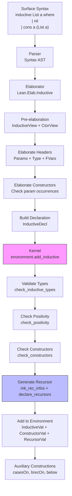

# Lean4 Recursive Types - Implementation Analysis

**Source:** Upstream Lean4 Repository (`/home/liu/Documents/bub/upstream/lean4/`)  
**Analysis Date:** February 27, 2026  
**Scope:** Core inductive type system, recursor generation, positivity checking

---

## Executive Summary

Lean4 implements recursive types through a **nominal approach** where type constructors are declared in the global environment, and recursion is resolved through name references rather than explicit fixpoint operators. This design separates concerns between the surface syntax (pattern matching, `inductive` declarations), the elaborator (which checks well-formedness), and the kernel (which validates and generates primitive recursors).

The key architectural decision is that **recursion happens through the environment, not through the term syntax**. When you define `data List a = Nil | Cons a (List a)`, the `List` constructor is registered in the environment first, and the constructor types reference it by name. This enables mutual recursion naturally—multiple types can reference each other simply by name lookup. The kernel then validates these declarations for strict positivity (ensuring the type is well-founded) and generates a primitive recursor that encodes the induction principle.

Compared to SystemF's current approach, Lean differs in several key ways:

| Aspect | Lean4 | SystemF (Current) |
|--------|-------|-------------------|
| Recursion mechanism | Nominal (name-based) | Direct nominal recursion |
| Positivity checking | Strict (kernel-enforced) | None (like Haskell) |
| Recursion principle | Generated primitive recursor | Manual fold/unfold |
| Mutual recursion | First-class via environment | Global pre-registration |
| Type equality | Definitional + isorecursive | Isorecursive (constructor name) |

Lean's approach provides stronger guarantees (strict positivity ensures termination and consistency) at the cost of complexity in the kernel. SystemF's lighter approach trades some safety for simplicity, which may be appropriate for a teaching/implementation language.

---

## Core Data Structures (Index)

### `Expr` - Core Abstract Syntax Tree

**File:** `/home/liu/Documents/bub/upstream/lean4/src/Lean/Expr.lean`  
**Lines:** 298-463

The fundamental representation of terms in Lean. Recursive types are represented as constants (`.const`) referring to the type constructor by name.

```lean
inductive Expr where
  | bvar (deBruijnIndex : Nat)     -- Bound variables
  | fvar (fvarId : FVarId)         -- Free variables (locally nameless)
  | mvar (mvarId : MVarId)         -- Metavariables (elaboration only)
  | sort (u : Level)               -- Sorts (Prop, Type u)
  | const (declName : Name) (us : List Level)  -- Constants (includes type constructors)
  | app (fn : Expr) (arg : Expr)   -- Application
  | lam (binderName : Name) (binderType : Expr) (body : Expr) (binderInfo : BinderInfo)
  | forallE (binderName : Name) (binderType : Expr) (body : Expr) (binderInfo : BinderInfo)
  | letE (declName : Name) (type : Expr) (value : Expr) (body : Expr) (nondep : Bool)
  | lit : Literal → Expr
  | mdata (data : MData) (expr : Expr)
  | proj (typeName : Name) (idx : Nat) (struct : Expr)
```

**Role in recursion:** Recursive types appear as `.const `TypeName` []` in constructor types. No explicit fixpoint operator exists in the core language—recursion is entirely nominal through the global constant table.

---

### `InductiveVal` - Inductive Type Metadata

**File:** `/home/liu/Documents/bub/upstream/lean4/src/Lean/Declaration.lean`  
**Lines:** 255-296

Stores all metadata about an inductive type after elaboration and kernel validation.

```lean
structure InductiveVal extends ConstantVal where
  numParams : Nat
  /-- Number of indices. An index is an argument that varies over constructors.
  Example: the `n : Nat` in `cons : α → Vector α n → Vector α (n+1)` -/
  numIndices : Nat
  /-- List of all (including this one) inductive datatypes in the mutual declaration -/
  all : List Name
  /-- List of the names of the constructors -/
  ctors : List Name
  /-- Number of auxiliary data types produced from nested occurrences -/
  numNested : Nat
  /-- True when recursive (appears as argument in a constructor) -/
  isRec : Bool
  /-- Whether flagged as unsafe -/
  isUnsafe : Bool
  /-- True if has constructor taking function returning same type (e.g., `(Nat → T) → T`) -/
  isReflexive : Bool
```

**Key insight:** The `isRec` flag is computed by scanning constructor types for occurrences of the type being defined (see `is_rec()` in `/home/liu/Documents/bub/upstream/lean4/src/kernel/inductive.cpp`, lines 265-286).

---

### `ConstructorVal` - Constructor Metadata

**File:** `/home/liu/Documents/bub/upstream/lean4/src/Lean/Declaration.lean`  
**Lines:** 322-332

```lean
structure ConstructorVal extends ConstantVal where
  /-- Inductive type this constructor is a member of -/
  induct : Name
  /-- Constructor index (position in declaration) -/
  cidx : Nat
  /-- Number of parameters in inductive datatype -/
  numParams : Nat
  /-- Number of fields (arity - nparams) -/
  numFields : Nat
  isUnsafe : Bool
```

**Role:** Each constructor is a separate constant in the environment. The `numFields` is calculated as total arity minus `numParams` (parameters are shared across all constructors).

---

### `RecursorVal` - Recursion Principle

**File:** `/home/liu/Documents/bub/upstream/lean4/src/Lean/Declaration.lean`  
**Lines:** 351-375

Stores the automatically-generated recursor (induction principle) for an inductive type.

```lean
structure RecursorVal extends ConstantVal where
  /-- List of all inductive datatypes in the mutual declaration -/
  all : List Name
  numParams : Nat
  numIndices : Nat
  /-- Number of motives (one per inductive in mutual block) -/
  numMotives : Nat
  /-- Number of minor premises (one per constructor) -/
  numMinors : Nat
  /-- Reduction rule for each constructor -/
  rules : List RecursorRule
  /-- Supports K-like reduction (see below) -/
  k : Bool
  isUnsafe : Bool
```

**RecursorRule structure** (lines 341-348):
```lean
structure RecursorRule where
  ctor : Name        -- Constructor this rule applies to
  nfields : Nat      -- Number of fields (non-param args)
  rhs : Expr         -- Right-hand side of reduction
```

**Key insight:** The recursor's type has the form:
```
rec : ∀ (params) (motives) (minors) (indices) (major), motive major
```

Where:
- `params`: Type parameters (fixed across all constructors)
- `motives`: One motive `C : ∀ (indices), I params indices → Sort u` per inductive in the mutual block
- `minors`: One minor premise per constructor, with type derived from constructor signature
- `indices`: Indices that vary per constructor
- `major`: The value being eliminated

---

### `Declaration` - Top-Level Declarations

**File:** `/home/liu/Documents/bub/upstream/lean4/src/kernel/declaration.h`  
**Lines:** 191-234 (C++), mirrored in Lean

```cpp
enum class declaration_kind { Axiom, Definition, Theorem, Opaque, Quot, MutualDefinition, Inductive };

/* In Lean:
inductive Declaration where
  | axiomDecl       (val : AxiomVal)
  | defnDecl        (val : DefinitionVal)
  | thmDecl         (val : TheoremVal)
  | opaqueDecl      (val : OpaqueVal)
  | quotDecl
  | mutualDefnDecl  (defns : List DefinitionVal)
  | inductDecl      (lparams : List Name) (nparams : Nat) 
                    (types : List InductiveType) (isUnsafe : Bool)
*/
```

**Role:** Inductive declarations are atomic at the kernel level. The entire mutual block is submitted together with level parameters, number of parameters, and the list of inductive types with their constructors.

---

## Algorithms and Checks (Manifest)

### Strict Positivity Checking

**Files:** 
- `/home/liu/Documents/bub/upstream/lean4/src/kernel/inductive.cpp`
- **Lines:** 392-409 (`check_positivity`), 334-366 (`is_valid_ind_app`)

**Purpose:** Ensure recursive occurrences are strictly positive (to the left of an even number of arrows), preventing unsound definitions like:
```lean
inductive Bad where
  | mk : (Bad → Bad) → Bad  -- Non-positive: rejected
```

**Algorithm:**

```cpp
void check_positivity(expr t, name const & cnstr_name, int arg_idx) {
    t = whnf(t);
    if (!has_ind_occ(t)) {
        // Non-recursive argument - OK
    } else if (is_pi(t)) {
        // Function type: check domain doesn't contain inductive
        if (has_ind_occ(binding_domain(t)))
            throw "non positive occurrence";
        // Continue checking in codomain
        expr local = mk_local_decl_for(t);
        check_positivity(instantiate(binding_body(t), local), cnstr_name, arg_idx);
    } else if (is_valid_ind_app(t)) {
        // Recursive argument in valid form - OK
    } else {
        throw "non valid occurrence";
    }
}
```

**Valid occurrence check** (`is_valid_ind_app`):
```cpp
bool is_valid_ind_app(expr const & t, unsigned i) {
    buffer<expr> args;
    expr I = get_app_args(t, args);
    // Must be the i-th inductive type being defined
    if (I != m_ind_cnsts[i]) return false;
    // Must have correct number of args (params + indices)
    if (args.size() != m_nparams + m_nindices[i]) return false;
    // All parameters must match exactly
    for (unsigned i = 0; i < m_nparams; i++) {
        if (m_params[i] != args[i]) return false;
    }
    // Indices cannot contain recursive occurrences
    for (unsigned i = m_nparams; i < args.size(); i++) {
        if (has_ind_occ(args[i])) return false;
    }
    return true;
}
```

!!! note "Critical Constraint"
    The `has_ind_occ` check on indices prevents types like `data T = Mk (T → T)` where the recursive occurrence appears in a function argument position within an index. This is the key to ensuring strict positivity.

---

### Recursor Generation

**File:** `/home/liu/Documents/bub/upstream/lean4/src/kernel/inductive.cpp`

#### Step 1: Build Recursor Info Structures

**Lines:** 588-673 (`mk_rec_infos`)

Creates the "motive" (what we're trying to prove/compute) and "minor premises" (one per constructor) for each inductive in the mutual block.

```cpp
void mk_rec_infos() {
    // First pass: create motives C : ∀ (indices), I params indices → Sort u
    for (inductive_type const & ind_type : m_ind_types) {
        rec_info info;
        // ... populate indices ...
        info.m_major = mk_local_decl("t", mk_app(mk_app(m_ind_cnsts[d_idx], m_params), info.m_indices));
        expr C_ty = mk_sort(m_elim_level);
        C_ty = mk_pi(info.m_major, C_ty);
        C_ty = mk_pi(info.m_indices, C_ty);
        info.m_C = mk_local_decl("motive", C_ty);
        m_rec_infos.push_back(info);
    }
    
    // Second pass: create minor premises
    for (inductive_type const & ind_type : m_ind_types) {
        for (constructor const & cnstr : ind_type.get_cnstrs()) {
            buffer<expr> b_u;  // Non-recursive + recursive args
            buffer<expr> u;    // Just recursive args
            
            // Scan constructor fields
            expr t = constructor_type(cnstr);
            while (is_pi(t)) {
                if (i < m_nparams) {
                    t = instantiate(binding_body(t), m_params[i]);
                } else {
                    expr l = mk_local_decl_for(t);
                    b_u.push_back(l);
                    if (is_rec_argument(binding_domain(t)))
                        u.push_back(l);  // Track recursive args
                    t = instantiate(binding_body(t), l);
                }
            }
            
            // Build induction hypotheses (v) for recursive args
            buffer<expr> v;
            for (expr const & u_i : u) {
                // Type is: ∀ (xs), motive (u_i xs)
                expr v_i_ty = mk_pi(xs, mk_app(motive, mk_app(u_i, xs)));
                expr v_i = mk_local_decl("ih", v_i_ty);
                v.push_back(v_i);
            }
            
            // Minor premise type: ∀ (b_u), (∀ (v), motive result) → motive result
            expr minor_ty = mk_pi(b_u, mk_pi(v, C_app));
            m_rec_infos[d_idx].m_minors.push_back(mk_local_decl("minor", minor_ty));
        }
    }
}
```

#### Step 2: Generate Reduction Rules

**Lines:** 705-749 (`mk_rec_rules`)

Creates the computational behavior of the recursor (iota reduction):

```cpp
recursor_rules mk_rec_rules(unsigned d_idx, buffer<expr> const & Cs, 
                           buffer<expr> const & minors, unsigned & minor_idx) {
    buffer<recursor_rule> rules;
    for (constructor const & cnstr : d.get_cnstrs()) {
        // Collect constructor arguments
        buffer<expr> b_u, u;
        expr t = constructor_type(cnstr);
        // ... populate b_u and u ...
        
        // Build recursive calls (v)
        buffer<expr> v;
        for (expr const & u_i : u) {
            // recursor application for this recursive arg
            expr rec_app = mk_constant(rec_name, lvls);
            rec_app = mk_app(rec_app, m_params);  // params
            rec_app = mk_app(rec_app, Cs);        // motives  
            rec_app = mk_app(rec_app, minors);    // minors
            rec_app = mk_app(rec_app, it_indices);// indices
            rec_app = mk_app(rec_app, mk_app(u_i, xs)); // recursive arg
            v.push_back(mk_lambda(xs, rec_app));
        }
        
        // RHS: apply minor premise to arguments and recursive calls
        expr e_app = mk_app(mk_app(minors[minor_idx], b_u), v);
        expr comp_rhs = mk_lambda(m_params, mk_lambda(Cs, mk_lambda(minors, 
                   mk_lambda(b_u, e_app))));
        
        rules.push_back(recursor_rule(constructor_name(cnstr), b_u.size(), comp_rhs));
        minor_idx++;
    }
    return recursor_rules(rules);
}
```

#### Step 3: Declare Recursor

**Lines:** 752-776 (`declare_recursors`)

Assembles the final recursor type and adds it to the environment:

```cpp
void declare_recursors() {
    for (unsigned d_idx = 0; d_idx < m_ind_types.size(); d_idx++) {
        rec_info const & info = m_rec_infos[d_idx];
        
        // Build type: ∀ (params) (motives) (minors) (indices) (major), motive major
        expr C_app = mk_app(mk_app(info.m_C, info.m_indices), info.m_major);
        expr rec_ty = mk_pi(info.m_major, C_app);
        rec_ty = mk_pi(info.m_indices, rec_ty);
        rec_ty = mk_pi(minors, rec_ty);
        rec_ty = mk_pi(Cs, rec_ty);
        rec_ty = mk_pi(m_params, rec_ty);
        
        recursor_rules rules = mk_rec_rules(d_idx, Cs, minors, minor_idx);
        name rec_name = mk_rec_name(m_ind_types[d_idx].get_name());
        
        m_env.add_core(constant_info(recursor_val(rec_name, rec_lparams, rec_ty, 
            all, m_nparams, m_nindices[d_idx], nmotives, nminors, rules, m_K_target, m_is_unsafe)));
    }
}
```

---

### Recursor Reduction (Computation)

**File:** `/home/liu/Documents/bub/upstream/lean4/src/Lean/Meta/WHNF.lean`
**Lines:** 226-262

Defines how recursor applications compute (iota reduction):

```lean
private def reduceRec (recVal : RecursorVal) (recLvls : List Level) (recArgs : Array Expr) 
    (failK : Unit → MetaM α) (successK : Expr → MetaM α) : MetaM α :=
  let majorIdx := recVal.getMajorIdx
  if h : majorIdx < recArgs.size then do
    let major := recArgs[majorIdx]
    let mut major ← whnf major
    
    -- K-like reduction for subsingletons (Eq, etc.)
    if recVal.k then
      major ← toCtorWhenK recVal major
    
    -- Find applicable reduction rule
    match getRecRuleFor recVal major with
    | some rule =>
      let majorArgs := major.getAppArgs
      let rhs := rule.rhs.instantiateLevelParams recVal.levelParams recLvls
      
      -- Apply: params ++ motives ++ minors
      let rhs := mkAppRange rhs 0 (recVal.numParams+recVal.numMotives+recVal.numMinors) recArgs
      
      -- Apply constructor arguments (skipping params)
      let nparams := majorArgs.size - rule.nfields
      let rhs := mkAppRange rhs nparams majorArgs.size majorArgs
      
      -- Apply remaining recursor args after major
      let rhs := mkAppRange rhs (majorIdx + 1) recArgs.size recArgs
      
      successK rhs
    | none => failK ()
```

!!! note "K-like Reduction"
    For types like `Eq` with one constructor and no fields, Lean supports K-like reduction where any proof of `Eq a b` reduces to `Eq.refl` (axiom K). This is controlled by the `k` flag in `RecursorVal`.

---

### Auxiliary Recursor Constructions

**File:** `/home/liu/Documents/bub/upstream/lean4/src/Lean/AuxRecursor.lean`

Lean generates several auxiliary constructions from primitive recursors:

| Construction | Suffix | Purpose | Example for `List` |
|-------------|--------|---------|-------------------|
| `casesOn` | `.casesOn` | Non-dependent elimination | `List.casesOn : (xs : List α) → (motive : List α → Sort u) → motive [] → ((x : α) → (xs : List α) → motive (x :: xs)) → motive xs` |
| `recOn` | `.recOn` | Convenient recursor | `List.recOn` (different arg order) |
| `brecOn` | `.brecOn` | Well-founded recursion with below | `List.brecOn` |
| `below` | `.below` | Accessibility predicate | `List.below` |

**Generation** (from `/home/liu/Documents/bub/upstream/lean4/src/Lean/Meta/Constructions/CasesOn.lean`):
```lean
@[extern "lean_mk_cases_on"] 
opaque mkCasesOnImp (env : Kernel.Environment) (declName : @& Name) : 
    Except Kernel.Exception Declaration

def mkCasesOn (declName : Name) : MetaM Unit := do
  let name := mkCasesOnName declName
  let decl ← ofExceptKernelException (mkCasesOnImp (← getEnv).toKernelEnv declName)
  addDecl decl
  setReducibleAttribute name
```

**Below construction** (`/home/liu/Documents/bub/upstream/lean4/src/Lean/Meta/Constructions/BRecOn.lean`, lines 59-121):
```lean
/-- Constructs `.below` definition for inductive predicate.
For `List`:
```
@[reducible] protected def List.below.{u} : {a : Type} → {motive : List a → Sort u} → 
    List a → Sort (max 1 u) :=
fun {a} {motive} t => List.rec PUnit (fun a_1 a a_ih => motive a ×' a_ih) t
``` -/
private def mkBelowFromRec (recName : Name) (nParams : Nat) (belowName : Name) : MetaM Unit := do
  -- Build definition by applying recursor with appropriate motives
```

---

## Data Flow

### Mermaid Diagram: From Syntax to Recursors



### Step-by-Step Walkthrough

1. **Surface Syntax Parsing**: The `inductive` command is parsed into a `Syntax` tree with the type name, parameters, and constructor specifications.

2. **Elaboration Phase** (`/home/liu/Documents/bub/upstream/lean4/src/Lean/Elab/Inductive.lean`):
   - Create `InductiveView` with parsed metadata
   - Elaborate type header to determine parameters and universe level
   - Create free variables (`FVar`) for each inductive type in the mutual block
   - Elaborate constructor types, converting syntax to `Expr`
   - Check that parameter occurrences match (line 275-309 in `Inductive.lean`)

3. **Declaration Construction** (`/home/liu/Documents/bub/upstream/lean4/src/Lean/Elab/MutualInductive.lean`):
   - Collect all inductive types and constructors
   - Build `InductiveDecl` containing level params, number of params, and type/constructor list

4. **Kernel Validation** (`/home/liu/Documents/bub/upstream/lean4/src/kernel/inductive.cpp`):
   - Verify all inductive types in mutual block have consistent parameters
   - Check that types live in compatible universes
   - **Strict Positivity Check**: Ensure recursive occurrences are valid (see algorithm above)
   - Validate constructor return types match their inductive type

5. **Recursor Generation** (Kernel, lines 588-776):
   - Determine if type supports K-like reduction (single constructor, no fields, in Prop)
   - Build motive types (one per inductive in mutual block)
   - Build minor premises (one per constructor with appropriate induction hypotheses)
   - Generate reduction rules for each constructor
   - Construct recursor type: `∀ params motives minors indices major, motive major`

6. **Environment Registration**:
   - Add `InductiveVal` for type metadata
   - Add `ConstructorVal` for each constructor
   - Add `RecursorVal` for primitive recursion principle

7. **Auxiliary Constructions** (Meta-level):
   - Generate `casesOn` for dependent pattern matching
   - Generate `brecOn` and `below` for well-founded recursion
   - Mark auxiliary declarations in environment

---

## Key Insights

### Critical Design Decisions

1. **Nominal vs. Structural Recursion**: Lean uses nominal recursion (name-based) rather than explicit fixpoint operators. This enables:
   - Mutual recursion without fixpoint combinators
   - Natural separation between definition and use
   - Simpler core language (no `μ` or `fix` constructs)
   - But requires global environment and multi-phase elaboration

2. **Strict Positivity Requirement**: The kernel enforces that recursive occurrences are strictly positive:
   - Ensures logical consistency (no paradoxes)
   - Guarantees termination of primitive recursion
   - Prevents types like `Bad = (Bad → Bad) → Bad`
   - Trade-off: Some valid types are rejected, but safety is ensured

3. **Primitive Recursor as Core**: Every inductive type gets a primitive recursor generated by the kernel:
   - Single canonical elimination principle
   - All other eliminators (pattern matching, casesOn) desugar to it
   - Reduction behavior is primitive (iota reduction)
   - Enables separate compilation and proof checking

4. **Parameters vs. Indices Distinction**:
   - **Parameters** (`numParams`): Fixed across all constructors. Used for polymorphism (e.g., `List α`).
   - **Indices** (`numIndices`): Vary per constructor. Enable inductive families (e.g., `Vector α n`).
   - Recursive occurrences must use exact same parameters but can vary indices.

5. **Mutual Recursion via Environment**: Multiple types can reference each other simply by name:
   ```lean
   mutual
     inductive Even : Nat → Prop
     | zero : Even 0
     | succ : Odd n → Even (n+1)
     
     inductive Odd : Nat → Prop  
     | succ : Even n → Odd (n+1)
   end
   ```
   The `all : List Name` field in `InductiveVal` tracks which types are mutually recursive.

6. **K-like Reduction for Propositions**: Types like `Eq` with one constructor and no fields in `Prop` get special reduction behavior:
   - All proofs are definitionally equal (proof irrelevance)
   - Enables tactics like `rfl` to work uniformly
   - Controlled by `k` flag in `RecursorVal`

### Trade-offs

| Aspect | Lean's Approach | Alternative Approaches |
|--------|----------------|----------------------|
| **Safety** | Strong (strict positivity) | Haskell (none), Coq (similar) |
| **Complexity** | High (kernel must check) | Low (accept more, check less) |
| **Expressiveness** | High (nested, mutual, indexed) | Varies |
| **Performance** | Good (primitive recursors) | Can be slower with desugaring |
| **User Experience** | Good (pattern matching) | Similar |

### Recommendations for SystemF

Based on Lean4's implementation:

1. **Keep Nominal Recursion**: Your current `TypeConstructor` approach with name-based lookup is sound and aligns with production languages.

2. **Consider Positivity Checking**: If SystemF aims for soundness:
   - Implement strict positivity like Lean (see algorithm in manifest)
   - Reject types with non-positive occurrences
   - Document the restriction clearly

3. **Generate Fold Operations**: Instead of full recursors, generate:
   - `fold` (catamorphism) for consuming values
   - `unfold` (anamorphism) for generating values
   - These are easier to understand than primitive recursors

4. **Track Recursion Metadata**: Add fields to your type representation:
   - `isRec : Bool` - whether type is recursive
   - `all : List Name` - for mutual recursion tracking
   - `numParams : Nat` - distinguish params from indices

5. **Environment Pre-registration**: Like Lean, declare types before defining constructors:
   ```
   1. Register type constructor in environment
   2. Define constructors (can reference type by name)
   3. Generate fold/unfold operations
   ```

6. **Defer Auxiliary Operations**: Like Lean's `casesOn` and `brecOn`, generate convenience operations after core type definition.

7. **Isorecursive Equality**: Your current approach (types equal if same constructor) is reasonable for simplicity. Lean uses definitional equality which is more powerful but requires unification.

---

## File Reference Index

### Core Type Definitions

| File | Lines | Description |
|------|-------|-------------|
| `/home/liu/Documents/bub/upstream/lean4/src/Lean/Declaration.lean` | 88-321 | Core value structures: `ConstantVal`, `InductiveVal` (255-296), `ConstructorVal` (322-332), `RecursorVal` (351-375), `ConstantInfo` (422-527) |
| `/home/liu/Documents/bub/upstream/lean4/src/Lean/Expr.lean` | 298-463 | Core AST `Expr` definition with 11 constructors including `const`, `app`, `forallE`, `lam` |
| `/home/liu/Documents/bub/upstream/lean4/src/kernel/declaration.h` | 1-497 | C++ headers mirroring Lean structures: `inductive_val`, `constructor_val`, `recursor_val` (276-383), `declaration` (191-234) |

### Kernel Implementation

| File | Lines | Description |
|------|-------|-------------|
| `/home/liu/Documents/bub/upstream/lean4/src/kernel/inductive.cpp` | 1-1249 | Core inductive type processing: `add_inductive_fn` class (124-790), `check_positivity` (392-409), `is_valid_ind_app` (334-366), `mk_rec_infos` (588-673), `declare_recursors` (752-776) |
| `/home/liu/Documents/bub/upstream/lean4/src/kernel/declaration.cpp` | 1-261 | Declaration construction and validation functions |

### Elaboration

| File | Lines | Description |
|------|-------|-------------|
| `/home/liu/Documents/bub/upstream/lean4/src/Lean/Elab/Inductive.lean` | 1-344 | Surface elaboration: `inductiveSyntaxToView` (25-101), `elabCtors` (203-269), parameter occurrence checking (275-309) |
| `/home/liu/Documents/bub/upstream/lean4/src/Lean/Elab/MutualInductive.lean` | 1-1764 | Mutual inductive elaboration framework: `InductiveView` (89-110), `InductiveElabDescr` (175-177), orchestration of multi-phase elaboration |
| `/home/liu/Documents/bub/upstream/lean4/src/Lean/Elab/PreDefinition/Structural/IndGroupInfo.lean` | 1-116 | Mutual inductive group tracking: `IndGroupInfo` (31-38), `IndGroupInst` (59-62) |

### Recursor Operations

| File | Lines | Description |
|------|-------|-------------|
| `/home/liu/Documents/bub/upstream/lean4/src/Lean/Meta/WHNF.lean` | 115-314 | Recursor reduction: `reduceRec` (226-262), `toCtorWhenK` (137-158), `isRecStuck?` (294-305) |
| `/home/liu/Documents/bub/upstream/lean4/src/Lean/Meta/RecursorInfo.lean` | 1-248 | Recursor metadata: `RecursorInfo` (24-34), `RecursorUnivLevelPos` (16-18), `mkRecursorInfo` (244-246) |
| `/home/liu/Documents/bub/upstream/lean4/src/Lean/Meta/Match/Match.lean` | 1-1297 | Pattern matching compilation: `withAlts` (138-194), conversion from patterns to recursor applications |
| `/home/liu/Documents/bub/upstream/lean4/src/Lean/Meta/Inductive.lean` | 1-28 | Utility functions for inductive types |

### Auxiliary Constructions

| File | Lines | Description |
|------|-------|-------------|
| `/home/liu/Documents/bub/upstream/lean4/src/Lean/AuxRecursor.lean` | 1-93 | Auxiliary recursor definitions: suffix constants (16-24), `markAuxRecursor` (28-32), `isCasesOnRecursor` (44-46), `isBRecOnRecursor` (50-51) |
| `/home/liu/Documents/bub/upstream/lean4/src/Lean/Meta/Constructions/CasesOn.lean` | 1-31 | `casesOn` generation: `mkCasesOn` (19-26), `mkCasesOnImp` (15) |
| `/home/liu/Documents/bub/upstream/lean4/src/Lean/Meta/Constructions/BRecOn.lean` | 1-329 | `below` and `brecOn` generation: `mkBelow` (113-130), `mkBelowFromRec` (59-121), `buildBelowMinorPremise` (33-48) |
| `/home/liu/Documents/bub/upstream/lean4/src/Lean/Meta/Constructions/RecOn.lean` | 1-30 | `recOn` generation (similar structure to CasesOn) |

### Environment and Lookup

| File | Lines | Description |
|------|-------|-------------|
| `/home/liu/Documents/bub/upstream/lean4/src/Lean/MonadEnv.lean` | 1-166 | Environment queries: `isInductive?` (107), `getConstInfoInduct` (138), `isRec?` (124-126), `matchConstRec` (75) |

---

## Summary

Lean4's recursive type implementation represents the state-of-the-art in dependently-typed language design. The key innovation is the strict separation between:

1. **Surface syntax** (pattern matching, `inductive` declarations)
2. **Elaboration** (checking well-formedness, resolving names)
3. **Kernel validation** (strict positivity, universe checking)
4. **Primitive recursors** (canonical elimination principles)
5. **Auxiliary constructions** (convenience operations)

This layered approach provides strong guarantees (logical consistency via strict positivity) while maintaining good ergonomics (automatic recursor generation). For SystemF, adopting the nominal recursion model and considering strict positivity checking would provide a solid foundation, while the full complexity of dependent types and universe polymorphism could be deferred or simplified based on project goals.