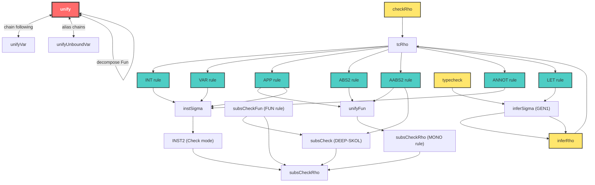
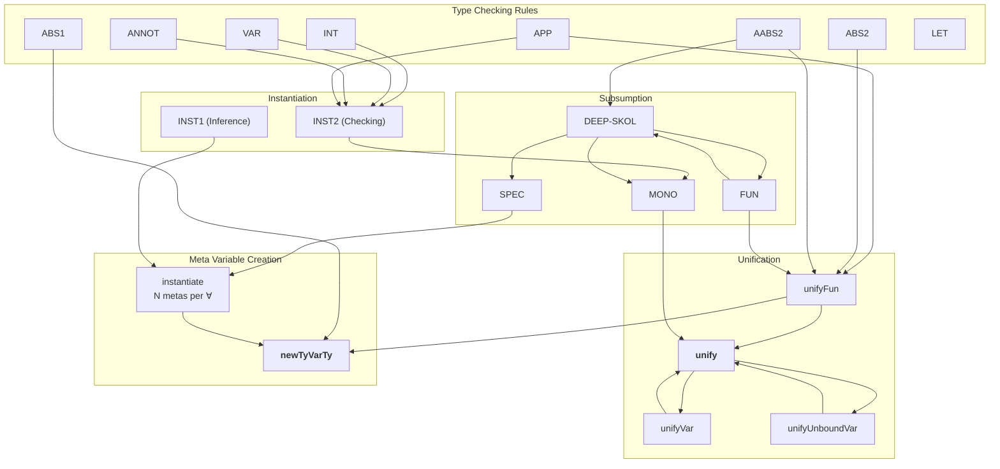

# Every Path to `unify` - Complete Call Graph

## Mermaid Graph



## Alternative: Rules-First View



## Path Summary Table

| Rule | Path to `unify` | Paper Rules |
|------|----------------|-------------|
| **INT** | INT → INST2 → MONO → **unify** | Direct mono unification |
| **VAR** | VAR → INST2 → MONO → **unify** | Direct mono unification |
| **APP** | APP → UNIFYFUN → **unify** | Function decomposition |
| **APP (result)** | APP → INST2 → MONO → **unify** | Result instantiation |
| **ABS2** | ABS2 → UNIFYFUN → **unify** | Expected arrow decomposition |
| **AABS2 (arrow)** | AABS2 → UNIFYFUN → **unify** | Expected arrow decomposition |
| **AABS2 (subsumption)** | AABS2 → DEEP-SKOL → MONO → **unify** | Annotation subsumption |
| **ANNOT** | ANNOT → INST2 → MONO → **unify** | Annotation instantiation |
| **FUN (contra)** | FUN → DEEP-SKOL → MONO → **unify** | Contravariant arg check |
| **FUN (co)** | FUN → MONO → **unify** | Covariant result check |
| **SPEC** | SPEC → INST1 → ... → MONO → **unify** | Instantiate outer foralls |

## Key Patterns

### Pattern 1: Direct Unification (INT, VAR, ANNOT)
```
Rule → INST2 → MONO → unify
```
Simple type instantiation followed by mono unification.

### Pattern 2: Function Decomposition (APP, ABS2)
```
Rule → UNIFYFUN → unify
```
Creates/extracts function components via unification.

### Pattern 3: Subsumption Checking (AABS2, FUN)
```
Rule → DEEP-SKOL → (SPEC/FUN/MONO) → unify
```
Full subsumption with skolemization and recursive checking.

### Pattern 4: Polymorphic Instantiation (SPEC)
```
SPEC → INST1 → ... → MONO → unify
```
Instantiates foralls and recurses.

---

## Every Path to `newTyVarTy` - Meta Variable Creation

Fresh meta type variables are the "unknowns" that unification solves.
There are exactly **3 creation points** in the implementation, reached
through different paths. These are shown in the Rules-First View above
(the "Meta Variable Creation" subgroup).

### Creation Points

| # | Function | What it creates | Line |
|---|----------|----------------|------|
| 1 | `unifyFun` (non-Fun case) | 2 metas: `arg_ty`, `res_ty` | L329-330 |
| 2 | `ABS1` rule in `tcRho` | 1 meta: `var_ty` for λ parameter | L464 |
| 3 | `instantiate` | N metas: one per ∀-bound variable | L197 |

### Path Summary Table

| Rule | Path to `newTyVarTy` / `newMetaTyVar` | What gets created |
|------|---------------------------------------|-------------------|
| **APP** | APP → unifyFun → **newTyVarTy** ×2 | arg/res metas for inferred function |
| **ABS2** | ABS2 → unifyFun → **newTyVarTy** ×2 | arg/res metas when expected type isn't Fun |
| **AABS2 (arrow)** | AABS2 → unifyFun → **newTyVarTy** ×2 | arg/res metas when expected type isn't Fun |
| **ABS1** | ABS1 → **newTyVarTy** ×1 | mono meta for unannotated λ parameter |
| **INT (infer)** | INT → INST1 → instantiate → **newMetaTyVar** ×N | metas replacing ∀-bound vars (N=0 for Int) |
| **VAR (infer)** | VAR → INST1 → instantiate → **newMetaTyVar** ×N | metas replacing ∀-bound vars in σ |
| **ANNOT (infer)** | ANNOT → INST1 → instantiate → **newMetaTyVar** ×N | metas replacing ∀-bound vars in annotation |
| **APP (result, infer)** | APP → INST1 → instantiate → **newMetaTyVar** ×N | metas for result type's ∀ vars |
| **SPEC** | SPEC → instantiate → **newMetaTyVar** ×N | metas replacing outer ∀ in subsumption |
| **FUN (lhs/rhs)** | FUN → unifyFun → **newTyVarTy** ×2 | arg/res metas when one side isn't Fun |

### Creation Semantics

**`newTyVarTy`** (via `unifyFun`, `ABS1`): Creates a fresh `MetaTv` wrapped in a
`MetaTv` type constructor. The IORef starts as `Nothing` (unsolved). These are
"demand" metas — created because the algorithm needs an arrow type but doesn't
have one yet.

**`newMetaTyVar`** (via `instantiate`): Creates a fresh `MetaTv` directly.
These are "instantiation" metas — created to replace ∀-bound variables so
the polymorphic type can participate in unification.

Both end up as `Meta Uniq (IORef (Maybe Tau))` — the distinction is purely
about *why* the meta was created:

| Kind | Created by | Purpose | Example |
|------|-----------|---------|---------|
| **Demand** | `unifyFun`, `ABS1` | Force structure to exist | `_a` in `_a → _b` when checking `f x` |
| **Instantiation** | `instantiate` | Replace ∀-bound var | `_a` in `_a → _a` from `∀a. a → a` |

Both kinds are solved by `unify` (via `writeTv`) and generalized by `quantify`
(GEN1: `ftv(ρ) - ftv(Γ)`) if they survive unconstrained by the environment.