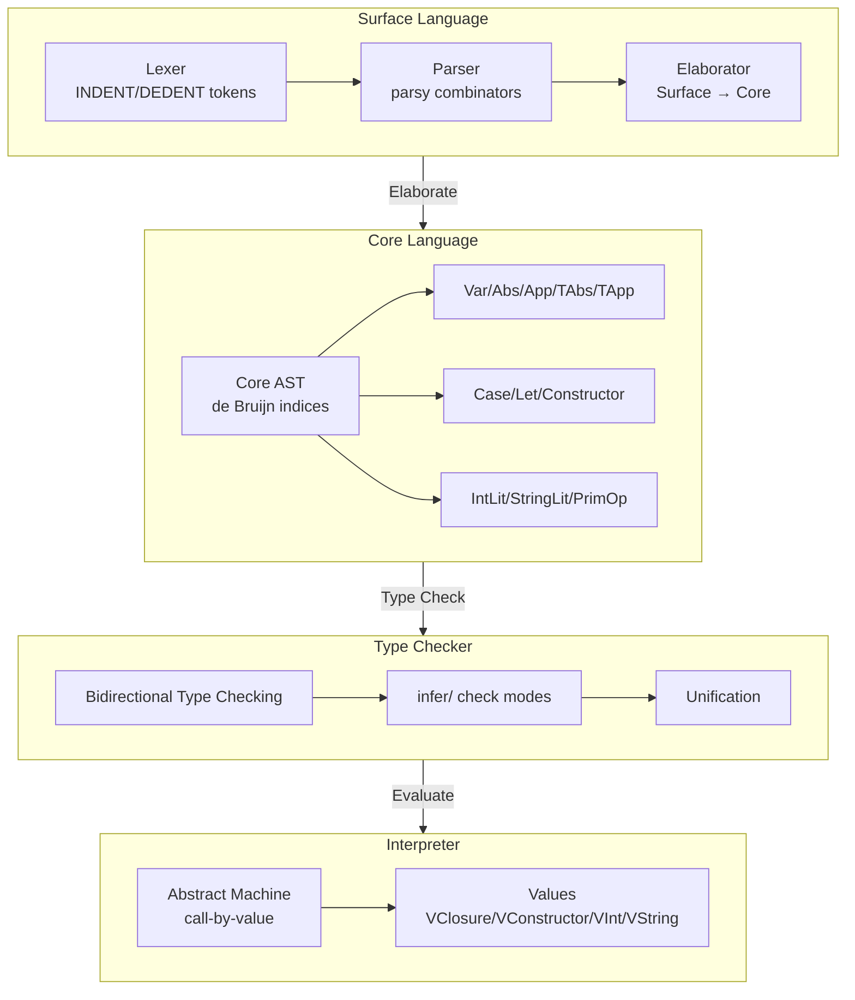

# SystemF Architecture

This document provides a comprehensive overview of the SystemF compiler architecture and detailed design specifications for key subsystems.

## Table of Contents

- [Overview](#overview)
- [High-Level Architecture](#high-level-architecture)
- [Indentation-Based Syntax](#indentation-based-syntax)
- [Pluggable Primitives System](#pluggable-primitives-system)
- [REPL (TODO)](#repl-todo)
- [Module System (TODO)](#module-system-todo)
- [LLM and Tool Integration (TODO)](#llm-and-tool-integration-todo)

---

## Overview

SystemF is a DSL compiler for a polymorphic lambda calculus (System F) extended with algebraic data types, primitive operations, and LLM FFI capabilities. It features a clean multi-layer architecture that separates surface syntax from core language semantics.

### Key Characteristics

- **Polymorphic Type System**: Full System F with `forall` quantification
- **Algebraic Data Types**: Sum and product types via `data` declarations
- **Bidirectional Type Inference**: Synthesis and checking modes
- **Indentation-Based Syntax**: Python/Haskell-style layout rules
- **Pluggable Primitives**: Types declared in prelude, operations via `$prim` namespace
- **De Bruijn Indices**: Efficient variable representation in core language

---

## High-Level Architecture



!!! tip "Layer Separation"

    The architecture cleanly separates surface syntax (convenience) from core language (semantics). This allows the surface syntax to evolve independently while maintaining a stable core.

### Directory Structure

```
systemf/
├── src/systemf/
│   ├── core/                    # Core language layer
│   │   ├── ast.py              # Core AST (de Bruijn, explicitly typed)
│   │   ├── types.py            # Type representations
│   │   ├── context.py          # Typing contexts
│   │   ├── unify.py            # Unification algorithm
│   │   ├── checker.py          # Bidirectional type checker
│   │   └── errors.py           # Error hierarchy
│   │
│   ├── surface/                 # Surface language layer
│   │   ├── ast.py              # Surface AST (name-based)
│   │   ├── types.py            # Token types and lexer types
│   │   ├── lexer.py            # Indentation-aware tokenizer
│   │   ├── parser.py           # Parsy-based parser
│   │   ├── elaborator.py       # Surface → Core translation
│   │   └── desugar.py          # Desugaring (operators → primitives)
│   │
│   ├── eval/                    # Interpreter layer
│   │   ├── value.py            # Runtime values
│   │   ├── machine.py          # Abstract machine
│   │   ├── pattern.py          # Pattern matching
│   │   ├── tools.py            # Tool registry for FFI
│   │   └── repl.py             # Interactive REPL
│   │
│   └── utils/
│       └── location.py         # Source locations for errors
│
├── tests/                       # Comprehensive test suite (400+ tests)
├── examples/                    # Example .sf programs
└── prelude.sf                   # Primitive type/operation declarations
```

!!! note "File Organization"
    The codebase follows a strict separation between layers:
    - `core/` contains the canonical language representation
    - `surface/` handles parsing and name resolution
    - `eval/` implements the operational semantics

### Data Flow

1. **Source** → Lexer emits tokens (including INDENT/DEDENT)
2. **Tokens** → Parser builds surface AST
3. **Surface AST** → Elaborator converts to core AST (name resolution, de Bruijn indices)
4. **Core AST** → Type checker validates (bidirectional inference)
5. **Core AST** → Evaluator executes (call-by-value semantics)

!!! tip "Compilation Pipeline"
    Each transformation preserves semantics while changing representation:
    - Source text → structured tokens (surface syntax)
    - Surface AST → canonical core language (name resolution)
    - Core terms → verified well-typed terms (type checking)
    - Well-typed terms → runtime values (evaluation)

---

## Indentation-Based Syntax

SystemF uses indentation for block structure, similar to Python and Haskell. This eliminates the need for explicit braces or `in` keywords in many cases.

### Core Design

**Principle:** Indentation serves as block boundaries; braces/bars convey structural info inside blocks.

!!! note "Why Indentation-Based?"
    Indentation-based syntax reduces visual noise while maintaining clarity:
    - No need for explicit `in` keywords in let bindings
    - No braces required for block structures
    - Familiar to Python/Haskell programmers
    - Dual syntax support allows explicit braces when needed

### Lexer: Indentation Tracking

The lexer tracks indentation levels using a stack and emits `INDENT`/`DEDENT` tokens:

```python
class Lexer:
    def __init__(self, source, filename):
        self._indent_stack: list[int] = [0]  # Stack of indentation levels
        self._at_line_start = True
        # ...
    
    def _process_indentation(self) -> bool:
        """Process indentation at the start of a logical line."""
        # Measure leading whitespace
        # Skip blank lines
        # Emit INDENT when indentation increases
        # Emit DEDENT(s) when indentation decreases
        # Error on inconsistent indentation or mixed tabs/spaces
```

#### Algorithm

```
1. Initialize stack with [0] (outermost level)
2. At each new line:
   a. Measure leading whitespace (spaces/tabs)
   b. Skip blank lines (whitespace/comments only)
   c. If current > stack[-1]: emit INDENT, push current
   d. If current < stack[-1]: pop and emit DEDENT until current == stack[-1]
   e. If current not in stack: error (inconsistent indentation)
3. At EOF: emit DEDENTs to close all open blocks
```

#### Token Types

- `INDENT`: Indentation level increased
- `DEDENT`: Indentation level decreased
- `EOF`: End of file (preceded by DEDENTs to close all blocks)

#### Edge Cases

- **Blank lines**: Ignored for indentation tracking
- **Comments**: Line comments don't affect indentation
- **Mixed tabs/spaces**: Error on same line
- **Multiple dedents**: Emit multiple `DEDENT` tokens for large drops

!!! warning "Indentation Consistency"
    The lexer enforces strict indentation rules:
    - Mixed tabs and spaces on the same line raise a `LexerError`
    - Inconsistent indentation (indenting to a level not previously seen) is an error
    - The stack tracks all indentation levels to detect mismatches

### Parser: Indentation-Aware Combinators

The parser uses parsy combinators with `@generate` decorator for monadic parsing:

```python
@generate
def indented_block(content_parser):
    """Parse INDENT content DEDENT sequence."""
    yield INDENT
    content = yield content_parser
    yield DEDENT
    return content

@generate  
def indented_many(item_parser):
    """Parse one or more indented items (no separator)."""
    yield INDENT
    items = []
    first = yield item_parser
    items.append(first)
    rest = yield item_parser.many()  # Same indentation level
    items.extend(rest)
    yield DEDENT
    return items
```

### Syntax Examples

#### Let Bindings

**Old (explicit `in`):**
```systemf
let x = 1 in
let y = 2 in
x + y
```

**New (indentation-based):**
```systemf
let x = 1
  let y = 2
    x + y
```

**Or with explicit braces (backward compatibility):**
```systemf
let x = 1 {
  let y = 2 {
    x + y
  }
}
```

#### Case Expressions

**Old (brace/bar delimited):**
```systemf
case xs of {
  Nil -> 0;
  Cons y ys -> 1 + length ys
}
```

**New (indentation-based):**
```systemf
case xs of
  Nil -> 0
  Cons y ys -> 1 + length ys
```

**Dual syntax support (both styles work):**
```systemf
case xs of {
  Nil -> 0
  Cons y ys -> 1 + length ys
}
```

#### Data Declarations

**Old (bar-separated):**
```systemf
data Bool = True | False
```

**New (indentation-based):**
```systemf
data Bool =
  True
  False
```

### Grammar Changes

**Before (Brace/Keyword Delimited):**
```
let_expr ::= LET IDENT EQ expr IN expr
case_expr ::= CASE expr OF LBRACE branches RBRACE
data_decl ::= DATA CON params EQ constrs
branches ::= branch (BAR branch)*
constrs ::= constr (BAR constr)*
```

**After (Indentation-Based with Dual Syntax):**
```
let_expr ::= LET IDENT EQ expr INDENT let_body DEDENT
           | LET IDENT EQ expr LBRACE let_body RBRACE
let_body ::= expr

case_expr ::= CASE expr OF INDENT branches DEDENT
            | CASE expr OF LBRACE branches RBRACE
branches ::= branch (branch)*
branch ::= pattern ARROW expr

data_decl ::= DATA CON params EQ INDENT constrs DEDENT
            | DATA CON params EQ constrs  -- single line
constrs ::= constr (constr)*
```

### Error Messages

- "Expected indented block after 'let' binding"
- "Indentation mismatch: expected dedent"
- "Mixed tabs and spaces in indentation"
- "Inconsistent indentation level"

---

## Pluggable Primitives System

The primitives system provides a clean separation between core language semantics and primitive operations (arithmetic, I/O, etc.). Types are declared in the prelude while the core language remains minimal.

### Core Philosophy

**Clean Separation:** Types live in prelude, evaluation only needs symbol names and raw values.

```systemf
-- Prelude declares primitive types and their operations
prim_type Int
prim_op int_plus : Int -> Int -> Int
prim_op int_minus : Int -> Int -> Int

-- User code can shadow regular names
plus = \x y -> x  -- Shadows 'plus'

-- But NOT $prim names
1 + 2  -- Desugars to $prim.int_plus 1 2 (always works!)
```

!!! note "Design Rationale"
    The `$prim` namespace provides a clean separation:
    - User-defined names can be shadowed without affecting primitives
    - Primitive operations are always accessible via `$prim.xxx`
    - Type signatures are declared once in the prelude, not hardcoded in the compiler
    - New primitives can be added without modifying the compiler

### Architecture Layers

#### 1. AST Nodes

**Value Types (Runtime):**
```python
@dataclass(frozen=True)
class VInt(Value):
    """Runtime integer value."""
    value: int

@dataclass(frozen=True)
class VString(Value):
    """Runtime string value."""
    value: str
```

**Core Terms:**
```python
@dataclass(frozen=True)
class IntLit(Term):
    """Integer literal: 42
    Created directly by parser from NUMBER tokens.
    """
    value: int

@dataclass(frozen=True)
class StringLit(Term):
    """String literal: "hello"
    Created directly by parser from STRING tokens.
    """
    value: str

@dataclass(frozen=True)
class PrimOp(Term):
    """Primitive operation: $prim.xxx
    Elaborator converts $prim.xxx names to PrimOp.
    Arguments handled via App wrapping (consistent with functions).
    """
    name: str  # e.g., "int_plus", "string_concat"
```

**Type Representations:**
```python
@dataclass(frozen=True)
class PrimitiveType(Type):
    """Primitive type from prelude: Int, String, etc."""
    name: str
```

#### 2. Prelude Syntax

**Single-token keywords:**
```systemf
prim_type Int       -- Declare primitive type
prim_op int_plus    -- Declare primitive operation
```

**Surface AST Declarations:**
```python
@dataclass(frozen=True)
class SurfacePrimTypeDecl:
    """Surface: prim_type Int"""
    name: str

@dataclass(frozen=True)
class SurfacePrimOpDecl:
    """Surface: prim_op int_plus : Int -> Int -> Int"""
    name: str
    type_annotation: SurfaceType
```

#### 3. Name Resolution

The `$prim` namespace bypasses all scopes:

```python
def resolve_name(name: str) -> Term:
    if name.startswith("$prim."):
        op_name = name[6:]  # Strip "$prim."
        return PrimOp(op_name)  # Bypass all scopes
    if name in term_env:
        return Var(term_env[name])
    if name in global_terms:
        return Global(name)
    raise UndefinedVariable(name)
```

#### 4. Type Checking Flow

**IntLit:**
```python
case IntLit(_):
    # Lookup from prelude-populated registry
    return self.primitive_types["Int"]
```

**StringLit:**
```python
case StringLit(_):
    return self.primitive_types["String"]
```

**PrimOp:**
```python
case PrimOp(name):
    full_name = f"$prim.{name}"
    if full_name not in self.global_types:
        raise TypeError(f"Unknown primitive: {name}")
    return self.global_types[full_name]
```

!!! warning "No Hardcoded Signatures"
    The type checker **does not** have hardcoded primitive signatures. All primitive types are looked up from registries populated by the prelude. This design ensures:
    - Core language remains minimal
    - New primitives can be added without modifying the type checker
    - Type signatures are declared in one place (the prelude)

#### 5. Evaluation Flow

**Evaluator Registry:**
```python
class Evaluator:
    def __init__(self):
        self.primitive_impls = {
            "int_plus": lambda x, y: VInt(x.value + y.value),
            "int_minus": lambda x, y: VInt(x.value - y.value),
            "int_mult": lambda x, y: VInt(x.value * y.value),
            "int_div": lambda x, y: VInt(x.value // y.value),
            "string_concat": lambda x, y: VString(x.value + y.value),
            "string_length": lambda x: VInt(len(x.value)),
        }
    
    def evaluate(self, term, env):
        match term:
            case IntLit(value):
                return VInt(value)
            case StringLit(value):
                return VString(value)
            case PrimOp(name):
                # Arguments come via App wrapping
                pass
```

### Communication Between Components

**Type Checker ↔ Evaluator:**
- **Shared:** Operation symbol names (e.g., "int_plus")
- **Type Checker:** Knows types from prelude-declared signatures
- **Evaluator:** Knows implementations from `primitive_impls` registry

### Example Compilation Flow

```systemf
-- prelude.sf
prim_type Int
prim_op int_plus : Int -> Int -> Int

-- user.sf
1 + 2
```

**Step-by-step:**
1. **Parse prelude:** `prim_type Int` → `SurfacePrimTypeDecl("Int")`
2. **Elaborate prelude:** `primitive_types["Int"] = PrimitiveType("Int")`
3. **Parse user:** `1 + 2` → `App(App(Var("+"), IntLit(1)), IntLit(2))`
4. **Desugar:** `+` → `$prim.int_plus` → `App(App(PrimOp("int_plus"), IntLit(1)), IntLit(2))`
5. **Type check:** `IntLit(1)` → `primitive_types["Int"]` ✓
6. **Evaluate:** `primitive_impls["int_plus"](VInt(1), VInt(2))` → `VInt(3)`

### Supported Primitives

#### Integer Operations
- `int_plus`, `int_minus`, `int_mult`, `int_div`
- `int_eq`, `int_lt`, `int_le`, `int_gt`, `int_ge`

#### String Operations
- `string_concat`: Concatenate two strings
- `string_length`: Get string length

#### Type Declarations
- `prim_type Int`
- `prim_type String`

### Files Modified

- `systemf/src/systemf/core/ast.py` - IntLit, StringLit, PrimOp
- `systemf/src/systemf/core/types.py` - PrimitiveType
- `systemf/src/systemf/core/checker.py` - Lookup from prelude registries
- `systemf/src/systemf/core/__init__.py` - Export new types
- `systemf/src/systemf/surface/ast.py` - SurfacePrimTypeDecl, SurfacePrimOpDecl
- `systemf/src/systemf/surface/lexer.py` - PRIM_TYPE, PRIM_OP tokens
- `systemf/src/systemf/surface/parser.py` - Parse declarations
- `systemf/src/systemf/surface/elaborator.py` - Elaborate IntLit, PrimOp, declarations
- `systemf/src/systemf/surface/desugar.py` - Operator desugaring (+ → $prim.int_plus)
- `systemf/src/systemf/eval/value.py` - VInt, VString
- `systemf/src/systemf/eval/machine.py` - primitive_impls registry
- `systemf/prelude.sf` - Primitive declarations

---

## REPL (TODO)

!!! warning "Under Design"
    This section is under design. The module system was cancelled in favor of a file-based REPL approach.

### Planned Features

- Interactive evaluation of SystemF expressions
- Persistent definitions across sessions
- File loading with `load "filename.sf"`
- Type inspection with `:type expr`
- Help system with `:help`

### Current Status

- Basic REPL exists in `systemf/src/systemf/eval/repl.py`
- Supports term definitions and type inspection
- Module loading needs redesign

### Open Questions

- Should modules be first-class values or just file loading?
- How to handle namespacing in REPL vs. file mode?
- Interactive debugging features?

---

## Module System (TODO)

!!! warning "Design Cancelled"
    This section was under design but Task 32 was cancelled. A new approach is needed.

### Current Direction

Instead of a traditional module system, consider:

- **File-based loading**: `load "path/to/file.sf"` loads and evaluates
- **Implicit modules**: Each file is a module; definitions become available
- **Simple namespacing**: Files can shadow or be shadowed

### Open Questions

- How to handle name conflicts between files?
- Should there be explicit export/import lists?
- How to support library distribution?
- Cyclic dependencies?

---

## LLM and Tool Integration (TODO)

!!! info "Partially Implemented"
    This section is partially implemented but needs refinement for production use.

### Current Implementation

**Pragma Syntax (Haskell-style):**
```systemf
{-# LLM provider=openai model=gpt-4 temperature=0.7 #-}
{-# TOOL name=calculator description="Evaluate math expressions" #-}
```

**Tool Calls as Functions:**
```systemf
result = @calculator "2 + 2"
```

**AST Support:**
```python
@dataclass(frozen=True)
class ToolCall(Term):
    """Tool invocation for FFI operations."""
    tool_name: str
    args: list[Term]
```

### Completed Features

- [x] Pragma lexer/parser support (`{-# ... #-}`)
- [x] ToolCall AST node
- [x] Tool registry in `systemf/src/systemf/eval/tools.py`
- [x] Docstring attachments to AST nodes (`-- |`, `-- ^`)

### Planned Features

- [ ] LLM FFI integration (connect to OpenAI/Anthropic APIs)
- [ ] Automatic tool schema generation from types
- [ ] Error handling for tool failures
- [ ] Async tool execution

### Open Questions

- How to pass API keys securely?
- Should tool calls be effect-tracked in types?
- How to handle streaming LLM responses?
- Caching of LLM calls?

---

## Design Principles

!!! note "Guiding Philosophy"
    These principles guide architectural decisions and trade-offs in SystemF.

1. **Minimal Core, Expressive Surface**: Core language is minimal System F; surface syntax adds conveniences
2. **No Hardcoded Primitives**: All primitive types and operations declared in prelude
3. **Indentation as Structure**: Clean syntax without excessive braces
4. **Explicit is Better than Implicit**: Type annotations guide inference
5. **Functional First**: Pure functions by default; effects via explicit primitives
6. **Extensibility**: Plugin architecture for primitives and tools

---

## Related Documents

- `PROJECT_SUMMARY.md` - High-level project overview
- `docs/design/parsy-parser-design.md` - Parser implementation details
- `README.md` - User-facing documentation
- `prelude.sf` - Primitive type and operation declarations
- `tasks/*-kanban-*.md` - Detailed workflow tracking

---

## Testing

!!! tip "Comprehensive Test Coverage"
    SystemF maintains high test coverage across all architectural layers to ensure correctness and prevent regressions.

- **400+ tests** across all layers
- Unit tests for each component (lexer, parser, elaborator, checker, evaluator)
- Integration tests for full pipeline
- Property-based tests for type safety

Run tests:

```bash
cd systemf
uv run pytest
```

---

## Future Work

- [ ] Complete REPL with file loading
- [ ] Design and implement module system
- [ ] Full LLM FFI with streaming
- [ ] Additional primitive types (Float, Bool, List)
- [ ] Optimized evaluator (CEK machine)
- [ ] Compilation to bytecode or LLVM
